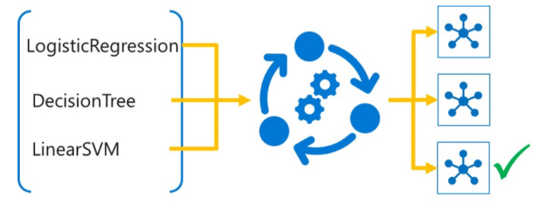

# Automate machine learning model selection with Azure Machine Learning

*Automated Machine Learning* enables you to try multiple algorithms and preprocessing transformations with your data. This, combined with scalable cloud-based compute makes it possible to find the best performing model for your data without the huge amount of time-consuming manual trial and error that would otherwise be required.

Azure Machine Learning includes support for automated machine learning through a visual interface in Azure Machine Learning studio for *Enterprise* edition workspaces only. You can use the Azure Machine Learning SDK to run automated machine learning experiments in either *Basic* or *Enterprise* edition workspaces.

## Learning Objectives

* Use Azure Machine Learning's automated machine learning capabilities to determine the best performing algorithm for your data.
* Use automated machine learning to preprocess data for training.
* Run an automated machine learning experiment.

## Automated machine learning tasks and algorithms

You can use automated machine learning in Azure Machine Learning to train models for the following types of machine learning task:

* Classification
* Regression
* Time Series Forecasting

## Task-specific algorithms
Azure Machine Learning includes support for numerous commonly used algorithms for these tasks, including:

### Classification algorithms
* Logistic Regression
* Light Gradient Boosting Machine (GBM)
* Decision Tree
* Random Forest
* Naive Bayes
* Linear Support Vector Machine (SVM)
* XGBoost
* Deep Neural Network (DNN) Classifier
* Others...

### Regression algorithms
* Linear Regression
* Light Gradient Boosting Machine (GBM)
* Decision Tree
* Random Forest
* Elastic Net
* LARS Lasso
* XGBoost
* Others...

### Forecasting algorithms
* Linear Regression
* Light Gradient Boosting Machine (GBM)
* Decision Tree
* Random Forest
* Elastic Net
* LARS Lasso
* XGBoost
* Others...

More Information: For a full list of supported algorithms, see [How to define a machine learning task](https://aka.ms/AA70rrr).

### Restrict algorithm selection
By default, automated machine learning will randomly select from the full range of algorithms for the specified task. You can choose to block individual algorithms from being selected; which can be useful if you know that your data is not suited to a particular type of algorithm, or you have to comply with a policy that restricts the type of machine learning algorithms you can use in your organization.

## Preprocessing and featurization

As well as trying a selection of algorithms, automated machine learning can apply preprocessing transformations to your data; improving the performance of the model.

### Scaling and normalization
Automated machine learning applies scaling and normalization to numeric data automatically, helping prevent any large-scale features from dominating training. During an automated machine learning experiment, multiple scaling or normalization techniques will be applied.

### Optional featurization
You can choose to have automated machine learning apply preprocessing transformations, such as:

* Missing value imputation to eliminate nulls in the training dataset.

* Categorical encoding to convert categorical features to numeric indicators.

* Dropping high-cardinality features, such as record IDs.

* Feature engineering (for example, deriving individual date parts from DateTime features)

* Others...

More Information: For more information about the preprocessing support in automated machine learning, see [What is automated machine learning](https://aka.ms/AA70rrt).
