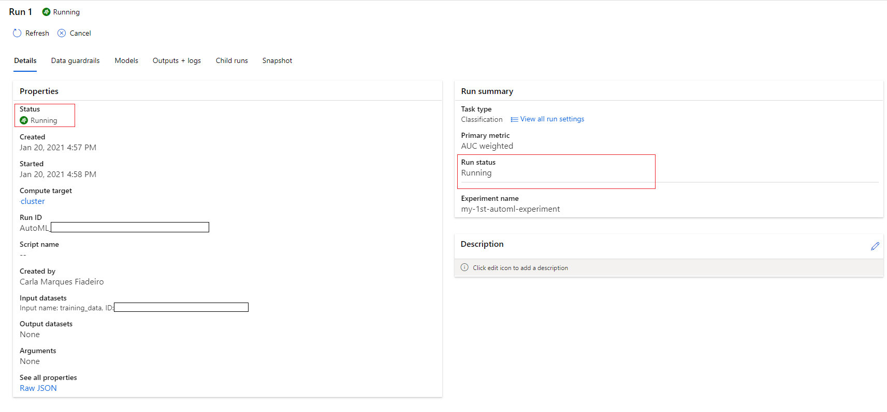
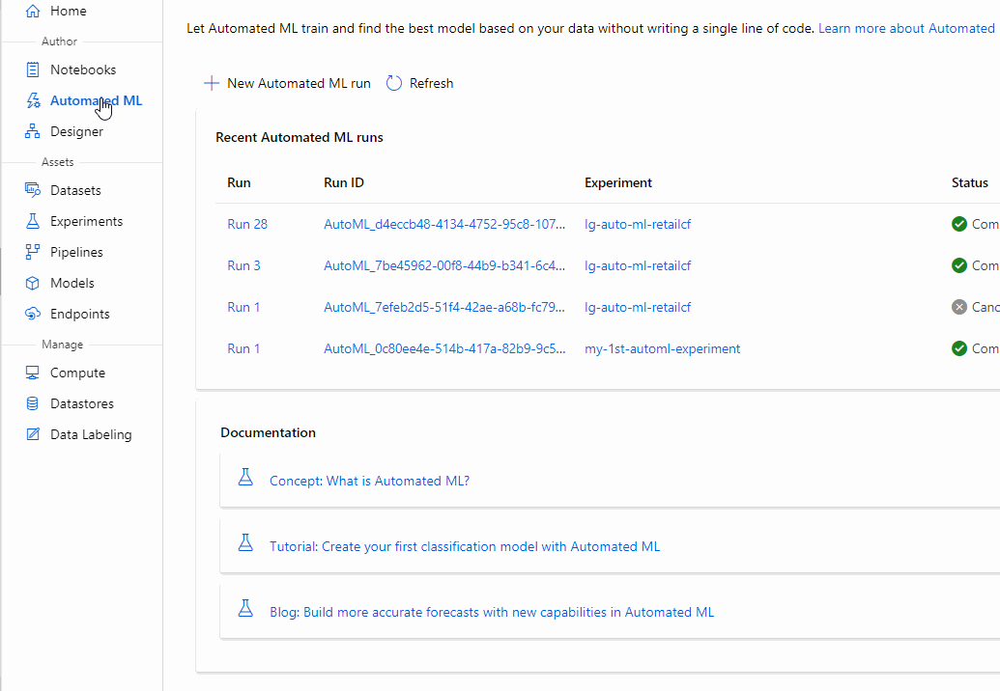
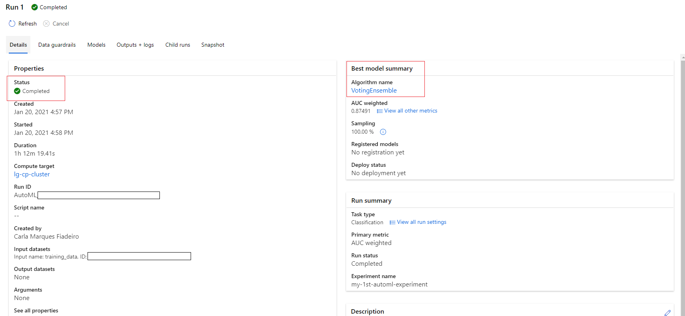

# How to work with Azure Machine Learning Studio Automated Machine Learning (ML)

Azure Machine Learning Studio Automated ML allows the user to create a model without writing a single line of code.

Automated ML provides the automation of intensive tasks, it rapidly iterates over many combinations of algorithms and hyperparameters to help find the best model based on a success metric of your choosing.

In this tutorial, we will guide you on how to do the following tasks:

* Understand Automated ML supported models and primary metrics
* Run an automated machine learning experiment.
* View experiment details.
* Deploy the Best Model.
* Download the Best Model details.

## Supported Models and Primary Metrics

Automated machine learning tries different models and algorithms during the automation and tuning process. As a user, there is no need for you to specify the algorithm. The following table summarizes the supported models by task type.

|Classification|Regression|Time Series Forecasting|
|--------------|--------------|-----------------|
|Logistic Regression*	|Elastic Net*	|Elastic Net|
|Light GBM*	|Light GBM*	|Light GBM|
|Gradient Boosting*	|Gradient Boosting*	|Gradient Boosting|
|Decision Tree*	|Decision Tree*	|Decision Tree|
|K Nearest Neighbors*	|K Nearest Neighbors*	|K Nearest Neighbors|
|Linear SVC*	|LARS Lasso*	|LARS Lasso|
|Support Vector Classification (SVC)* |Stochastic Gradient Descent (SGD)* |Stochastic Gradient Descent (SGD)|
|Random Forest*	|Random Forest*	|Random Forest|
|Extremely Randomized Trees*	|Extremely Randomized Trees*	|Extremely Randomized Trees|
|Xgboost*	|Xgboost*	|Xgboost|
|Averaged Perceptron Classifier|Online Gradient Descent Regressor	|Auto-ARIMA|
|Naive Bayes*	|Fast Linear Regressor|	Prophet|
|Stochastic| Gradient Descent (SGD)*	|	ForecastTCN|
|Linear SVM Classifier*| | |

**Note: Only the algorithms marked with * support convertion to ONNX. As we can see, ONNX only supports classification and regression tasks at this time.**

The primary metric parameter determines the metric to be used during model training for optimization. The available metrics you can select is determined by the task type you choose and the following table shows valid primary metrics for each task type.

|Classification|Regression|Time Series Forecasting|
|--------------|--------------|-----------------|
|**accuracy** - Image classification, Sentiment analysis, Churn prediction|**spearman_correlation**	|**spearman_correlation**|
|**AUC_weighted** - Fraud detection, Image classification, Anomaly detection/spam detection |**normalized_root_mean_squared_error** - Price prediction (house/product/tip), Review score prediction |**normalized_root_mean_squared_error** - Price prediction (forecasting), Inventory optimization, Demand forecasting|
|**average_precision_score_weighted** - Sentiment analysis |**r2_score** - Airline delay, Salary estimation, Bug resolution time	|**r2_score** - Price prediction (forecasting), Inventory optimization, Demand forecasting|
|**norm_macro_recall** - Churn prediction |**normalized_mean_absolute_error**	|**normalized_mean_absolute_error**|
|**precision_score_weighted**| | |		

### Before you start

If you have not already done so, please:

* Create a Compute Cluster, this Automated ML feature won't work with a compute instance, it requires a compute cluster. More details can be seen in: [compute instance](../Documents/Create-Compute-Instance.md).
* Create a Datastore and a Dataset with the data you want to use. For more information see: [Create a Datastore using the web portal](../Documents/Work-With-Data-in-Azure-ML.md) and [Create Datasets using the web portal](../Documents/Work-With-Data-in-Azure-ML-Datasets.md).

The steps described below show how to create a simple classification model using automated machine learning in the Azure Machine Learning studio. This classification model predicts if a client will subscribe to a fixed term deposit with a financial institution.
Another example, using time-series forecasting model, can be seen here: https://docs.microsoft.com/en-us/azure/machine-learning/tutorial-automated-ml-forecast

Anyway, independent on the type of model, the steps are very similar.

### <a name = 'New-AutomatedML-Run'> Create a new Automated ML run

1. Sign in to [Azure Machine Learning studio](https://ml.azure.com/).

2. Select **Automated ML** on the left pane under **Author** section.

3. Select **+New automated ML** run.

4. A new window will appear where you need to select the dataset you want to work with and then press **Next**.

5. After loading and configuring the data, the next step is to set up the experiment on the  **Configure Run** section. This setup includes experiment design tasks such as, selecting the size of your compute environment and specifying what column you want to predict. Populate the Configure Run form as follows:

* Enter this **experiment name** taking into account the rule: experiment name must be 1-256 characters, start with a letter or a number and can only contain letters, numbers, underscores and dashes.

* Select the target column, which is what you want to predict. 

* Select the compute cluster created for this feature.

Click **Next**.

6. On the **Task type and settings** form, complete the setup for your automated ML experiment by specifying the machine learning task type and configuration settings. 
Select the **machine learning task type** and then select *View additional configuration settings* and populate the fields as follows. 

These settings are to better control the training job. Otherwise, defaults are applied based on experiment selection and data.

| **Additional configurations** | **Description** |
| ---------- | -------------- |
| Primary metric|	Evaluation metric that the machine learning algorithm will be measured by.	|
| Explain best model|	Automatically shows explainability on the best model created by automated ML.|
|Blocked algorithms|	Algorithms you want to exclude from the training job	|
|Exit criterion|	If a criteria is met, the training job is stopped.|
|Validation|	Choose a cross-validation type and number of tests.|
|Concurrency|	The maximum number of parallel iterations executed per iteration|

Once all the setting are properly filled, select **Save**.

7. Select **View featurization settings**. 
In every automated machine learning experiment, your data is automatically scaled and normalized to help certain algorithms that are sensitive to features that are on different scales. This scaling and normalization is referred to as featurization.
When configuring your experiments, the user can enable/disable the setting featurization.  
**Note: Automated ML featurization steps (feature normalization, handling missing data, converting text to numeric, etc.) will become part of the underlying model. When using the model for predictions, the same featurization steps applied during training are applied to your input data automatically.**

Configure accordingly.

Select **Save**.

8. Select **Finish** to run the experiment. 

9. The Run Detail screen opens with the Run status at the top as the experiment preparation begins. This status updates as the experiment progresses. Notifications also appear in the top right corner of the studio, to inform you of the status of your experiment.

_Preparation takes 10-15 minutes to prepare the experiment run. Once running, it takes 2-3 minutes more for each iteration._

### <a name = 'Explore-AutomatedML-Models'> Explore automated ML models
Once the automated ML run finishes or even when it's running. You can check the models that are being/were tested.

1. Navigate to the Models tab and see the algorithms (models) tested. By default, the models are ordered by metric score as they complete. 

2. Select the Algorithm name of a completed model to explore its performance details.

The following navigates through the Details and the Metrics tabs to view the selected model's properties, metrics, and performance charts.

### <a name = 'Download-Best-Model'> Download the Best Model details

Azure Automated ML also allows the user to download the Best Model details. This will mean a .zip file will be downloaded to your local machine. 
The file contains the following:
* the model file
* the scoring script
* the environment details 
 
 

### <a name = 'Deploy-AutomatedML-Model'> Deploy the Best Model

The automated machine learning interface allows you to deploy the best model as a web service in a few steps. Deployment is the integration of the model so it can predict on new data and identify potential areas of opportunity.

Once the experiment run is complete, the Details page is populated with a Best model summary section. 

Deploying a model might take about 20 minutes to complete. The deployment process entails several steps including registering the model, generating resources and configuring them for the web service.

1. Select the **best model** to open the model-specific page.

 
2. Select the **Deploy** button in the top-left.

3. Populate the Deploy a model pane with the following:
   * Select a **Deployment Name**
   * Add a **Deployment description**
   * Select the **Compute type** - both Compute Instances or Inference Clusters can be choosen. Inference Clusters are more powerful and are recommended for production enviromnemts with high usage. For development, testing or low usage webservices Compute Instances can be used.
   * Enable authentication - if authentication is required for the web service
   * Use custom deployments - when disables it allows for the default driver file (scoring script) and environment file to be autogenerated.

4. Select **Deploy**.

A green success message appears at the top of the Run screen, and in the Model summary pane, a status message appears under **Deploy status**. Select **Refresh** periodically to check the deployment status.
Once completed, the webservice can also be seen from the **Endpoints** on the left pane under **Assets** section, then **Real-time Endpoints**

 
Now we have an operational web service to generate predictions.

_Sources: https://docs.microsoft.com/en-us/azure/machine-learning/how-to-configure-auto-train#configure-your-experiment-settings and
https://docs.microsoft.com/en-us/azure/machine-learning/tutorial-first-experiment-automated-ml_
