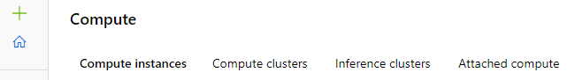

# Create an Attached Compute

This document details how to attach and use compute targets outside the Azure Machine Learning Workspace.

## What's a compute target?

With Azure Machine Learning, you can train your model on a variety of resources or environments, collectively referred to as compute targets. A compute target can be a local machine or a cloud resource, such as an Azure Machine Learning Compute, Azure HDInsight, or a remote virtual machine. You can also create compute targets for model deployment as described in Deploy a model as a batch inferencing service and Deploy a model as a real-time inferencing service.

Compute types include:.

* **[Compute Instance](../Documents/Create-Compute-Instance.md):** Development workstations that data scientists can use to work with data and models.
* **[Inference Cluster](../Documents/Create-Inference-Cluster.md):** Deployment targets for predictive services that use your trained models.
* **[Compute Cluster](../Documents/Create-Compute-Cluster.md):** Scalable clusters of virtual machines for on-demand processing of experiment code.
* **Attached Compute**: Links to other Azure compute resources, such as Virtual Machines or Azure Databricks clusters.

## Attached Compute

To use compute targets created outside the Azure Machine Learning workspace, you must attach them. Attaching a compute target makes it available to your workspace. An example of how this can be used includes:
* Training a model using Spark MLib on Databricks and deploying the model to ACI/AKS.
* Using Azure Databricks with automated machine learning capabilities on Azure ML SDK.
* Using Databricks as a compute target from an Azure Machine Learning pipeline. 
* See [here](https://docs.microsoft.com/en-us/azure/machine-learning/how-to-configure-databricks-automl-environment) for more information on how to use Azure Databricks with Azure Machine Learning and AutoML.

 **Note**: Use Attached compute to attach a compute target for training. Use Inference clusters to attach an AKS cluster for inferencing.
 
 ### View compute targets

1. Navigate to [Azure Machine Learning studio](https://ml.azure.com/).
2. Under **Manage**, select **Compute**, you will see four kinds of compute resources.

## Create an Attached Compute

1. Select **Attached Compute**

2. If you have no Attached Compute instances, select **Create** in the middle of the page. 
3. If you see a list of Attached Compute instances, select **+New** above the list. 

4. Fill out the form as follows:

 1. Select the type of compute to attach. Not all compute types can be attached from Azure Machine Learning studio. The compute types that can currently be attached for training include (Date: 12/03/21):

  * An Azure Virtual Machine (to attach a Data Science Virtual Machine)
  * Azure Databricks (for use in machine learning pipelines)
  * Azure Data Lake Analytics (for use in machine learning pipelines)
  * Azure HDInsight
  * Synapse Spark pool (preview)

  2. Enter a name for the compute target.
  3. Fill out the form and provide values for the required properties.
  4. Select **Attach**. 
 
 ### Next Steps
 
 After a target is created and attached to your workspace, you use it in your run configuration with a `ComputeTarget` object:
 
     from azureml.core.compute import ComputeTarget
     myvm = ComputeTarget(workspace=ws, name='my-vm-name')

