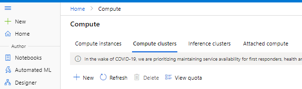
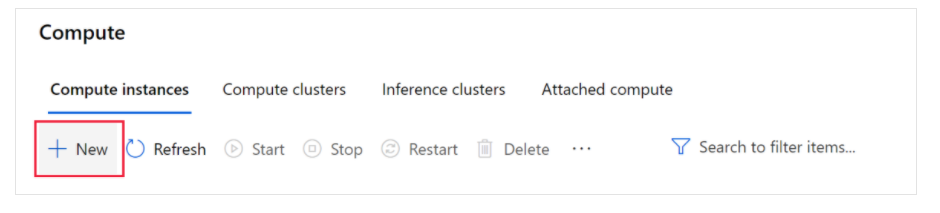
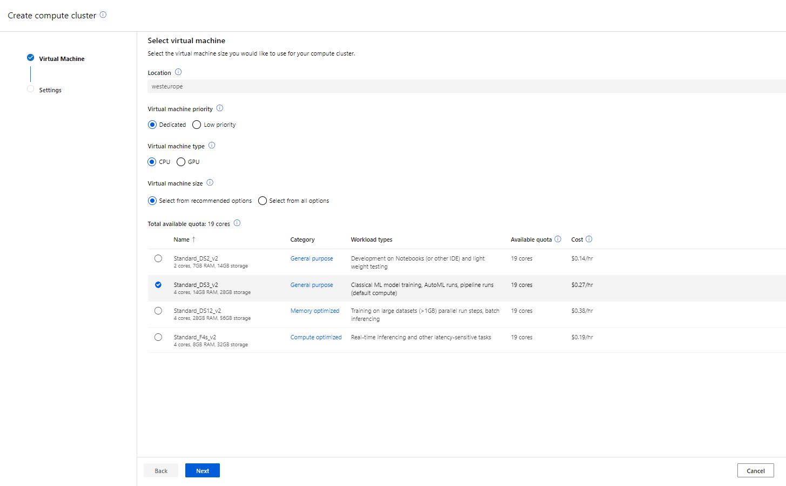
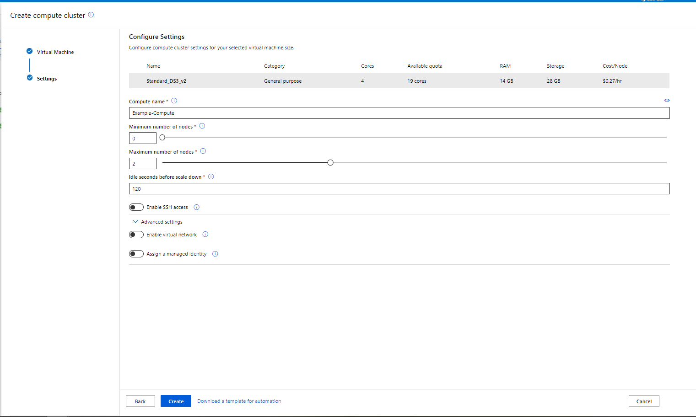
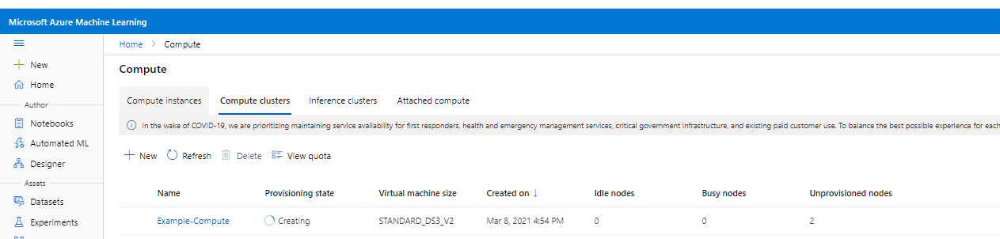
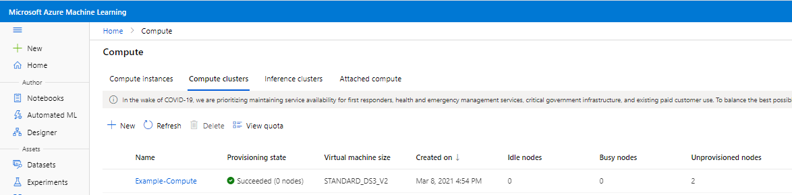
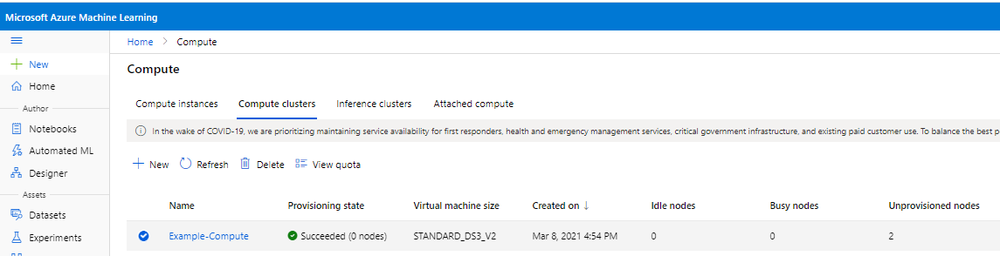

# Create and Remove a Compute Cluster

This document details how to create a compute cluster in Azure ML Studio. 

## What's a compute target?
With Azure Machine Learning, you can train your model on a variety of resources or environments, collectively referred to as compute targets. A compute target can be a local machine or a cloud resource, such as an Azure Machine Learning Compute, Azure HDInsight, or a remote virtual machine. You can also create compute targets for model deployment as described in [Deploy a model as a batch inferencing service](../Documents/Deploy-Batch-Inference-Pipeline.md) and [Deploy a model as a real-time inferencing service](../Documents/Deploy-Real-Time-Service.md).

Compute types include:
* **[Compute Instance](../Documents/Create-Compute-Instance.md):** Development workstations that data scientists can use to work with data and models.
* **[Inference Cluster](../Documents/Create-Inference-Cluster.md):** Deployment targets for predictive services that use your trained models.
* **Compute Cluster:** Scalable clusters of virtual machines for on-demand processing of experiment code.
* **[Attached Compute](../Documents/Create-Attached-Compute.md):** Links to other Azure compute resources, such as Virtual Machines or Azure Databricks clusters.

### What is a Compute Cluster?
Azure Machine Learning compute cluster is a managed-compute infrastructure that allows you to easily create a single or multi-node compute. The compute is created within your workspace region as a resource that can be shared with other users in your workspace. The compute scales up automatically when a job is submitted and can be put in an Azure Virtual Network. The compute executes in a containerized environment and packages your model dependencies in a Docker container. You can use Azure Machine Learning compute cluster to distribute a training or batch inference process across a cluster of CPU or GPU compute nodes in the cloud.  

Compute clusters can run jobs securely in a virtual network environment, without requiring enterprises to open up SSH ports. The job executes in a containerized environment and packages your model dependencies in a Docker container.

### View compute targets

1. Navigate to [Azure Machine Learning studio](https://ml.azure.com/).
2. Under **Manage**, select **Compute**, you will see four kinds of compute resources.

### Create a Compute Cluster

1. Select **Compute Cluster**.

2. If you have no Compute Clusters select **Create** in the middle of the page.
3. If you see a list of Compute Clusters, select **+New** above the list.

4. Select as appropriate for your requirements. Typically you can select as shown below:
   * **Region**: Should be the same region as your studio to avoid latency
   * **Virtual machine priority**: Dedicated- Low priority virtual machines are cheaper but don't guarantee the compute nodes. Your job may be preempted.
   * **Virtual machine type**: Select CPU for general use unless you know your code will use GPU (example for training deep learning models
   * **Virtual machine size**: *Standard_DS3_v2* if you want to run AutoML runs and pipeline runs select Standard_DS3_v2. Select a compute with higher RAM if you are training on large datasets or want to do real-time inferencing, etc.

  * **Compute name**: *enter a unique name*
        
        Naming rules:
        * Name is required and must be between 3 to 24 characters long.
        * Valid characters are upper and lower case letters, digits, and the - character.
        * Name must start with a letter
        * Name needs to be unique across all existing computes within an Azure region. You will see an alert if the name you choose is not unique
        * If - character is used, then it needs to be followed by at least one letter later in the name

  * **Minimum number of nodes**: Minimum number of nodes that you want to provision. If you want a dedicated number of nodes, set that count here. Save money by setting the minimum to 0, so you won't pay for any nodes when the cluster is idle.

  * **Maximum number of nodes**: Maximum number of nodes that you want to provision. The compute will autoscale to a maximum of this node count when a job is submitted.
  * **Idle seconds before scale down**: Adjust this number to the number of idle minutes before the cluster scales down to the minimum node count.
  * **Enable SSH access**: Unselected (you can use this to enable direct access to the virtual machine using an SSH client)
  * **Advanced settings**: Optional. Note the following settings, but do not select them unless you think you require them:
    *  **Enable virtual network**: Unselected (you would typically use this in an enterprise environment to enhance network security)
    * **Assign a managed identity**: Unselected (authenticate access to Azure resources without including credentials in your code).

5. Wait for the compute cluster to start and its **Provisioning state** to change to Succeeded.
 

## Delete a Compute Cluster

When you no longer intend to use your compute cluster you can delete it as shown below: 

* Select the Compute Cluster you want to delete.

* Click **Delete**.

* Confirm you want to delete your compute cluster.
