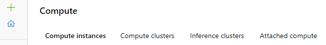
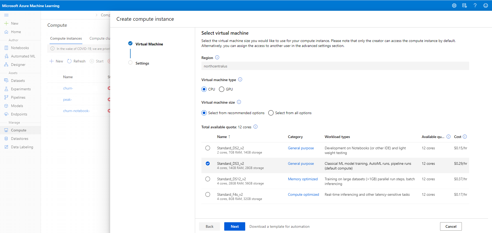
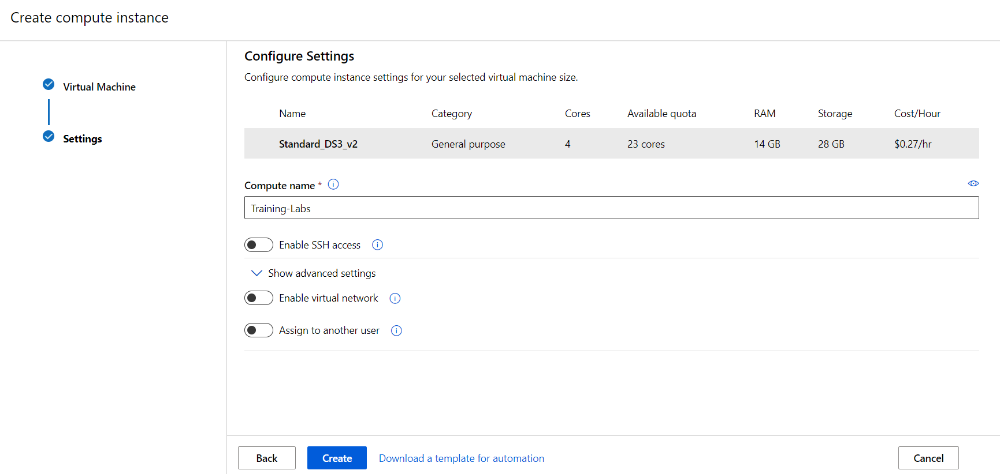
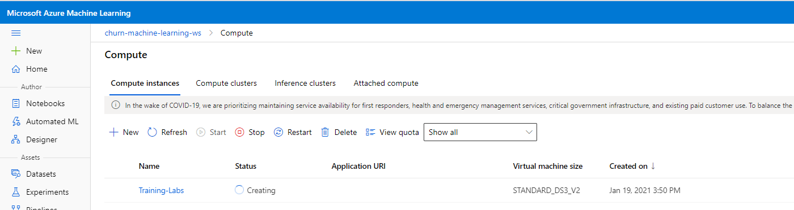
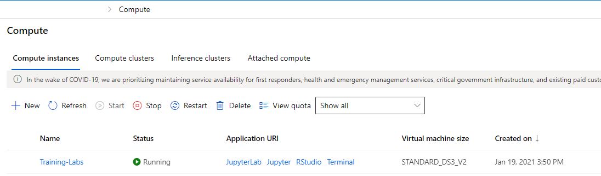

# Create a Compute Instance

One of the benefits of Azure Machine Learning is the ability to create cloud-based compute (*Compute Instances*) in a workspace to provide a development environment that is managed with all of the other assets in the workspace. These compute instances enable you to run experiments and training scripts at scale.

1. In Azure Machine Learning studio, view the Compute page. This is where you’ll manage compute resources for your data science activities. There are four kinds of compute resource you can create:

* **Compute instances:** Development workstations that data scientists can use to work with data and models.
* **Compute clusters:**  Scalable clusters of virtual machines for on-demand processing of experiment code.
* **Inference clusters:** Deployment targets for predictive services that use your trained models.
* **Attached compute:** Links to other Azure compute resources, such as Virtual Machines or Azure Databricks clusters.

For most scenarios a compute instance is enough for developing and testing code.  As a development environment, *a compute instance cannot, however, be shared with other users in your workspace—each individual will have to create their own compute instance.* 

2. On the **Compute instances** tab, add a new compute instance with the following settings. You’ll use this as a workstation to run code in notebooks.

* **Region:** *It's the same region as your studio to avoid latency*
* **Virtual machine type:** Select *CPU* for general use unless you know your code will use GPU (example for training deep learning models
* **Virtual machine size:** *Standard_DS2_v2* if you want to run AutoML runs and pipeline runs select *Standard_DS3_v2*. Select a compute with higher RAM if you are training on large datasets or want to do real-time inferencing, etc.  

* **Compute name:** *enter a unique name* 

        Naming rules:
           * Compute instance name must be between 3 to 24 characters long. 
           * Valid characters are upper and lower case letters, digits, and the - character.
           * Compute name must not end with '-' or contain '-' followed by numbers. '-' needs to be followed by at least one letter. 
           
* **Enable SSH access:** Unselected (you can use this to enable direct access to the virtual machine using an SSH client)
* **Show advanced settings:** Note the following settings, but do not select them unless you think you requore them:
    * **Enable virtual network:** Unselected (you would typically use this in an enterprise environment to enhance network security)
    * **Assign to another user:** Unselected (you can use this to assign a compute instance to another data scientist, as stated before, *a compute instance cannot be shared with other users in your workspace—each individual will have to create their own compute instance.*, this option gives the ability of creating a compute instance for someone else but then only that person will be able to use it)
    

  
3. Wait for the compute instance to start and its status to change to **Running**.

**Note:** Creating a Compute Cluster or an Inference Cluster is a very similar process, therefore we believe there isn't the need to specify those in this tutorial. The concepts are similar to the Compute Instance shown above.

## Stop Compute Instance

**When you are done with using your compute instance for now shut down your compute instance to avoid incurring unnecessary charges in your Azure subscription.**

To stop your compute instance please follow the steps provided in:

* [Stop a Compute Instance](../Documents/Stop-Compute-Instance.md)

_Source: https://docs.microsoft.com/en-us/azure/machine-learning/how-to-create-manage-compute-instance?tabs=azure-studio_
