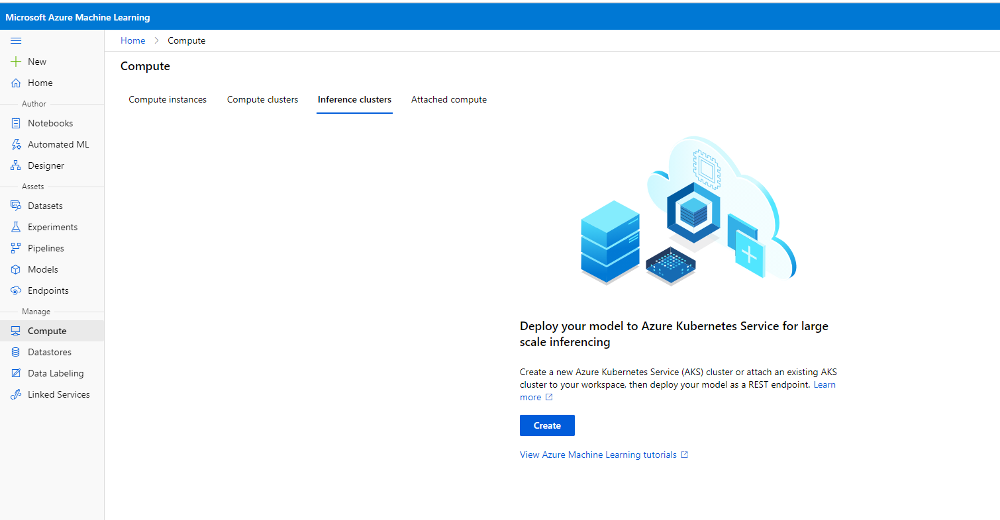
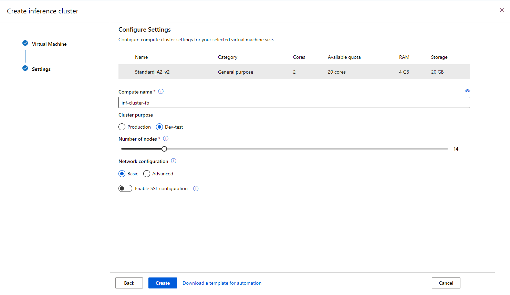
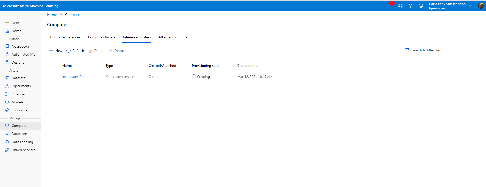
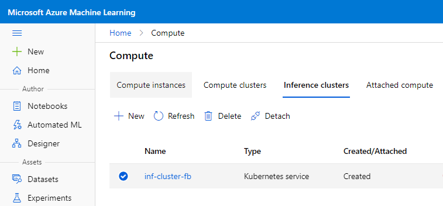

# Create and Remove an Inference Cluster

This document details how to create an inference cluster in Azure ML Studio.

## What's a compute target?

With Azure Machine Learning, you can train your model on a variety of resources or environments, collectively referred to as compute targets. A compute target can be a local machine or a cloud resource, such as an Azure Machine Learning Compute, Azure HDInsight, or a remote virtual machine. You can also create compute targets for model deployment as described in Deploy a model as a batch inferencing service and Deploy a model as a real-time inferencing service.

Compute types include:.

* [Compute instance](../Documents/Create-Compute-Instance.md): Development workstations that data scientists can use to work with data and models.
* **Inference Cluster**: Deployment targets for predictive services that use your trained models.
* [Compute Cluster](../Documents/Create-Compute-Cluster.md): Scalable clusters of virtual machines for on-demand processing of experiment code.
* **Attached compute**: Links to other Azure compute resources, such as Virtual Machines or Azure Databricks clusters.

## Inference Clusters

**Note** Using Azure Kubernetes Service with Azure Machine Learning has multiple configuration options. Some scenarios, such as networking, require additional setup and configuration. For more information on using AKS with Azure ML, see [Create and attach an Azure Kubernetes Service cluster](https://docs.microsoft.com/en-us/azure/machine-learning/how-to-create-attach-kubernetes.

### View compute targets

1. Navigate to [Azure Machine Learning studio](https://ml.azure.com/).
2. Under **Manage**, select **Compute**, you will see four kinds of compute resources.

## Create an Inference Cluster

1. Select **Inference Clusters** 

2. If you have no Inference Clusters, select **Create** in the middle of the page.
3. If you see a list of Inference Clusters, select **+New** above the list.

4. Select as appropriate for your requirements. Typically you can select as shown below to create the cluster. 

* **Kubernetes Service**: Select **Create New** and fill out the rest of the form. Or select **Use existing** and then select an existing AKS cluster from your subscription.
* **Compute name**: *enter a unique name*
        
        Naming rules:
        * Name is required and must be between 2 to 16 characters long.
        * Valid characters are upper and lower case letters, digits, and the - character.
        * Name must start with a letter
        * Name needs to be unique across all existing computes within an Azure region. You will see an alert if the name you choose is not unique
        * If - character is used, then it needs to be followed by at least one letter later in the name

* **Region**: Should be the same region as your studio to avoid latency
* **Virtual machine size**: Think about the size of your data, what types of machine learning models, how quickly you want it to run etc. you will be using etc. Supported virtual machine sizes might be restricted in your region. Check the [availability list](https://azure.microsoft.com/global-infrastructure/services/?products=virtual-machines).
*  **Cluster purpose** : Select **Production** or **Dev-test**. 
*  **Number of nodes**: The number of nodes multiplied by the virtual machine’s number of cores (vCPUs) must be greater than or equal to 12.
* **Network configuration**: Select **Advanced** to create the compute within an existing virtual network. For more information about AKS in a virtual network, see [Network isolation during training and inference with private endpoints and virtual networks](https://docs.microsoft.com/en-us/azure/machine-learning/how-to-secure-inferencing-vnet).
*  **Enable SSL configuration**: Use this to configure SSL certificate on the compute

5. Select **Create** and wait for its **Provisioning state** to change to Succeeded.

## Delete an Inference Cluster

When you no longer intend to use your Inference cluster you can delete it as shown below:

* Select the Inference Cluster you want to delete.

* Click **Delete**.

* Confirm you want to delete your Inference cluster.

