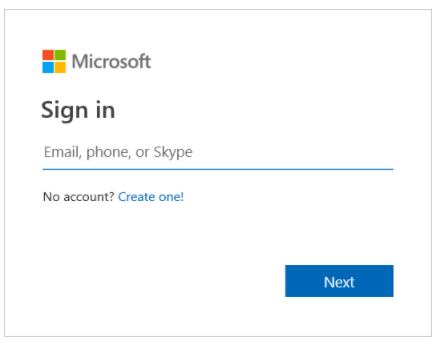
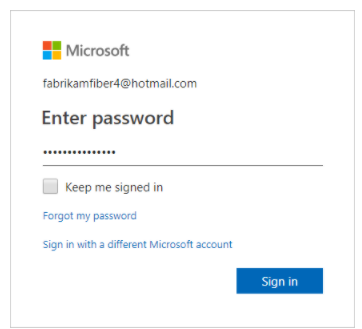
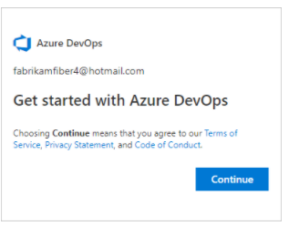
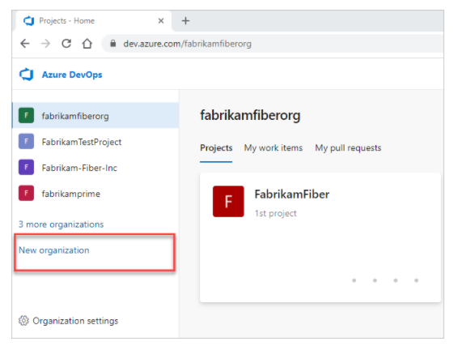
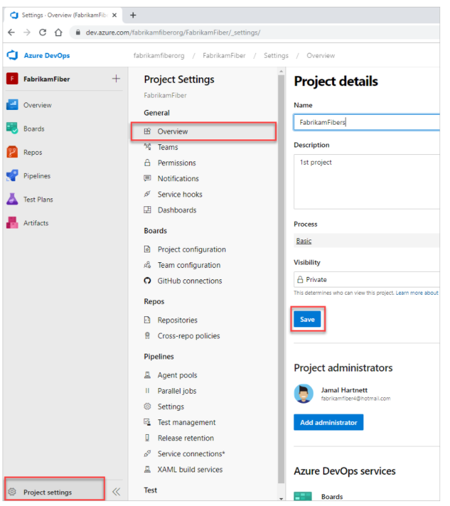
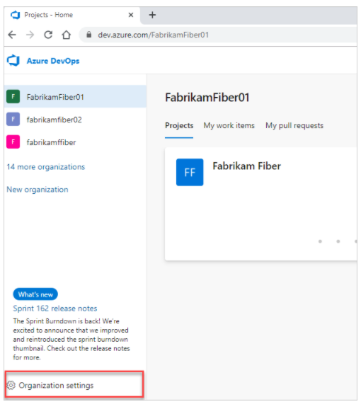
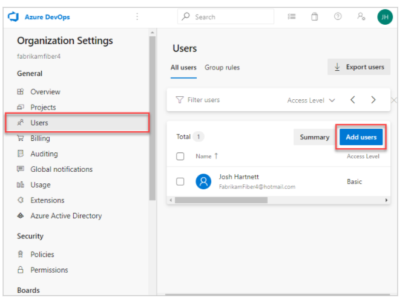
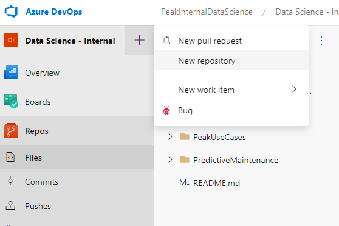
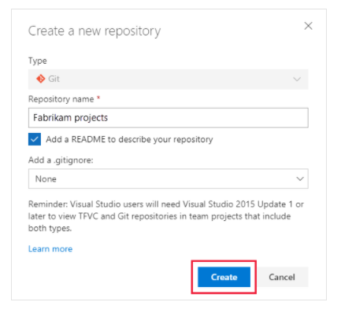

# Create a project in Azure DevOps and establish a repo for source code

This document describes how to use Azure DevOps to create a project and establish a repository (repo) for source code. 

You can manage and structure each project to support your business needs. Each project you create provides boundaries to isolate data from other projects. To learn more about projects and when to create one, see [About projects and scaling your organization](https://docs.microsoft.com/en-us/azure/devops/organizations/projects/about-projects?view=azure-devops). The process can be broken down into three subsections:

* Sign up, sign in to Azure DevOps
* Creating a project in Azure DevOps
* Creating a new Git repo in your project

## Sign up with a personal Microsoft account

1) Select the sign-up link for [Azure DevOps](https://azure.microsoft.com/services/devops/).

2. Enter your email address, phone number or Skype ID for your Microsoft account. If you're a Visual Studio subscriber and you get Azure DevOps as a benefit, use the Microsoft account associated with your subscription. Select **Next**.

3. Enter your password and select **Sign in**.

4. To get started with Azure DevOps, select **Continue**.

An organization is created based on the account you used to sign in. Sign in to your organization at any time, `(https://dev.azure.com/{yourorganization})`. According to Microsoft an organization is used to connect groups of related projects, helping to scale up an enterprise.

You can rename and delete your organization or change its location. To learn more, see the following articles:

* [Rename an organization](https://docs.microsoft.com/en-us/azure/devops/organizations/accounts/rename-organization?view=azure-devops)
* [Change the location of your organization](https://docs.microsoft.com/en-us/azure/devops/organizations/accounts/change-organization-location?view=azure-devops)

If you signed in with an existing Microsoft account, your next step is to [Create a Project](#CreateProject-1)). If you signed in with a newly created Microsoft account, then your project is automatically created and named after your account name. To learn more about managing projects, see [Manage projects](https://docs.microsoft.com/en-us/azure/devops/organizations/projects/about-projects?view=azure-devops).

## Create a Project

1. Sign in to your organization (https://dev.azure.com/{yourorganization}), and then open the project that you want to rename. If you click on an organization on the left side of the page you will see your newly created project on the right under the heading **Projects**.

2. Select **Project settings > Overview**, and then enter a new **Name**, **Description** and select **Save**.

**Note	—**Your project name can't contain special characters, such as `/ : \ ~ & % ; @ ' " ? < > | # $ * } { , + = [ ]`, can't begin with an underscore, can't begin or end with a period and must be 64 or fewer characters. Enter an optional description. Choose the visibility, initial source control type and work item process. You can also change the default setting on **Visibility** and [Process](https://docs.microsoft.com/en-us/azure/devops/boards/work-items/guidance/choose-process?view=azure-devops). Leave the **Process** as **Agile** but if you want to learn more about this see [here](https://docs.microsoft.com/en-us/azure/devops/boards/work-items/guidance/choose-process?view=azure-devops)

Select visibility of either public or private. When you choose public visibility, anyone on the internet can view your project. With private visibility, only people who you give access to can view your project. For more information about public projects, see [Create a public project in your organization](https://docs.microsoft.com/en-us/azure/devops/organizations/public/create-public-project?view=azure-devops). If the **Public** option isn't available, you need to change the policy.

### Invite team members

Give team members access to your organization by adding their email addresses or GitHub usernames to your organization. For GitHub user invitations, ensure you've [enabled the policy, Invite GitHub users](https://docs.microsoft.com/en-us/azure/devops/user-guide/sign-up-invite-teammates?view=azure-devops#enable-github-invitations) in **Organization settings > Policies tab**.

1. If you haven't already, sign in to your organization `(https://dev.azure.com/{yourorganization})`.

2. Select the toggle at the bottom for Organization settings Organization settings.

3. Select **Users > Add new users**.

4. Enter the following information:

* **Users**: Enter the email addresses (Microsoft accounts) or GitHub usernames for the users. You can add several email addresses by separating them with a semicolon (;). An email address appears in red when it's accepted.
* **Access level**: Leave the access level as **Basic** for users who will contribute to the code base. To learn more, see [About access levels](https://docs.microsoft.com/en-us/azure/devops/organizations/security/access-levels?view=azure-devops).
* **Add to project**: Select the project you want to add them to.
* **DevOps Groups**: Leave as **Project Contributors**, the default security group for users who will contribute to your project. To learn more, see [Default permissions and access assignments](https://docs.microsoft.com/en-us/azure/devops/organizations/security/permissions-access?view=azure-devops).

5. When you're done, select **Add** to complete your invitation.

For more information about managing users and organization access, see [Add organization users for Azure DevOps](https://docs.microsoft.com/en-us/azure/devops/organizations/accounts/add-organization-users?view=azure-devops).

## Add a repository to your project

From the admin context of the web portal, you can add additional repositories to a project. We are going to be adding a Git (distriubuted) repository for our data science work. Keep in mind that you can create as many Git repositories as you need. 

1. Select **New repository**.

2. Name the repository and select **Create**.

You have now created a project, added users to your project amd added a Git repo to store and version control your work.
