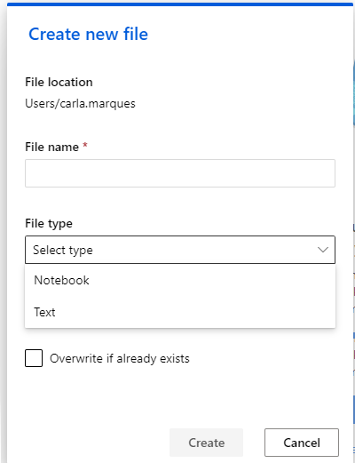
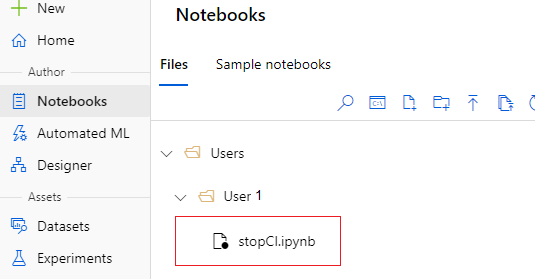
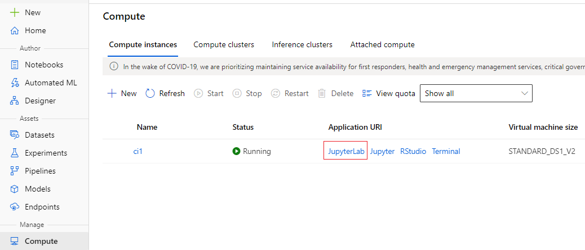
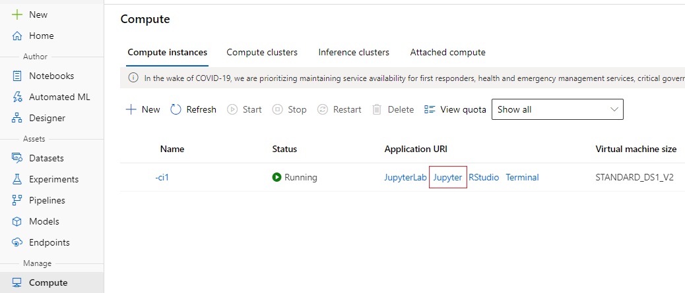
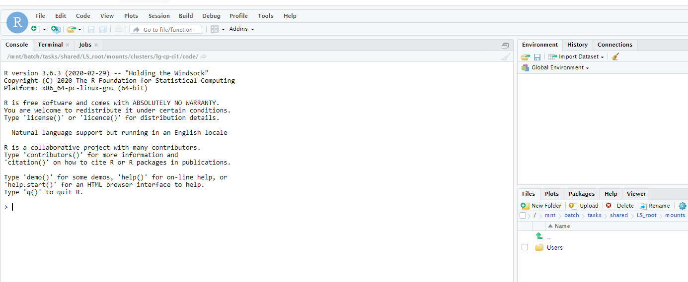
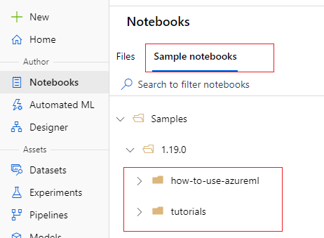

# Creating and Running a Python or R Notebook

There are a few possible ways of creating and running python or R notebooks in Azure Machine Learning studio:

1. Running those directly in the portal (this supports both Python and R)
2. Using the JupyterLab option provided on the compute instance (for python only)
3. Using the Jupyter option provided on the compute instance (for python only)
4. Using the RStudio option provided on the compute instance (for R only)

The next sections will explain how to use each of the options described above.

### Before you start

If you have not already done so, create a [compute instance](../Documents/Create-Compute-Instance.md).

## Notebooks directly in your Azure Machine Learning studio (Python or R)
In your Azure Machine Learning studio, create a new Jupyter notebook and start working. The newly created notebook is stored in the default studio storage. This notebook can be shared with anyone with access to the studio.

To create a new notebook:

1. Sign in to [Azure Machine Learning studio](https://ml.azure.com/).

2. On the left side, select Notebooks.

3. Select the icon **Create new file** which is under the Files section.

4. Name the file. For Jupyter notebook Files, select Notebook as the file type (you can also create text files. Select Text as the file type and add the extension to the name (for example, myfile.py or myfile.txt)). Select a file directory and finally select Create.

5. Once the file is created, it will appear under your user name.

6. Double click on the file name to open it and you can start your code (select the type of language as it's explained bellow).

**Notes**
  * On the top level, you see see the option **Compute** where in order to execute the code you need to have your compute instance up and running.
  * Also, on the top level you can see the type of language you are going to use, you can choose between Python 3, R or Python 3.6 - Azure ML (this last one will include Azure ML SDKs).
  
 
 
_Language Options_

7. You can also upload folders and files, including notebooks, with the tools at the top of the Notebooks page. 

## Notebooks using the JupyterLab option provided on the compute instance (for python only)
You can access JupyterLab from 2 options:

### Option 1: Using the notebook option from studio

1. While in the notebook pane in studio (the one explained above), you can open JupyterLab editor by selecting it in the Editors option.

2. Once you click on that option, you will be redirected to JupyterLab embebed in Azure ML Studio and which is installed in your compute instance (everything is done by Azure, the user can just select the editor and start working with it). If you haven't done yet, you will be prompted to add your credentials.

3. Once the right credentials are provided, you will be redirected to JupyterLab Editor.

4. You can start developing your code.

### Option 2: Using the compute instance option from studio

1. On the **Compute instances** tab, select your compute instance and click on JupyterLab 

2. Once you click on that option, you will be redirected to JupyterLab embebed in Azure ML Studio and which is installed in your compute instance (everything is done by Azure, the user can just select the editor and start working with it). If you haven't done yet, you will be prompted to add your credentials.

3. Once the right credentials are provided, you will be redirected to JupyterLab Editor.

4. You can start developing your code.

## Notebooks using the Jupyter option provided on the compute instance (for python only)
You can access Jupyter from 2 options:

### Option 1: Using the notebook option from studio

1. While in the notebook pane in studio (the one explained above), you can open Jypyter editor by selecting it in the Editors option.

2. Once you click on that option, you will be redirected to Jupyter editor embebed in Azure ML Studio and which is installed in your compute instance (everything is done by Azure, the user can just select the editor and start working with it). If you haven't done yet, you will be prompted to add your credentials.

3. Once the right credentials are provided, you will be redirected to Jupyter Editor. First you need to select the folder where your file is and then double click on the file name in order to start editing it.

4. You can start developing your code.

### Option 2: Using the compute instance option from studio

1. On the **Compute instances** tab, select your compute instance and click on Jupyter. 

2. Once you click on that option, you will be redirected to Jupyter embebed in Azure ML Studio and which is installed in your compute instance (everything is done by Azure, the user can just select the editor and start working with it). If you haven't done yet, you will be prompted to add your credentials.

3. Once the right credentials are provided, you will be redirected to Jupyter Editor. First you need to select the folder where your file is and then double click on the file name in order to start editing it.

4. You can start developing your code.

## Notebooks using the RStudio option provided on the compute instance (for R only)
1. On the **Compute instances** tab, select your compute instance and click on RStudio 

2. Once you click on that option, you will be redirected to RStudio embebed in Azure ML Studio and which is installed in your compute instance (everything is done by Azure, the user can just select the editor and start working with it). If you haven't done yet, you will be prompted to add your credentials.

3. Once the right credentials are provided, you will be redirected to Jupyter Editor. First you need to select the folder where your file is and then double click on the file name in order to start editing it.

4. You can start developing your code.

## Clone samples
Your studio contains a Samples folder with notebooks designed to help you explore the SDK and serve as examples for your own machine learning projects. You can clone these notebooks into your own folder on your storage container.

Also in this tutorial, we provide some python templates that can also be cloned. Please check [JupyterLab notebook templates](labs) and [Cloning and Running a Notebook](../Documents/Clone-and-Run-a-Notebook.md).

## Use files from Git and version my files
You can access all Git operations by using a terminal window. All Git files and folders will be stored in your workspace file system. For more details check: [Integrate with Git](../Documents/Integrate-with-Git.md).
