# Data Labeling with Azure Machine Learning Studio

If you want to train a machine learning model to classify images, you need hundreds or even thousands of images that are correctly labeled. Azure Machine Learning helps you manage the progress of your private team of domain experts as they label ((also referred to as tagging) your data.

In this tutorial we will explain you how to:

* Create a multi-class image labeling project.
* Label your data. Either you or your labelers can perform this task.
* Complete the project by reviewing and exporting the data.

## Start a labeling project

1 - Sign in to [Azure Machine Learning studio](https://ml.azure.com/).

2 - Select your subscription and the workspace you created.

3 - Create a datastore (follow the steps described in [Create Datastores](../Documents/Work-With-Data-in-Azure-ML.md#Create-Datastores)).

And fill with the following settings:

|Field	|Description|
|-------|-----------|
|Datastore name	|Give the datastore a name. Here we use data_labeling_tutorial.|
|Datastore type	|Select the type of storage. Here we use Azure Blob Storage, the preferred storage for images.|
|Account selection method|	Select Enter manually.|
|URL|	https://azureopendatastorage.blob.core.windows.net/openimagescontainer|
|Authentication type| Select SAS token.|
|Account key|	?sv=2019-02-02&ss=bfqt&srt=sco&sp=rl&se=2025-03-25T04:51:17Z&st=2020-03-24T20:51:17Z&spr=https&sig=7D7SdkQidGT6pURQ9R4SUzWGxZ%2BHlNPCstoSRRVg8OY%3D|

**Note:** This example is taken from a [Microsoft Tutorial](https://docs.microsoft.com/en-gb/azure/machine-learning/tutorial-labeling#start-a-labeling-project), it uses images of cats and dogs. Since each image is either a cat or a dog, this will be a multi-class labeling project.

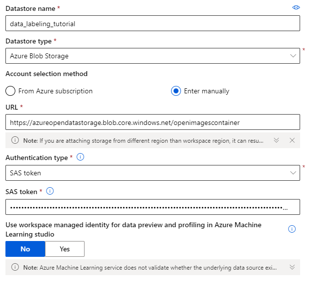

## Create a labeling project
Now that you have access to the data you want to have labeled, create your labeling project.

1 - Select **Data Labeling** on the left pane under Manage.

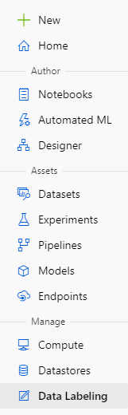

2 - At the top of the page, select Projects and then select **+ Add project**. 

If it's the first time you are adding a project then instead of **+ Add project** you need to select **Create**.

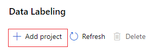

Use the following input for the Project details form:

|Field|	Description|
|------|----------|
|Project name|	Give your project a name. Here we'll use multi-class-cats-n-dogs.|
|Labeling task type|	Select Image Classification Multi-class.|

Select **Next** to continue creating the project.

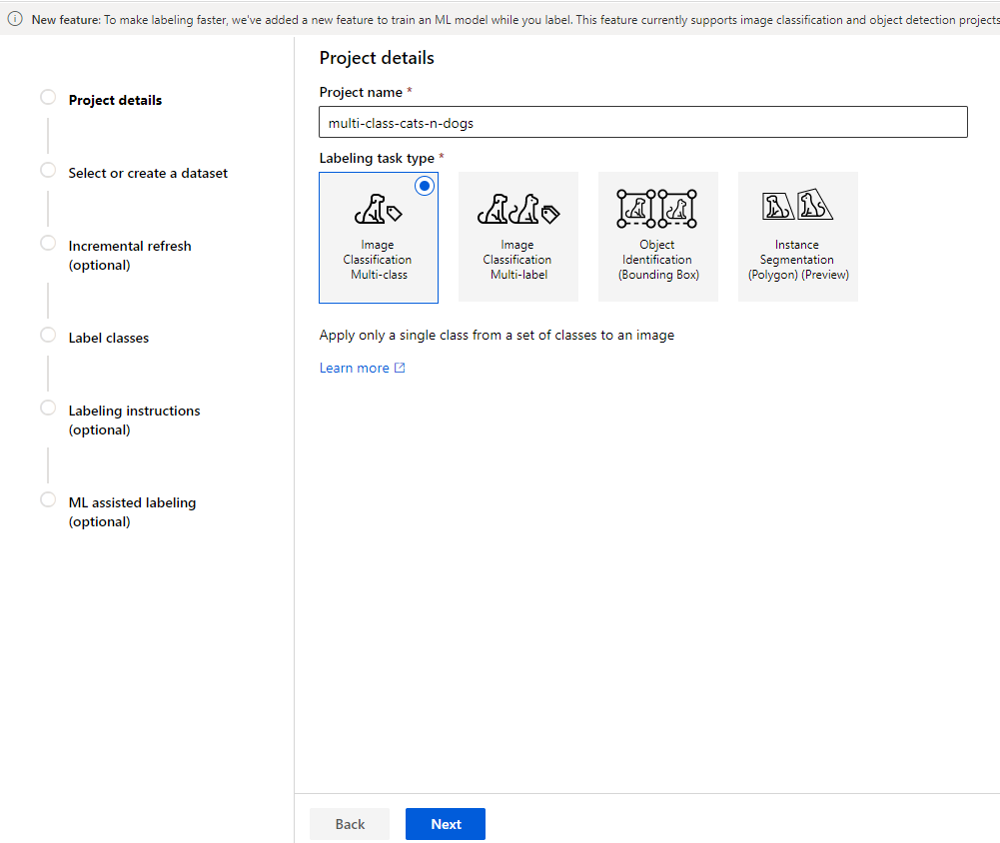

3 - On the **Select or create a dataset** form, select the second choice: **+ Create a dataset**, then select the link **From datastore**.

Use the following input for the Create dataset from datastore form:

* On the Basic info form, add a name. Add a description if you wish. Then select Next.
* On the Datastore selection form, select Previously created datastore, then click on the datastore name and select Select datastore.
* On the next page, verify that the currently selected datastore is correct. If not, select Previously created datastore and repeat the prior step.
* Next, still on the Datastore selection form, select **Browse** and then select MultiClass - DogsCats. Select **Save** to use /MultiClass - DogsCats as the path.
* Select Next to confirm details and then **Create** to create the dataset.
* Select the circle next to the dataset name in the list, for example cat-n-dogs.
* Select **Next** to continue creating the project.

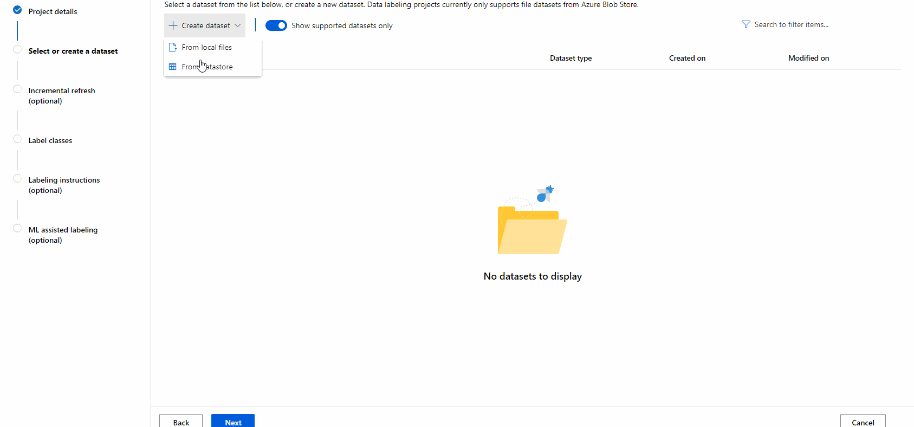

4 - On the **Incremental refresh** form select _Enable incremental refresh_ If you plan to add new images to your dataset, incremental refresh will find these new images and add them to your project. When you enable this feature, the project will periodically check for new images. 

For the purposr of this tutorial we will leave this feature unchecked.

Select **Next** to continue.

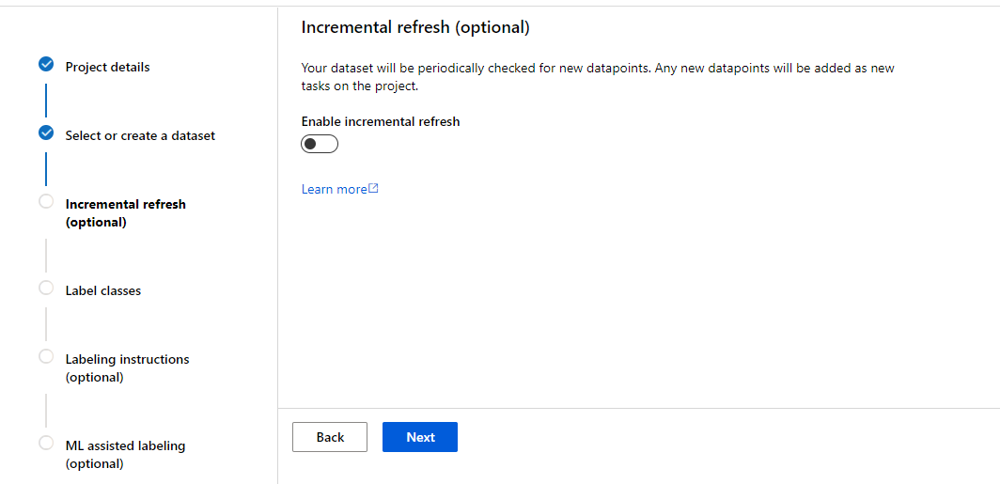

5 - On the **Label classes** form, type a label name, then select **+Add label** to type the next label. For this example, the labels are Cat, Dog and Uncertain.

Select **Next** when all the labels have been added.

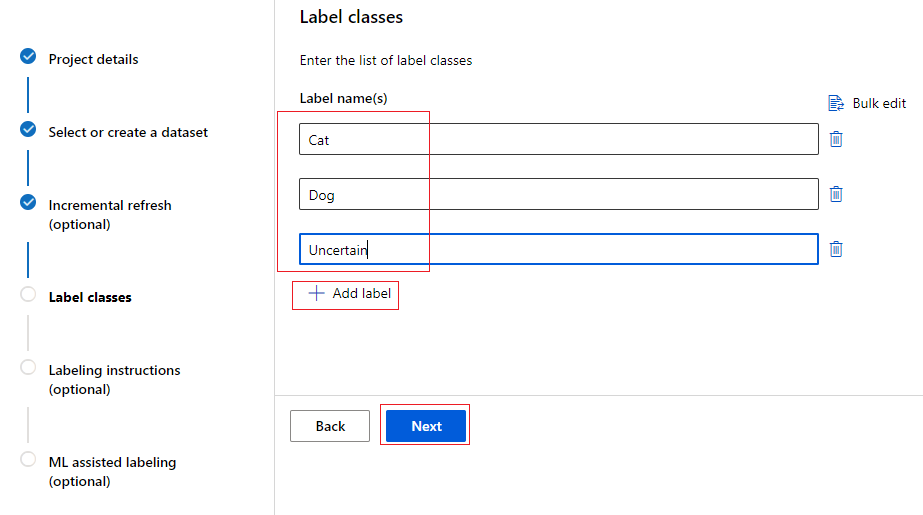

6 - On the **Labeling instructions** form (optional), you can provide a link to a website that provides detailed instructions for your labelers. We'll leave it blank for this tutorial. You can also add a short description of the task directly on the form. Type Labeling tutorial - Cats & Dogs.

Select **Next**.

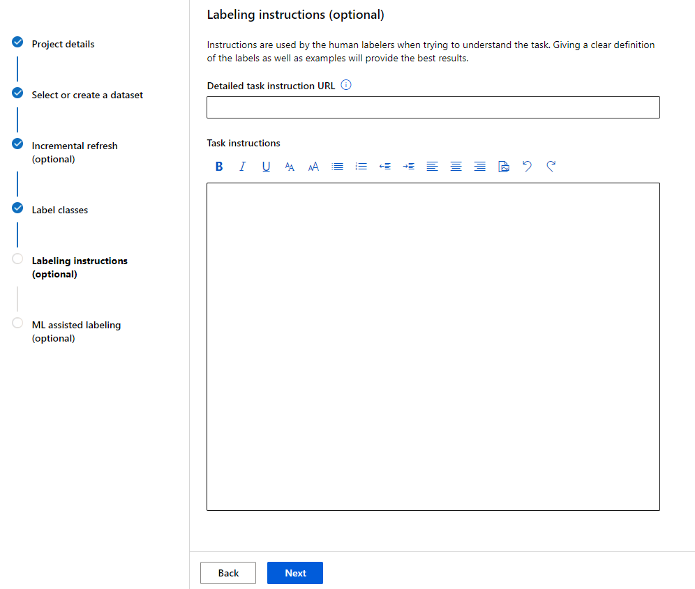

7 - In the **ML assisted labeling** section (also optional), leave the checkbox unchecked. ML assisted labeling requires more data than what we will be using in this tutorial.

Finally, select **Create project**.

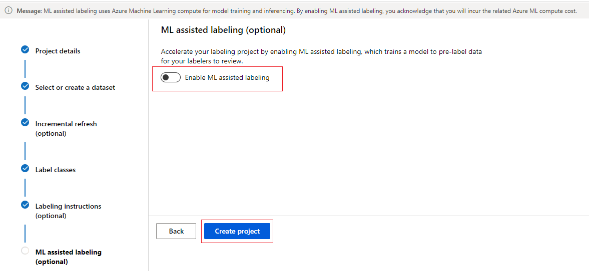

## Start a labeling
Since we've configured a data labeling project we can know start to add labels to the data.

1 - Select **Label data edit** link for the project you want to start labeling.

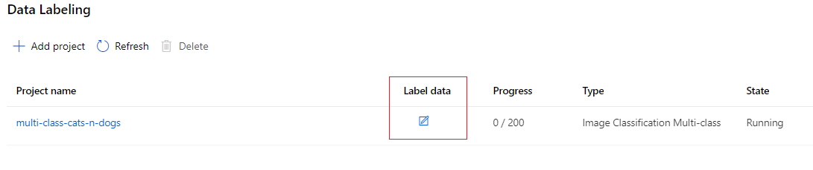

2 - Read the instructions, then select Tasks.

3 - Select a **thumbnail image** on the right to display the number of images you wish to label in one go. You must label all these images before you can move on. Only switch layouts when you have a fresh page of unlabeled data. Switching layouts clears the page's in-progress tagging work.

4 - Select one or more images, then select a tag to apply to the selection. The tag appears below the image. Continue to select and tag all images on the page. To select all the displayed images simultaneously, select Select all. Select at least one image to apply a tag.

5 - Once all the images on the page are tagged, select **Submit** to submit these labels.

## Complete the project
Once all the labeling is done another co-worker may want to review the work of the labeler.

### Review labeled data

1 - In Machine Learning studio, select **Data labeling** on the left-hand side to find your project.

2 - Select the **project name** link.

The Dashboard shows you the progress of your project.

At the top of the page, select **Data**.

On the left side, select *Labeled data* to see your tagged images.

5 - When you disagree with a label, select the image and then select **Reject** at the bottom of the page. The tags will be removed and the image is put back in the queue of unlabeled images.

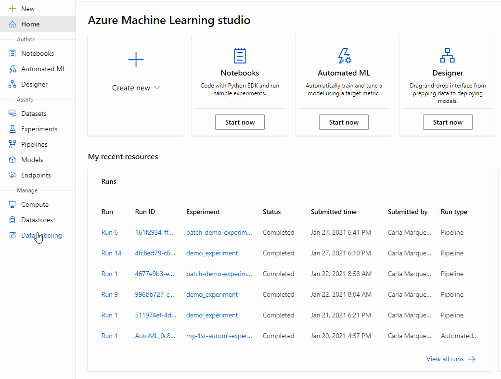

### Export labeled data
Label data can be exported for Machine Learning experimentation at any time. Users often export multiple times and train different models, rather than wait for all the images to be labeled.

Image labels can be exported in [COCO format](https://cocodataset.org/#format-data) or as an Azure Machine Learning dataset. The dataset format makes it easy to use for training in Azure Machine Learning.

1 - In Machine Learning studio, select **Data labeling** on the left-hand side to find your project.

2 - Select the **project name** link.

3 - Select **Export** and choose _Export as Azure ML Dataset_.

The status of the export appears just below the Export button.

4 - Once the labels are successfully exported, select Datasets on the left side to view the results.

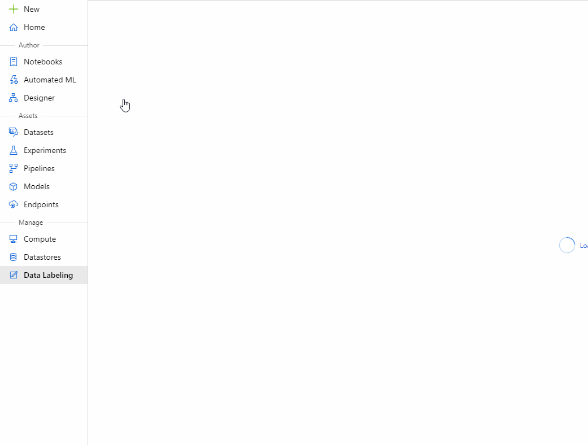

*Source: https://docs.microsoft.com/en-gb/azure/machine-learning/tutorial-labeling*
