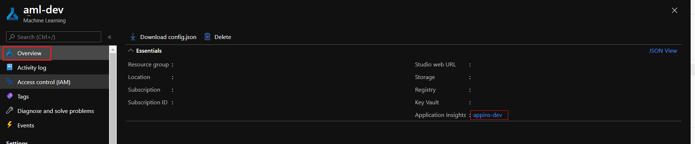

# Detect data drift on datasets

## What is data drift?
The variety of data sources and quick innovation in advanced analytics, data science, AI and machine learning has fundamentally changed the scale and pace of data integration. The added pressure to make decisions quickly in unprecedented times means that your organization is more dependent on fresh, reliable data than ever before. 

Data drift is unexpected and undocumented changes to data structure, semantics and infrastructure. Data drift breaks processes and corrupts data but can also reveal new opportunities for data use.

Data drift is one of the top reasons model accuracy degrades over time. For machine learning models, data drift is the change in model input data that leads to model performance degradation. Monitoring data drift helps detect these model performance issues.

Causes of data drift include:

* Process changes. Example: a sensor being replaced that changes the units of measurement from inches to centimeters.
* Data quality issues
* Natural drift in the data. Example:mean temperature changing with the seasons.
* Change in relation between features.

Azure Machine Learning simplifies drift detection by computing a single metric, abstracting the complexity of datasets being compared. These datasets may have hundreds of features and a lot of rows. But once drift is detected, you drill down into which features are causing the drift. You then inspect feature level metrics to debug and isolate the root cause for the drift. This top down approach makes it easy to monitor data instead of traditional rules-based techniques. 

Azure Machine Learning, uses **dataset monitors** to detect and alert for data drift:

* Analyze drift in the data to understand how it changes over time.
* Monitor model data for differences between training and serving datasets. 
* Monitor new data for differences between any baseline and target dataset.
* Profile features in data to track how statistical properties change over time.
* Set up alerts on data drift for early warnings to potential issues. Custom alerting can be set up on all metrics generated by the monitor through Azure Application Insights.

## Dataset monitors
Dataset monitors depend on the following Azure services.

|Azure service	|Description|
|------------|-----------|
|Dataset	| Drift uses Machine Learning datasets to retrieve training data and compare data for model training. Generating profile of data is used to generate some of the reported metrics such as min, max, distinct values, distinct values count.|
|Azureml pipeline and compute|	The drift calculation job is hosted in azureml pipeline. The job is triggered on demand or by schedule to run on a compute configured at drift monitor creation time.|
|Application insights|	Drift emits metrics to Application Insights belonging to the machine learning workspace.|
|Azure blob storage|	Drift emits metrics in json format to Azure blob storage.|

### Baseline and target datasets
The first step to define a Dataset Monitor is to define:

* Baseline dataset - usually the training dataset for a model.
* Target dataset - usually model input data - is compared over time to your baseline dataset. This comparison means that your target dataset must have a timestamp column specified.

The monitor will compare the baseline and target datasets.

#### Create target dataset
The target dataset needs the timeseries trait set on it by specifying the timestamp column either from a column in the data or a virtual column derived from the path pattern of the files. 

_Creating a target Dataset using Azure Machine Learning Studio Notebooks with Python_

The Dataset class with_timestamp_columns() method defines the time stamp column for the dataset.

```
from azureml.core import Workspace, Dataset, Datastore

# get workspace object
ws = Workspace.from_config()

# get datastore object 
dstore = Datastore.get(ws, 'your datastore name')

# specify datastore paths
dstore_paths = [(dstore, 'weather/*/*/*/*/data.parquet')]

# specify partition format
partition_format = 'weather/{state}/{date:yyyy/MM/dd}/data.parquet'

# create the Tabular dataset with 'state' and 'date' as virtual columns 
dset = Dataset.Tabular.from_parquet_files(path=dstore_paths, partition_format=partition_format)

# assign the timestamp attribute to a real or virtual column in the dataset
dset = dset.with_timestamp_columns('date')

# register the dataset as the target dataset
dset = dset.register(ws, 'target')
```

_Creating a Target Dataset using Azure Machine Learning Studio Create Dataset UI_

If you create your dataset using Azure Machine Learning studio, ensure the path to your data contains timestamp information, include all subfolders with data, and set the partition format.

In the following example, all data under the subfolder NoaaIsdFlorida/2019 is taken and the partition format specifies the timestamp's year, month, and day.


In the **Schema** settings, specify the timestamp column from a virtual or real column in the specified dataset:


If your data is partitioned by date, as is the case here, you can also specify the partition_timestamp.


More details on how to create a Dataset using Azure ML Studio Web Portal can be seen [here](../Documents/Work-With-Data-in-Azure-ML-Datasets.md)


#### Create dataset monitor
Create a dataset monitor to detect and alert to data drift on a new dataset.

_Creating a Dataset Monitor using Azure Machine Learning Studio Notebooks with Python_

```
from azureml.core import Workspace, Dataset
from azureml.datadrift import DataDriftDetector
from datetime import datetime

# get the workspace object
ws = Workspace.from_config()

# get the target dataset
dset = Dataset.get_by_name(ws, 'target')

# set the baseline dataset
baseline = target.time_before(datetime(2019, 2, 1))

# set up feature list
features = ['latitude', 'longitude', 'elevation', 'windAngle', 'windSpeed', 'temperature', 'snowDepth', 'stationName', 'countryOrRegion']

# set up data drift detector
monitor = DataDriftDetector.create_from_datasets(ws, 'drift-monitor', baseline, target, 
                                                      compute_target='cpu-cluster', 
                                                      frequency='Week', 
                                                      feature_list=None, 
                                                      drift_threshold=.6, 
                                                      latency=24)

# get data drift detector by name
monitor = DataDriftDetector.get_by_name(ws, 'drift-monitor')

# update data drift detector
monitor = monitor.update(feature_list=features)

# run a backfill for January through May
backfill1 = monitor.backfill(datetime(2019, 1, 1), datetime(2019, 5, 1))

# run a backfill for May through today
backfill1 = monitor.backfill(datetime(2019, 5, 1), datetime.today())

# disable the pipeline schedule for the data drift detector
monitor = monitor.disable_schedule()

# enable the pipeline schedule for the data drift detector
monitor = monitor.enable_schedule()
```

_Creating a Dataset Monitor using Azure Machine Learning Studio Create Dataset UI_

1. Sign in to the [Azure Machine Learning studio](https://ml.azure.com/).

2. Select **Datasets** in the **Assets** section of the left pane.


3. Select **Dataset monitors** and click on the **+ Create monitor**


4. Continue through the wizard by clicking Next.


* Select target dataset. The target dataset is a tabular dataset with timestamp column specified which will be analyzed for data drift. The target dataset must have features in common with the baseline dataset, and should be a timeseries dataset, which new data is appended to. Historical data in the target dataset can be analyzed, or new data can be monitored.

* Select baseline dataset. Select the tabular dataset to be used as the baseline for comparison of the target dataset over time. The baseline dataset must have features in common with the target dataset. Select a time range to use a slice of the target dataset, or specify a separate dataset to use as the baseline.

* Monitor settings. These settings are for the scheduled dataset monitor pipeline, which will be created.


|Setting	|Description	|Comments|
|-----------|------------------|---------|
|Name|	Name of the dataset monitor. Can only contain letters, numbers, dashes, underscore and start with a letter or number. Must be under 36 characters.|Can't be changed after the monitor has been created|
|Features|	List of features that will be analyzed for data drift over time.|Can be changed after the monitor has been created|
|Compute target|	Azure Machine Learning compute target to run the dataset monitor jobs. Needs to be a Compute Cluster.|Can be changed after the monitor has been created|
|Enable|	Enable or disable the schedule on the dataset monitor pipeline|Disable the schedule to analyze historical data with the backfill setting. It can be enabled after the dataset monitor is created.	Can be changed after the monitor has been created|
|Frequency|	The frequency that will be used to schedule the pipeline job and analyze historical data if running a backfill.|Options include day, week or month.	Each run compares data in the target dataset according to the frequency: _Day: Compare most recent complete day in target dataset with baseline_;  _Week: Compare most recent complete week (Monday - Sunday) in target dataset with baseline;_ _Month: Compare most recent complete month in target dataset with baseline_. Can't be changed after the monitor has been created|
|Latency	|Time, in hours, it takes for data to arrive in the dataset.| For instance, if it takes three days for data to arrive, set the latency to 72.	Can't be changed after the dataset monitor is created.|
|Email addresses|	Email addresses for alerting based on breach of the data drift percentage threshold.	|Emails are sent through Azure Monitor.	Can be changed after the monitor has been created|
|Threshold|	Data drift percentage threshold for email alerting.|	Further alerts and events can be set on many other metrics in the Studio's associated Application Insights resource.	Can be changed after the monitor has been created|

After finishing the wizard, the resulting dataset monitor will appear in the list. Select it to go to that monitor's details page.


#### Understand data drift results
On the monitor's detail page shown above you can check the drift results. 
The details displays 3 main sections:

* Summary Section


|Metric	|Description|
|---------|-----------------|
|Drift magnitude|	A percentage of drift between the baseline and target dataset over time. 0 indicates identical datasets and 100 indicates the Azure Machine Learning data drift model can completely tell the two datasets apart.|
|Top drifting features|	Shows the features from the dataset that have drifted the most and are therefore contributing the most to the Drift Magnitude metric.|
|Threshold|	Data Drift magnitude beyond the set threshold will trigger alerts. This can be configured in the monitor settings.|

* Drift magnitude trend


Allows the user to verify how the dataset differs from the target dataset in the specified time period. The closer to 100%, the more the two datasets differ.

* Drift magnitude by features

This will provide insights into the change in the selected feature's distribution, as well as other statistics, over time.

The target dataset is also profiled over time. The statistical distance between the baseline distribution of each feature is compared with the target dataset's over time. Conceptually, this is similar to the data drift magnitude. However this statistical distance is for an individual feature rather than all features. Min, max, and mean are also available.

In the Azure Machine Learning studio, click on a bar in the graph to see the the feature level details for that date. By default, you see the baseline dataset's distribution and the most recent run's distribution of the same feature.


These metrics can also be retrieved in the Python SDK through the `get_metrics()` method on a `DataDriftDetector` object.

_Feature Details_

Scroll down to view details for each individual feature. Select the metric you want to view and use the dropdowns in the chart to select the feature.


Metrics Available:

   * Numeric features:
      * Wasserstein distance
      * Mean value
      * Min value	
      * Max value
   * Categorical features
      * Euclidian distance
      * Unique values

On the chart, select a single date to compare the feature distribution between the target and this date for the displayed feature. For numeric features, this shows two probability distributions. If the feature is numeric, a bar chart is shown.


## Metrics, alerts, and events
Metrics can be queried in the Azure Application Insights resource associated with your machine learning workspace. You have access to all features of Application Insights including set up for custom alert rules and action groups to trigger an action such as, an Email/SMS/Push/Voice or Azure Function. Refer to the complete [Azure Application Insights](https://docs.microsoft.com/en-gb/azure/azure-monitor/app/app-insights-overview) documentation for details.

1. To get started, navigate to the Azure portal and select your workspace's Overview page. The associated Application Insights resource is on the far right:



2. Select Logs (Analytics) under Monitoring on the left pane:


3. The dataset monitor metrics are stored as **customMetrics**, therefore select **Schema --> Active --> customMetrics** and write and run a query:


4. After identifying metrics to set up alert rules, create a new alert rule:


5. An existing action group can be used or a new one can be created to define the action to be taken when the set conditions are met.


## Limitations and known issues for data drift monitors

Limitations and known issues for data drift monitors can be seen in the [Detect data drift on datasets troubleshooting]https://docs.microsoft.com/en-gb/azure/machine-learning/how-to-monitor-datasets?tabs=azure-studio#troubleshooting page.

##### _Source: https://docs.microsoft.com/en-gb/azure/machine-learning/how-to-monitor-datasets?tabs=python_
