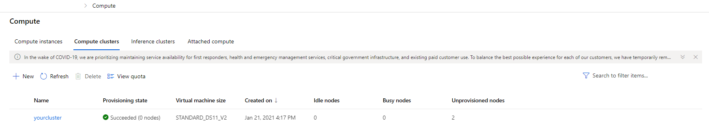
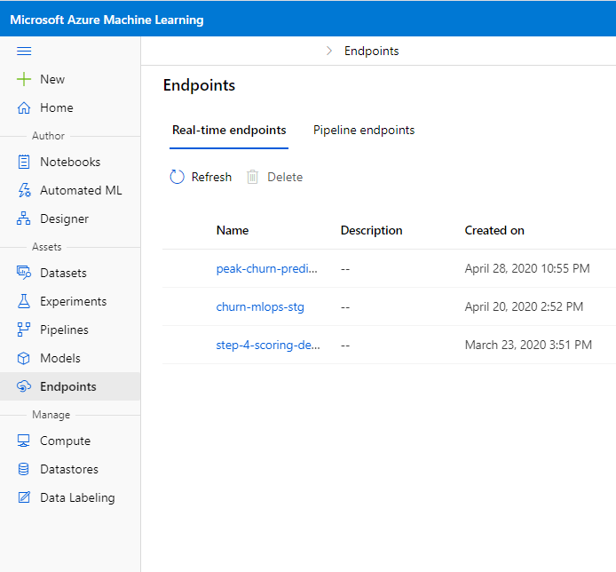

# Deploy batch inference pipelines with Azure Machine Learning 

## Before you start

This tutorial is based on the Azure ML Batch Inference definition. In Azure, Batch Inference is sometimes related with high-performance parallel computing. It performs the parallelization by creating a pool of tasks and run them in parallel in the compute nodes. More details can be seen [here](https://docs.microsoft.com/en-us/azure/machine-learning/tutorial-pipeline-batch-scoring-classification).
If the aim is only to have a batch process that runs the model from time to time with no parallel concerns, generating all possible predictions in a batch and storing those in a file, database, etc then follow the example provided [here](https://vladiliescu.net/deploying-models-with-azure-ml-pipelines/).

## Introduction

In many production scenarios, long-running tasks that operate on large volumes of data are performed as *batch* operations. In machine learning, *batch inferencing* is used to apply a predictive model to multiple cases asynchronously - usually writing the results to a file or database.

In Azure Machine Learning, you can implement batch inferencing solutions by creating a pipeline that includes a step to read the input data, load a registered model, predict labels and write the results as its output.

## Tutorial objectives

* Publish batch inference pipeline for a trained model.
* Use a batch inference pipeline to generate predictions.

## Creating a batch inference pipeline
To create a batch inferencing pipeline, perform the following tasks:

## <a name = 'Register'> 1. Register a model
To use a trained model in a batch inferencing pipeline, you must register it in your Azure Machine Learning workspace.

To register a model from a local file, you can use the **register** method of the **Model** object as shown in the following example code:

Alternatively, if you have a reference to the **Run** used to train the model, you can use its **register_model** method as shown in the following example code:

## <a name = 'Batch-Pipeline-scoring'> 2. Create a scoring script
Batch inferencing service requires a scoring script to load the model and use it to predict new values. It must include two functions:

* **init()**: Called when the pipeline is initialized.
* **run(mini_batch):** Called for each batch of data to be processed.

Typically, you use the **init** function to load the model from the model registry, and use the **run** function to generate predictions from each batch of data and return the results. The following example script shows this pattern:

    import os
    import numpy as np
    from azureml.core import Model
    import joblib

    def init():
        # Runs when the pipeline step is initialized
        global model
        # load the model
        model_path = Model.get_model_path('classification_model')
        model = joblib.load(model_path)

    def run(mini_batch):
        # This runs for each batch
        resultList = []
        # process each file in the batch
        for f in mini_batch:
            # Read the comma-delimited data into an array
            data = np.genfromtxt(f, delimiter=',')
            # Reshape into a 2-dimensional array for prediction (model expects multiple items)
                prediction = model.predict(data.reshape(1, -1))
               # Append prediction to results
                resultList.append("{}: {}".format(os.path.basename(f), prediction[0]))
          return resultList

## <a name = 'Batch-Pipeline-parallelstep'> 3. Create a pipeline with a ParallelRunStep

Azure Machine Learning provides a type of pipeline step specifically for performing parallel batch inferencing. Using the **ParallelRunStep** class, you can read batches of files from a **File** dataset and write the processing output to a **PipelineData** reference. Additionally, you can set the **output_action** setting for the step to "append_row", which will ensure that all instances of the step being run in parallel will collate their results to a single output file named *parallel_run_step.txt.* The following code snippet shows an example of creating a pipeline with a **ParallelRunStep**:

    from azureml.pipeline.steps import ParallelRunConfig, ParallelRunStep
    from azureml.pipeline.core import PipelineData
    from azureml.pipeline.core import Pipeline

    # Set default data store
    ws.set_default_datastore('workspaceblobstore')

    # Set the output location
    default_ds = ws.get_default_datastore()
    output_dir = PipelineData(name='inferences', 
                            datastore=default_ds, 
                            output_path_on_compute='results')

    # Define the parallel run step configuration
    parallel_run_config = ParallelRunConfig(
        source_directory=experiment_folder,			# The location of the script
        entry_script="batch_scoring_script.py",
        mini_batch_size="5",
        error_threshold=10,
        output_action="append_row",
        environment=batch_env,
        compute_target=inference_cluster,
        node_count=2)

    parallelrun_step = ParallelRunStep(
        name='batch-score',
        parallel_run_config=parallel_run_config,
        inputs=[batch_data_set.as_named_input('batch_data')],
        output=output_dir,
        arguments=[],
     allow_reuse=True
    )

    # Create the pipeline
    pipeline = Pipeline(workspace=ws, steps=[parallelrun_step])

## <a name = 'Batch-Pipeline-publish'> 4. Run the pipeline and retrieve the step output

After your pipeline has been defined, you can run it and wait for it to complete. Then you can retrieve the **parallel_run_step.txt** file from the output of the step to view the results, as shown in the following code example:

    from azureml.core import Experiment
    import pandas as pd

    # Run the pipeline as an experiment
    pipeline_run = Experiment(ws, 'batch_prediction_pipeline').submit(pipeline)
    pipeline_run.wait_for_completion(show_output=True)

    # Get the run for first and only step in our pipleine, and download its output
    prediction_run = next(pipeline_run.get_children())
    prediction_output = prediction_run.get_output_data('inferences')
    prediction_output.download(local_path='results')

    # Traverse the folder hierarchy and find the results file
    for root, dirs, files in os.walk('results'):
        for file in files:
            if file.endswith('parallel_run_step.txt'):
                result_file = os.path.join(root,file)

    # cleanup output format
    df = pd.read_csv(result_file, delimiter=":", header=None)
    df.columns = ["File", "Prediction"]
    print(df)

## Publishing and Scheduling a batch inference pipeline

You can publish a batch inferencing pipeline as a REST service, as shown in the following example code:

    published_pipeline = pipeline_run.publish_pipeline(
    name='Batch-Predictions_Pipeline', description='Batch pipeline', version='1.0')

    rest_endpoint = published_pipeline.endpoint

Once published, you can use the service endpoint to initiate a batch inferencing job, as shown in the following example code:

    import requests

    rest_endpoint = published_pipeline.endpoint
    response = requests.post(rest_endpoint, 
                            headers=auth_header, 
                            json={"ExperimentName": "Batch_Prediction"})
    run_id = response.json()["Id"]

You can also schedule the published pipeline to have it run automatically, as shown in the following example code:

    from azureml.pipeline import ScheduleRecurrence, Schedule

    weekly = ScheduleRecurrence(frequency='Week', interval =1)
    pipeline_schedule = Schedule.create(ws, name='Weekly Predictions',
					     description= 'batch inferencing',
					     pipeline_id=published_pipeline.id,
					     experiment_name='Batch_Prediction',
					     recurrence=weekly)

## Exercise - Create a Batch Inferencing Service

In many scenarios, inferencing is performed as a batch process that uses a predictive model to score a large number of cases. To implement this kind of inferencing solution in Azure Machine Learning, you can create a batch inferencing pipeline.

In this tutorial we provide some jupyter notebook templates (more detail in: [Jupyter Lab notebook templates](https://github.com/felicity-borg/Getting-Started-On-Azure-ML/tree/main/labs)). This example is based on the one provided in order to create a Batch Inferencing Service.

### Before you start

If you have not already done so, create a [compute instance](../Documents/Create-Compute-Instance.md) and ensure you have [Cloned the notebooks](../Documents/Clone-and-Run-a-Notebook.md) required for this exercise.

### Additional Information to note as you're working through your notebook

After creating a compute cluster to deploy your model you can view it selecting the **compute** page in [Azure Machine Learning studio](https://ml.azure.com/) and clicking on **Compute clusters** at the top of the page. 

. 

Clicking on your compute cluster will show you additional information about your compute cluster including its status and attributes. 

.

After creating a working pipeline, you can publish it and use it as a REST enpoint to run it from an application. You can view you endpoint by navigating to [Azure Machine Learning studio](https://ml.azure.com/) and clicking on **Endpoints** on the sidebar. 

.

### Open Jupyter

1. In Azure Machine Learning studio, view the **Compute** page for your workspace and on the **Compute Instances** tab, start your compute instance if it is not already running.
2. When the compute instance is running, click the **Jupyter** link to open the Jupyter home page in a new browser tab. Be sure to open Jupyter and not JupyterLab.

### Create a batch inferencing service
In this exercise, the code to deploy a model as a batch inferencing service is provided in a notebook.

1. In the Jupyter home page, browse to the Users/<user_name>/labs folder where you cloned the notebook repository and open the **Create-Batch-Inferencing-Service.ipynb** notebook.
2. Then read the notes in the notebook, running each code cell in turn.
3. When you have finished running the code in the notebook, on the **File** menu, click **Close and Halt** to close it and shut down its Python kernel. Then close all Jupyter browser tabs.

### Clean-up
If you’re finished working with Azure Machine Learning for now refer to [this page](../Documents/Stop-Compute-Instance.md) to stop your compute instance.  

_Source: https://docs.microsoft.com/en-us/azure/machine-learning/tutorial-pipeline-batch-scoring-classification_

## Useful links
_[How to consume an Azure Machine Learning web service that has been deployed from a Machine Learning experiment](https://github.com/uglide/azure-content/blob/master/articles/machine-learning/machine-learning-consume-web-services.md)_
