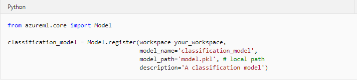

# Deploy batch inference pipelines with Azure Machine Learning 

## Introduction

In many production scenarios, long-running tasks that operate on large volumes of data are performed as *batch* operations. In machine learning, *batch inferencing* is used to apply a predictive model to multiple cases asynchronously - usually writing the results to a file or database.

In Azure Machine Learning, you can implement batch inferencing solutions by creating a pipeline that includes a step to read the input data, load a registered model, predict labels and write the results as its output.

## Tutorial objectives

* Publish batch inference pipeline for a trained model.
* Use a batch inference pipeline to generate predictions.

## Creating a batch inference pipeline
To create a batch inferencing pipeline, perform the following tasks:

## 1. Register a model
To use a trained model in a batch inferencing pipeline, you must register it in your Azure Machine Learning workspace.

To register a model from a local file, you can use the **register** method of the **Model** object as shown in the following example code:

Alternatively, if you have a reference to the **Run** used to train the model, you can use its **register_model** method as shown in the following example code:

## 2. Create a scoring script
Batch inferencing service requires a scoring script to load the model and use it to predict new values. It must include two functions:

* **init()**: Called when the pipeline is initialized.
* **run(mini_batch):** Called for each batch of data to be processed.

Typically, you use the **init** function to load the model from the model registry, and use the **run** function to generate predictions from each batch of data and return the results. The following example script shows this pattern:

## 3. Create a pipeline with a ParallelRunStep

Azure Machine Learning provides a type of pipeline step specifically for performing parallel batch inferencing. Using the **ParallelRunStep** class, you can read batches of files from a **File** dataset and write the processing output to a **PipelineData** reference. Additionally, you can set the **output_action** setting for the step to "append_row", which will ensure that all instances of the step being run in parallel will collate their results to a single output file named *parallel_run_step.txt.* The following code snippet shows an example of creating a pipeline with a **ParallelRunStep**:

## 4. Run the pipeline and retrieve the step output

After your pipeline has been defined, you can run it and wait for it to complete. Then you can retrieve the **parallel_run_step.txt** file from the output of the step to view the results, as shown in the following code example:

## Publishing a batch inference pipeline

You can publish a batch inferencing pipeline as a REST service, as shown in the following example code:

Once published, you can use the service endpoint to initiate a batch inferencing job, as shown in the following example code:

You can also schedule the published pipeline to have it run automatically, as shown in the following example code:

## Exercise - Create a Batch Inferencing Service

In many scenarios, inferencing is performed as a batch process that uses a predictive model to score a large number of cases. To implement this kind of inferencing solution in Azure Machine Learning, you can create a batch inferencing pipeline.

In this tutorial we provide some jupyter notebook templates (more detail in: [Jupyter Lab notebook templates](https://github.com/felicity-borg/Getting-Started-On-Azure-ML/tree/main/labs)). This example is based on the one provided in order to create a Batch Inferencing Service.

### Before you start

If you have not already done so, create a [compute instance](../Documents/Create-Compute-Instance.md) and ensure you have [Cloned the notebooks](../Documents/Clone-and-Run-a-Notebook.md) required for this exercise.

### Additional Information to note as you're working through your notebook

After creating a compute cluster to deploy your model you can view it selecting the **compute** page in [Azure Machine Learning studio](https://ml.azure.com/) and clicking on **Compute clusters** at the top of the page. 

. 

Clicking on your compute cluster will show you additional information about your compute cluster including its status and attributes. 

.

After creating a working pipeline, you can publish it and use it as a REST enpoint to run it from an application. You can view you endpoint by navigating to [Azure Machine Learning studio](https://ml.azure.com/) and clicking on **Endpoints** on the sidebar. 

.

### Open Jupyter

1. In Azure Machine Learning studio, view the **Compute** page for your workspace and on the **Compute Instances** tab, start your compute instance if it is not already running.
2. When the compute instance is running, click the **Jupyter** link to open the Jupyter home page in a new browser tab. Be sure to open Jupyter and not JupyterLab.

### Create a batch inferencing service
In this exercise, the code to deploy a model as a batch inferencing service is provided in a notebook.

1. In the Jupyter home page, browse to the Users/<user_name>/labs folder where you cloned the notebook repository and open the **Create-Batch-Inferencing-Service.ipynb** notebook.
2. Then read the notes in the notebook, running each code cell in turn.
3. When you have finished running the code in the notebook, on the **File** menu, click **Close and Halt** to close it and shut down its Python kernel. Then close all Jupyter browser tabs.

### Clean-up
If you’re finished working with Azure Machine Learning for now refer to [this page](../Documents/Stop-Compute-Instance.md) to stop your compute instance.  
