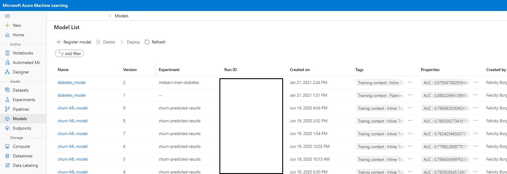
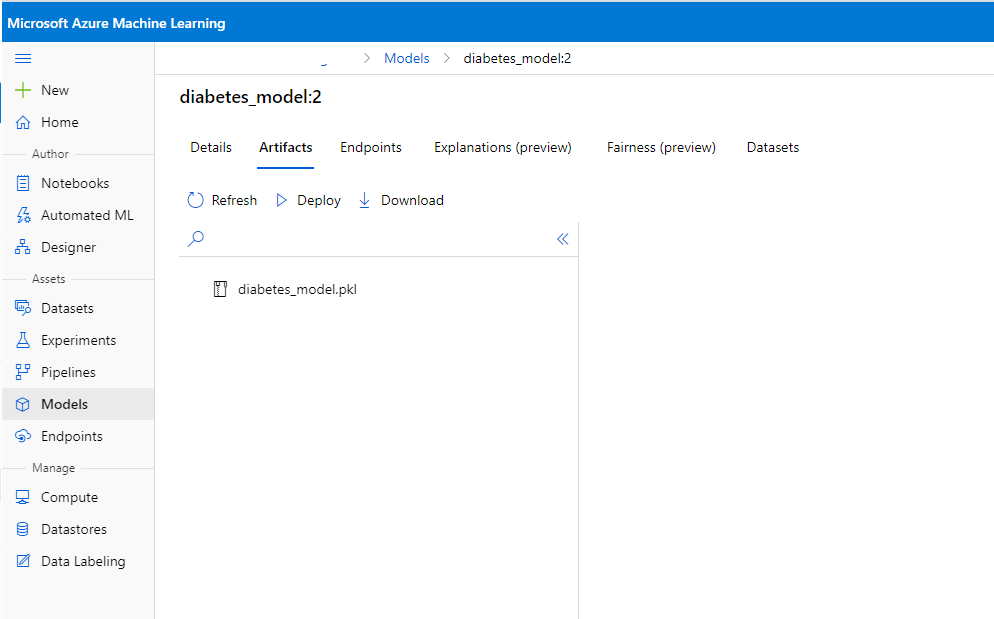
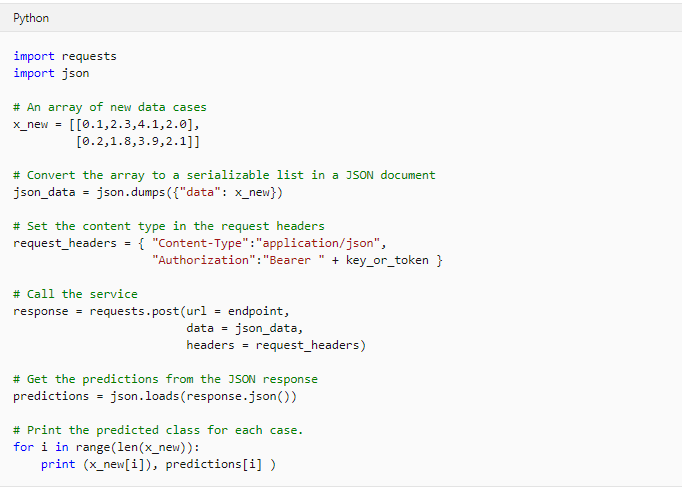
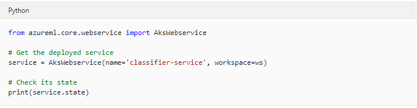

# Deploy real-time machine learning services with Azure Machine Learning

## Introduction

In machine learning, *inferencing* refers to the use of a trained model to predict labels for new data on which the model has not been trained. Often, the model is deployed as part of a service that enables applications to request immediate or *real-time* predictions for individual or small numbers of data observations.

In Azure Machine learning, you can create real-time inferencing solutions by deploying a model as a service, hosted in a containerized platform such as Azure Kubernetes Services (AKS).

## Learning objectives
In this module, you will learn how to:

* Deploy a model as a real-time inferencing service.
* Consume a real-time inferencing service.
* Troubleshoot service deployment

## Deploying a model as a real-time service

You can deploy a model as a real-time web service to several kinds of compute target, including local compute, an Azure Machine Learning compute instance, an Azure Container Instance (ACI), an Azure Kubernetes Service (AKS) cluster, an Azure Function  or an Internet of Things (IoT) module. Azure Machine Learning uses containers as a deployment mechanism, packaging the model and the code to use it as an image that can be deployed to a container in your chosen compute target.

**Note:** Deployment to a local service, a compute instance or an ACI is a good choice for testing and development. For production, you should deploy to a target that meets the specific performance, scalability and security needs of your application architecture.

To deploy a model as a real-time inferencing service, you must perform the following tasks:

## <a name = 'Inf-Pipeline-register'> 1. Register a model

After successfully training a model, you must register it in your Azure Machine Learning workspace. Your real-time service will then be able to load the model when required.

To register a model from a local file, you can use the **register** method of the **Model** object as shown here:

Alternatively, if you have a reference to the **Run** used to train the model, you can use its **register_model** method as shown here:

To view your registered model navigate to the **Models** page in [Azure Machine Learning studio](https://ml.azure.com/?tid=168c1fe3-a841-49b5-b692-7b3132c0a997&wsid=/subscriptions/52cbf6c7-01f2-4df2-bae9-c80cee4db7eb/resourcegroups/churn-prediction-azure-tutorial/workspaces/churn-machine-learning-ws). Here you will be able view your models.

Select the model you would like more information on and you will get additional details such as logged metrics, which experiment generated the model, model version and a serialized file containing the model. 

## <a name = 'Inf-Pipeline-infconfig'> 2. Define an inference configuration
The model will be deployed as a service that consist of:

* A script to load the model and return predictions for submitted data.
* An environment in which the script will run.

You must therefore define the script and environment for the service.

### Creating an entry script

Create the *entry script* (sometimes referred to as the *scoring script*) for the service as a Python (.py) file. It must include two functions:

* **init():** Called when the service is initialized.
* **run(raw_data):** Called when new data is submitted to the service.

Typically, you use the **init** function to load the model from the model registry and use the **run** function to generate predictions from the input data. The following example script shows this pattern:

### Creating an environment
Your service requires a Python environment in which to run the entry script, you can configure using Conda configuration file. An easy way to create this file is to use a **CondaDependencies** class to create a default environment (which includes the **azureml-defaults** package and commonly-used packages like **numpy** and **pandas**), add any other required packages and then serialize the environment to a string and save it:

### Combining the script and environment in an InferenceConfig
After creating the entry script and environment configuration file, you can combine them in an **InferenceConfig** for the service like this:

## <a name = 'Inf-Pipeline-infdepconfig'> 3. Define a deployment configuration
Now that you have the entry script and environment, you need to configure the compute to which the service will be deployed. If you are deploying to an AKS cluster, you must create the cluster and a compute target for it before deploying:

With the compute target created, you can now define the deployment configuration, which sets the target-specific compute specification for the containerized deployment:

The code to configure an ACI deployment is similar, except that you do not need to explicitly create an ACI compute target and you must use the **deploy_configuration** class from the **azureml.core.webservice.AciWebservice** namespace. Similarly, you can use the azureml.core.webservice.LocalWebservice namespace to configure a local Docker-based service.

**Note:** To deploy a model to an Azure Function, you do not need to create a deployment configuration. Instead, you need to package the model based on the type of function trigger you want to use. This functionality is in preview at the time of writing. For more details, see [Deploy a machine learning model to Azure Functions](https://aka.ms/AA70rrn) in the Azure Machine Learning documentation.

## <a name = 'Inf-Pipeline-depmodel'> 4. Deploy the model

After all of the configuration is prepared, you can deploy the model. The easiest way to do this is to call the **deploy** method of the **Model** class, like this:

For ACI or local services, you can omit the **deployment_target parameter** (or set it to **None**).

**More Information**: For more information about deploying models with Azure Machine Learning, see [Deploy models with Azure Machine Learning](https://aka.ms/AA70zfv) in the documentation.

## <a name = 'Consume_inf'> Consuming a real-time inferencing service

After deploying a real-time service, you can consume it from client applications to predict labels for new data cases.

### Using the Azure Machine Learning SDK
For testing, you can use the Azure Machine Learning SDK to call a web service through the run method of a WebService object that references the deployed service. Typically, you send data to the run method in JSON format with the following structure:

The response from the **run** method is a JSON collection with a prediction for each case that was submitted in the data. The following code sample calls a service and displays the response:

### Using a REST endpoint

In production, most client applications will not include the Azure Machine Learning SDK, and will consume the service through its REST interface. You can determine the endpoint of a deployed service in Azure machine Learning studio or by retrieving the **scoring_uri** property of the **Webservice** object in the SDK, like this:

With the endpoint known, you can use an HTTP POST request with JSON data to call the service. The following example shows how to do this using Python:

### Authentication

In production, you will likely want to restrict access to your services by applying authentication. There are two kinds of authentication you can use:

* **Key:** Requests are authenticated by specifying the key associated with the service.
* **Token:** Requests are authenticated by providing a JSON Web Token (JWT).

By default, authentication is disabled for ACI services and set to key-based authentication for AKS services (for which primary and secondary keys are automatically generated). You can optionally configure an AKS service to use token-based authentication (which is not supported for ACI services).

Assuming you have an authenticated session established with the workspace, you can retrieve the keys for a service by using the **get_keys** method of the **WebService** object associated with the service:

`primary_key, secondary_key = service.get_keys()`

For token-based authentication, your client application needs to use service-principal authentication to verify its identity through Azure Active Directory (Azure AD) and call the **get_token** method of the service to retrieve a time-limited token.

To make an authenticated call to the service's REST endpoint, you must include the key or token in the request header like this:

## Troubleshooting service deployment

There are a lot of elements to a real-time service deployment, including the trained model, the runtime environment configuration, the scoring script, the container image and the container host. Troubleshooting a failed deployment or an error when consuming a deployed service can be complex.

### Check the service state
As an initial troubleshooting step, you can check the status of a service by examining its **state**:

**Note:** To view the **state** of a service, you must use the compute-specific service type (for example **AksWebservice**) and not a generic **WebService** object.

For an operational service, the state should be **Healthy**.

### Review service logs

If a service is not healthy or you are experiencing errors when using it, you can review its logs:

`print(service.get_logs())`

The logs include detailed information about the provisioning of the service, and the requests it has processed; and can often provide an insight into the cause of unexpected errors.

### Deploy to a local container
Deployment and runtime errors can be easier to diagnose by deploying the service as a container in a local Docker instance, like this:

You can then test the locally deployed service using the SDK:

`print(service.run(input_data = json_data))`

You can then troubleshoot runtime issues by making changes to the scoring file that is referenced in the inference configuration and reloading the service without redeploying it (something you can only do with a local service):

`service.reload()`

`print(service.run(input_data = json_data))`

## Exercise - Create a Real-time Inference Service

There’s no point in training and registering machine learning models if you don’t plan to make them available for applications to use. In this exercise, you’ll deploy a model as a web service for real-time inferencing.

### Before you start

In this tutorial we provide some jupyter notebook templates that you can run (more detail in: [Jupyter Lab notebook templates](../labs)).

If you have not already done so, create a [compute instance](../Documents/Create-Compute-Instance.md) and ensure you have [cloned the notebooks](../Documents/Clone-and-Run-a-Notebook.md) required for this exercise.

### Open Jupyter

1. In Azure Machine Learning studio, view the **Compute** page for your workspace and on the **Compute Instances** tab, start your compute instance if it is not already running.
2. When the compute instance is running, click the **Jupyter** link to open the Jupyter home page in a new browser tab. Be sure to open Jupyter and not JupyterLab.

### Create a Real-time Inference Service
In this exercise, the code to deploy a model as a real-time inferencing service is provided in a notebook.

1. In the Jupyter home page, browse to the Users/<user_name>/labs folder where you cloned the notebook repository and open the **Create-Real-Time-Inferencing_service.ipynb** notebook.

2. Then read the notes in the notebook, running each code cell in turn.

3. When you have finished running the code in the notebook, on the **File** menu, click **Close and Halt** to close it and shut down its Python kernel. Then close all Jupyter browser tabs.

### Clean-up
If you’re finished working with Azure Machine Learning for now refer to [this page](../Documents/Stop-Compute-Instance.md) to stop your compute instance.  
