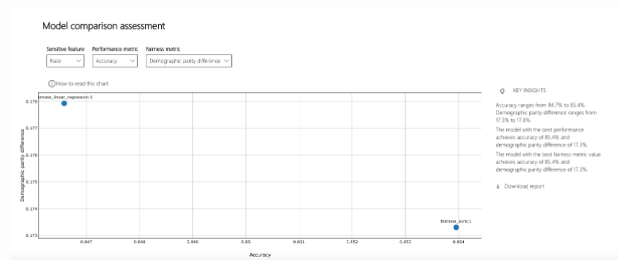

# Detect and mitigate unfairness in models with Azure Machine Learning

Machine learning models are increasingly used to inform decisions that affect people's lives. For example, a prediction made by a machine learning model might influence:

* Approval for a loan, insurance or other financial services.
* Acceptance into a school or college course.
* Eligibility for a medical trial or experimental treatment.
* Inclusion in a marketing promotion.
* Selection for employment or promotion.

With such critical decisions in the balance, confidence that the machine learning models we rely on predict and don't discriminate for or against subsets of the population based on ethnicity, gender, age or other factors.

## Tutorial objectives
In this module, you will learn how to:

* Evaluate machine learning models for fairness.
* Mitigate predictive disparity in a machine learning model.

## Consider model fairness

When we consider the concept of *fairness* concerning predictions made by machine learning models, it helps to be clear about what we mean by "fair".

For example, suppose a classification model is used to predict the probability of successful loan repayment and therefore influences whether or not the loan is approved. The model will likely be trained using features that reflect the characteristics of the applicant, such as:

* Age
* Employment status
* Income
* Savings
* Current debt

These features are used to train a binary classification model that predicts whether an applicant will repay a loan.

Suppose the model predicts that around 45% of applicants will successfully repay their loans. However, on reviewing loan approval records, you begin to suspect that fewer loans are approved for applicants aged 25 or younger than for applicants who are over 25. How can you be sure the model is *fair* to applicants in both age groups?

### Measuring disparity in predictions
One way to start evaluating the fairness of a model is to compare *predictions* for each group within a *sensitive feature*. For the loan approval model, *Age* is a sensitive feature that we care about, so we could split the data into subsets for each age group and compare the *selection rate* (the proportion of positive predictions) for each group.

Let's say we find that the model predicts that 36% of applicants aged 25 or younger will repay a loan, but it predicts successful repayments for 54% of applicants aged over 25. There's a disparity in predictions of 18%.

At first glance, this comparison seems to confirm that there's bias in the model that discriminates against younger applicants. However, when you consider the population as a whole, it may be that younger people generally earn less than people more established in their careers, have lower levels of savings and assets and have a higher rate of defaulting on loans.

The important point to consider here is that just because we want to ensure fairness regarding age, it doesn't necessarily follow that age is **not** a factor in loan repayment probability. It's possible that in general, younger people are less likely to repay a loan than older people. To get the full picture, we need to look a little deeper into the predictive performance of the model for each subset of the population.

### Measuring disparity in prediction performance
When you train a machine learning model using a supervised technique, like regression or classification, you use metrics achieved against hold-out validation data to evaluate the overall predictive performance of the model. For example, you might evaluate a classification model based on *accuracy, precision* or *recall*.

To evaluate the fairness of a model, you can apply the same predictive performance metric to subsets of the data, based on the sensitive features on which your population is grouped and measure the disparity in those metrics across the subgroups.

For example, suppose the loan approval model exhibits an overall recall metric of *0.67* - in other words, it correctly identifies 67% of cases where the applicant repaid the loan. The question is whether or not the model provides a similar rate of correct predictions for different age groups.

To find out, we group the data based on the sensitive feature *(Age)* and measure the predictive performance metric *(recall)* for those groups. Then we can compare the metric scores to determine the disparity between them.

Let's say that we find that the recall for validation cases where the applicant is 25 or younger is 0.50, and recall for cases where the applicant is over 25 is 0.83. In other words, the model correctly identified 50% of the people in the 25 or younger age group who successfully repaid a loan (and therefore misclassified 50% of them as loan defaulters), but found 83% of loan repayers in the older age group (misclassifying only 17% of them). The disparity in prediction performance between the groups is 33%, with the model predicting significantly more false negatives for the younger age group.

### Potential causes of disparity
When you find a disparity between prediction rates or prediction performance metrics across sensitive feature groups, it's worth considering potential causes. These might include:

* Data imbalance. Some groups may be overrepresented in the training data or the data may be skewed so that cases within a specific group aren't representative of the overall population.
* Indirect correlation. The sensitive feature itself may not be predictive of the label, but there may be a hidden correlation between the sensitive feature and some other feature that influences the prediction. For example, there's likely a correlation between age and credit history and there's likely a correlation between credit history and loan defaults. If the credit history feature is not included in the training data, the training algorithm may assign a predictive weight to age without accounting for credit history, which might make a difference to loan repayment probability.
* Societal biases. Subconscious biases in the data collection, preparation or modeling process may have influenced feature selection or other aspects of model design.

### Mitigating bias
Optimizing for fairness in a machine learning model is a *sociotechnical* challenge. In other words, it's not always something you can achieve purely by applying technical corrections to a training algorithm. However, there are some strategies you can adopt to mitigate bias, including:

* Balance training and validation data. You can apply over-sampling or under-sampling techniques to balance data and use stratified splitting algorithms to maintain representative proportions for training and validation.
* Perform extensive feature selection and engineering analysis. Make sure you fully explore the interconnected correlations in your data to try to differentiate features that are directly predictive from features that encapsulate more complex, nuanced relationships. You can use the model interpretability support in Azure Machine Learning to understand how individual features influence predictions.
Evaluate models for disparity based on significant features. You can't easily address the bias in a model if you can't quantify it.
Trade-off overall predictive performance for the lower disparity in predictive performance between sensitive feature groups. A model that is 99.5% accurate with comparable performance across all groups is often more desirable than a model that is 99.9% accurate but discriminates against a particular subset of cases.

The rest of this module explores the **Fairlearn** package - a Python package that you can use to evaluate and mitigate unfairness in machine learning models.

## Analyze model fairness with Fairlearn and Responsible-AI-Widgets (raiwidgets)

**Fairlearn** is a Python package that you can use to analyze models and evaluate disparity between predictions and prediction performance for one or more sensitive features.
**raiwidgets** extends the Fairlearn repository and provides user interfaces for model interpretability and fairness assessment of machine learning models. Raiwidget offers several different user interfaces which can be further explored [here](https://pypi.org/project/raiwidgets/). In this tutorial we will be exploring the user interface **Fairness Dashboard**.

Fairlearn works by calculating group metrics for the sensitive features you specify. The metrics themselves are based on standard **scikit-learn** model evaluation metrics, such as *accuracy, precision* or *recall* for classification models.

The Fairlearn API is extensive, offering multiple ways to explore disparity in metrics across sensitive feature groupings. For a binary classification model, you might start by comparing the selection rate (the number of positive predictions for each group) by using the **selection_rate** function. This function returns the overall selection rate for the test dataset. You can also use standard **sklearn.metrics** functions (such as **accuracy_score**, **precision_score** or **recall_score**) to get an overall view of how the model performs.

Then, you can define one or more *sensitive features* in your dataset with which you want to group subsets of the population and compare selection rate and predictive performance. Fairlearn includes a **MetricFrame** function that enables you to create a dataframe of multiple metrics by the group.

For example, in a binary classification model for loan repayment prediction, where the sensitive feature **Age** consists of two possible categorical values (**25-and-under** and **over-25**), a MetricFrame for these groups might be similar to the following table:

| Age | selection_rate | accuracy | recall | precision |
| --- | -------------- | -------- | ------ | --------- |
| 50 or younger |	0.298178 | 0.89619 | 0.825926 | 0.825926 |
| Over 50 |	0.708995 | 0.888889 |	0.937984 | 0.902985 |

### Visualizing metrics using Fairness Dashboard
It's often easier to compare metrics visually, the Fairness Dashboard is a user interface for Fairlearn which enables you to use common fairness metrics to assess understand how your model's predictions impact differet groupps (e.g., different ethnicities), and compare multiple models along different fairness and performance metrics.

#### Setup and single-model assessment
To assess a single model’s fairness and performance, the dashboard widget can be launched within a Jupyter notebook as follows:

    from raiwidgets import FairnessDashboard

    # A_test contains your sensitive features (e.g., age, binary gender)
    # y_true contains ground truth labels
    # y_pred contains prediction labels

    FairnessDashboard(sensitive_features=A_test,
                      y_true=Y_test,
                      y_pred={"predictive_model": model.predict(X_test)})
                      
Once you load the visualization dashboard, the widget walks the user through the assessment setup, where the user is asked to select

1. The sensitive feature of interest(e.g., `binary gender` or `age`). 

2. The performance metric (e.g., model precision) along which to evaluate the overall model performance.

3. The fairness metric (e.g., demographic parity ratio) along which to evaluate any disparities across groups.

These selections are then used to obtain the visualization of the model’s impact on the subgroups. (e.g., one is interested to consider non-binary gender for fairness testing and selects "demographic parity ratio" as a metric of interest to see how females and males are selected to get a loan).

### Comparing multiple models
Fairlearn integrates with Azure Machine Learning by enabling you to run an experiment in which the dashboard metrics are uploaded to your Azure Machine Learning workspace. This enables you to share the dashboard in Azure Machine Learning studio so that your data science team can track and compare disparity metrics for models registered in the workspace.

## Mitigate unfairness with Fairlearn
A common approach to mitigation is to use one of the algorithms and constraints to train multiple models and then compare their performance, selection rate and disparity metrics to find the optimal model for your needs. Often, the choice of the model involves a trade-off between raw predictive performance and fairness - based on your definition of fairness for a given scenario. Generally, fairness is measured by a reduction in the disparity of feature selection (for example, ensuring that an equal proportion of members from each gender group is approved for a bank loan) or by a reduction in the disparity of performance metric (for example, ensuring that a model is equally accurate at identifying repayers and defaulters in each age group).

In addition to enabling you to analyze disparity in selection rates and predictive performance across sensitive features, the dashboard also enables comparison of multiple models, such as the models produced by different learning algorithms and different mitigation approaches, including Fairlearn's [GridSearch](https://fairlearn.github.io/v0.5.0/api_reference/fairlearn.reductions.html#fairlearn.reductions.GridSearch), [ExponentiatedGradient](https://fairlearn.github.io/v0.5.0/api_reference/fairlearn.reductions.html#fairlearn.reductions.ExponentiatedGradient), and [ThresholdOptimizer](https://fairlearn.github.io/v0.5.0/api_reference/fairlearn.postprocessing.html#fairlearn.postprocessing.ThresholdOptimizer).

As before, select the sensitive feature and the performance metric. The model comparison view then depicts the performance and disparity of all the provided models in a scatter plot. This allows the you to examine trade-offs between performance and fairness. Each of the dots can be clicked to open the assessment of the corresponding model. The figure below shows the model comparison view with `binary gender` selected as a sensitive feature and accuracy rate selected as the performance metric.
You can select an individual model in the scatterplot to see its details, enabling you to explore the options and select the best model for your fairness requirements.

### Mitigation algorithms and parity constraints
The mitigation support in Fairlearn is based on the use of algorithms to create alternative models that apply *parity constraints* to produce comparable metrics across sensitive feature groups. Fairlearn supports the following mitigation techniques. 

| Technique | Description | Model type support |
| --------- | ----------- | ------------------ |
| Exponentiated Gradient |	A reduction technique that applies a cost-minimization approach to learning the optimal trade-off of overall predictive performance and fairness disparity |	Binary classification and regression |
| Grid Search |	A simplified version of the Exponentiated Gradient algorithm that works efficiently with small numbers of constraints |	Binary classification and regression |
| Threshold Optimizer |	A post-processing technique that applies a constraint to an existing classifier, transforming the prediction as appropriate |	Binary classification |

### Integration with Azure Machine Learning
Just as when analyzing an individual model, you can register all of the models found during your mitigation testing and upload the dashboard metrics to Azure Machine Learning as shown in the example below. 

    # Register the models
    registered_model_predictions = dict()
    for model_name, prediction_data in predictions.items():
        model_file = os.path.join(model_dir, model_name + ".pkl")
        registered_model = Model.register(model_path=model_file,
                                          model_name=model_name,
                                          workspace=ws)
         registered_model_predictions[registered_model.id] = prediction_data

    #  Create a group metric set for binary classification based on the Age feature for all of the models
    sf = { 'Age': S_test.Age}
    dash_dict = _create_group_metric_set(y_true=y_test,
                                        predictions=registered_model_predictions,
                                        sensitive_features=sf,
                                        prediction_type='binary_classification')

    exp = Experiment(ws, "mslearn-diabetes-fairness")
    print(exp)

    run = exp.start_logging(snapshot_directory=None)
    RunDetails(run).show()

    # Upload the dashboard to Azure Machine Learning
    try:
        dashboard_title = "Fairness Comparison of Diabetes Models"
        upload_id = upload_dashboard_dictionary(run,
                                                dash_dict,
                                                dashboard_name=dashboard_title)
        print("\nUploaded to id: {0}\n".format(upload_id))
    finally:
        run.complete()

## Exercise - Use Fairlearn and raiwidgets with Azure Machine Learning

Now it's your chance to detect and mitigate unfairness in a model.

In this exercise, you will:

* Use the Fairlearn package with Azure Machine Learning to evaluate prediction performance disparity.
* Use the Fairlearn package with Azure Machine Learning to mitigate unfairness.

### Detect and Mitigate Unfairness
Machine learning models can often encapsulate unintentional bias that results in unfairness. For example, a machine learning model that predicts whether or not a patient should be tested for diabetes may predict more accurately for some age groups than others, with the result that a subsection of the patient population is either deprived of appropriate preventative health checks or subjected to unnecessary clinical testing.

### Before you start

In this tutorial we provide some jupyter notebook templates that you can run (more detail in: [Jupyter Lab notebook templates](../labs)).

If you have not already done so, create a [compute instance](../Documents/Create-Compute-Instance.md) and ensure you have [cloned the notebooks](../Documents/Clone-and-Run-a-Notebook.md) required for this exercise.

### Open Jupyter

1. In Azure Machine Learning studio, view the **Compute** page for your workspace and on the Compute Instances tab, start your compute instance if it is not already running.
2. When the compute instance is running, click the **Jupyter** link to open the Jupyter home page in a new browser tab. Be sure to open Jupyter and not JupyterLab.

### Use Fairlearn and Azure Machine Learning to detect unfairness
In this exercise, the code to evaluate models for fairness is provided in a notebook.

1. In the Jupyter home page, browse to the **Users/<user_name>/labs** folder where you cloned the notebook repository and open the **Detect-Unfairness.ipynb** notebook.

2. Then read the notes in the notebook, running each code cell in turn.

3. When you have finished running the code in the notebook, on the **File** menu, click **Close and Halt** to close it and shut down its Python kernel. Then close all Jupyter browser tabs.

### Clean-up
If you’re finished working with Azure Machine Learning for now refer to [this page](../Documents/Stop-Compute-Instance.md) to stop your compute instance. 

*Source: https://docs.microsoft.com/en-us/learn/modules/detect-mitigate-unfairness-models-with-azure-machine-learning/*
