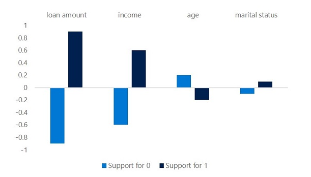
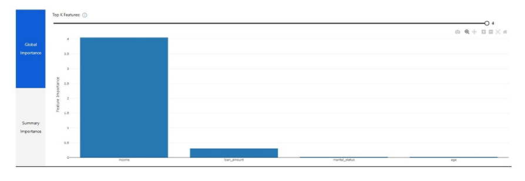
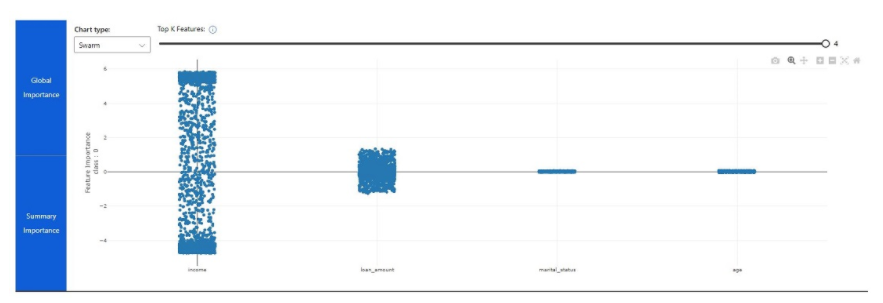
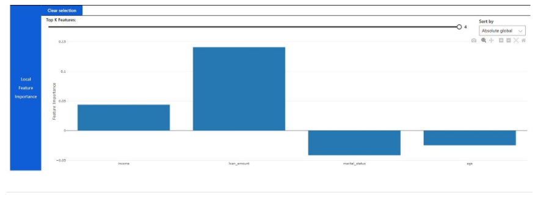

# Explain machine learning models with Azure Machine Learning

## Introduction

As machine learning becomes increasingly integral to decisions that affect health, safety, economic wellbeing, and other aspects of people's lives, it's important to be able to understand how models make predictions; and to be able to explain the rationale for machine learning based decisions.

Explaining models is difficult because of the range of machine learning algorithm types and the nature of how machine learning works, but model interpretability has become a key element of helping to make model predictions explainable.

## Learning Objectives

In this module, you will learn how to:

* Interpret *global* and *local* feature importance.
* Use an explainer to interpret a model.
* Create model explanations in a training experiment.
* Visualize model explanations.

## Feature importance

Model explainers use statistical techniques to calculate *feature importance*. This enables you to quantify the relative influence each feature in the training dataset has on label prediction. Explainers work by evaluating a test data set of feature cases and the labels the model predicts for them.

### Global feature importance
Global feature importance quantifies the relative importance of each feature in the test dataset as a whole. It provides a general comparison of the extent to which each feature in the dataset influences prediction.

For example, a binary classification model to predict loan default risk might be trained from features such as loan amount, income, marital status, and age to predict a label of 1 for loans that are likely to be repaid, and 0 for loans that have a significant risk of default (and therefore shouldn't be approved). An explainer might then use a sufficiently representative test dataset to produce the following global feature importance values:

* **income**: 0.98
* **loan amount**: 0.67
* **age**: 0.54
* **marital status** 0.32

It's clear from these values, that in respect to the overall predictions generated by the model for the test dataset, **income** is the most important feature for predicting whether or not a borrower will default on a loan, followed by the **loan amount**, then **age**, and finally **marital status**.

### Local feature importance
Local feature importance measures the influence of each feature value for a specific individual prediction.

For example, suppose Sam applies for a loan, which the machine learning model approves (by predicting that Sam won't default on the loan repayment). You could use an explainer to calculate the local feature importance for Sam's application to determine which factors influenced the prediction. You might get a result like this:

| Feature | Support for 0 | support for 1 |
| ------- | ------------- | ------------- |
| loan amount |	-0.9 |	0.9 |
| income |	-0.6	| 0.6 |
| age |	0.2	| -0.2 |
| marital status	| -0.1 |	0.1 |

Because this is a *classification* model, each feature gets a local importance value for each possible class, indicating the amount of support for that class based on the feature value. Since this is a *binary* classification model, there are only two possible classes (0 and 1). Each feature's support for one class results in correlatively negative level of support for the other.

In Sam's case, the overall support for class 0 is -1.4, and the support for class 1 is correspondingly 1.4; so support for class 1 is higher than for class 0, and the loan is approved. The most important feature for a prediction of class 1 is **loan amount**, followed by **income** - these are the opposite order from their global feature importance values (which indicate that **income** is the most important factor for the data sample as a whole). There could be multiple reasons why local importance for an individual prediction varies from global importance for the overall dataset; for example, Sam might have a lower income than average, but the loan amount in this case might be unusually small.

For a multi-class classification model, a local importance values for each possible class is calculated for every feature, with the total across all classes always being 0. For example, a model might predict the species of a penguin based on features like its bill length, bill width, flipper length, and weight. Suppose there are three species of penguin, so the model predicts one of three class labels (0, 1, or 2). For an individual prediction, the flipper length feature might have local importance values of 0.5 for class 0, 0.3 for class 1, and -0.8 for class 2 - indicating that the flipper length moderately supports a prediction of class 0, slightly supports a prediction of class 1, and strongly supports a prediction that this particular penguin is **not** class 2.

For a regression model, there are no classes so the local importance values simply indicate the level of influence each feature has on the predicted scalar label.

## Using explainers

You can use the Azure Machine Learning SDK to create explainers for models, even if they were not trained using an Azure Machine Learning experiment.

### Creating an explainer

To interpret a local model, you must install the **azureml-interpret** package and use it to create an explainer. There are multiple types of explainer, including:

* **MimicExplainer** - An explainer that creates a *global surrogate model* that approximates your trained model and can be used to generate explanations. This explainable model must have the same kind of architecture as your trained model (for example, linear or tree-based).
* **TabularExplainer** - An explainer that acts as a wrapper around various SHAP explainer algorithms, automatically choosing the one that is most appropriate for your model architecture.
* **PFIExplainer** - a *Permutation Feature Importance* explainer that analyzes feature importance by shuffling feature values and measuring the impact on prediction performance.

The following code example shows how to create an instance of each of these explainer types for a hypothetical model named **loan_model**:

      # MimicExplainer
      from interpret.ext.blackbox import MimicExplainer
      from interpret.ext.glassbox import DecisionTreeExplainableModel

      mim_explainer = MimicExplainer(model=loan_model,
                                  initialization_examples=X_test,
                                  explainable_model = DecisionTreeExplainableModel,
                                  features=['loan_amount','income','age','marital_status'], 
                                  classes=['reject', 'approve'])
                             

      # TabularExplainer
      from interpret.ext.blackbox import TabularExplainer

      tab_explainer = TabularExplainer(model=loan_model,
                                  initialization_examples=X_test,
                                  features=['loan_amount','income','age','marital_status'],
                                  classes=['reject', 'approve'])

      # PFIExplainer
      from interpret.ext.blackbox import PFIExplainer

      pfi_explainer = PFIExplainer(model = loan_model,
                                  features=['loan_amount','income','age','marital_status'],
                                  classes=['reject', 'approve'])
                                  
### Explaining global feature importance
To retrieve global importance values for the features in your mode, you can call the **explain_global()** method of your explainer to get a global explanation, and then use the **get_feature_importance_dict()** method to get a dictionary of the feature importance values. The following code example shows how to retrieve global feature importance: 

        # MimicExplainer
      global_mim_explanation = mim_explainer.explain_global(X_train)
      global_mim_feature_importance = global_mim_explanation.get_feature_importance_dict()

      # TabularExplainer
      global_tab_explanation = tab_explainer.explain_global(X_train)
      global_tab_feature_importance = global_tab_explanation.get_feature_importance_dict()

      # PFIExplainer
      global_pfi_explanation = pfi_explainer.explain_global(X_train, y_train)
      global_pfi_feature_importance = global_pfi_explanation.get_feature_importance_dict()
      
**Note:** The code is the same for MimicExplainer and TabularExplainer. The PFIExplainer requires the actual labels that correspond to the test features.

### Explaining local feature importance

To retrieve local feature importance from a **MimicExplainer** or a **TabularExplainer**, you must call the **explain_local()** method of your explainer, specifying the subset of cases you want to explain. Then you can use the **get_ranked_local_names()** and **get_ranked_local_values()** methods to retrieve dictionaries of the feature names and importance values, ranked by importance. The following code example shows how to retrieve local feature importance:

      # MimicExplainer
      local_mim_explanation = mim_explainer.explain_local(X_test[0:5])
      local_mim_features = local_mim_explanation.get_ranked_local_names()
      local_mim_importance = local_mim_explanation.get_ranked_local_values()

      # TabularExplainer
      local_tab_explanation = tab_explainer.explain_local(X_test[0:5])
      local_tab_features = local_tab_explanation.get_ranked_local_names()
      local_tab_importance = local_tab_explanation.get_ranked_local_values()
      
**Note:** The code is the same for MimicExplainer and TabularExplainer. The PFIExplainer doesn't support local feature importance explanations.

## Creating explanations

When you use an estimator or a script to train a model in an Azure Machine Learning experiment, you can create an explainer and upload the explanation it generates to the run for later analysis.

### Creating an explanation in the experiment script
To create an explanation in the experiment script, you'll need to ensure that the **azureml-interpret** and **azureml-contrib-interpret** packages are installed in the run environment. Then you can use these to create an explanation from your trained model and upload it to the run outputs. The following code example shows how code to generate and upload a model explanation can be incorporated into an experiment script.

      # Import Azure ML run library
      from azureml.core.run import Run
      from azureml.contrib.interpret.explanation.explanation_client import ExplanationClient
      from interpret.ext.blackbox import TabularExplainer
      # other imports as required

      # Get the experiment run context
      run = Run.get_context()

      # code to train model goes here

      # Get explanation
      explainer = TabularExplainer(model, X_train, features=features, classes=labels)
      explanation = explainer.explain_global(X_test)

      # Get an Explanation Client and upload the explanation
      explain_client = ExplanationClient.from_run(run)
      explain_client.upload_model_explanation(explanation, comment='Tabular Explanation')

      # Complete the run
      run.complete()

### Viewing the explanation
You can view the explanation you created for your model in the **Explanations** tab for the run in Azure Machine learning studio.

You can also use the **ExplanationClient** object to download the explanation in Python.

      from azureml.contrib.interpret.explanation.explanation_client import ExplanationClient

      client = ExplanationClient.from_run_id(workspace=ws,
                                            experiment_name=experiment.experiment_name, 
                                            run_id=run.id)
      explanation = client.download_model_explanation()
      feature_importances = explanation.get_feature_importance_dict()
      
## Visualizing explanations

Model explanations in Azure Machine Learning studio include multiple visualizations that you can use to explore feature importance.

**Note:** Visualizations are only available for experiment runs that were configured to generate and upload explanations. When using automated machine learning, only the run producing the best model has explanations generated by default.

### Visualizing global feature importance
The first visualization on the **Explanations** tab for a run shows global feature importance.

You can use the slider to show only the top N features.

### Visualizing summary importance
Switching to the **Summary Importance** visualization shows the distribution of individual importance values for each feature across the test dataset.

You can view the features as a *swarm* plot (shown above), a *box* plot, or a *violin* plot.

### Visualizing local feature importance
Selecting an individual data point shows the local feature importance for the case to which the data point belongs.

## Exercise  - Interpret Models

As machine learning becomes increasingly integral to decisions that affect health, safety, economic wellbeing, and other aspects of people’s lives, it’s important to be able to understand how models make predictions; and to be able to explain the rationale for machine learning based decisions.

In this exercise, you will:

* Generate feature importance for a model.
* Generate explanations as part of a model training experiment.

### Before you start

If you have not already done so, create a [compute instance](../Documents/Create-Compute-Instance.md) and ensure you have [Cloned the notebooks](../Documents/Clone-and-Run-a-Notebook.md) required for this exercise.

### Additional Information to note as you're working through your notebook

After creating a compute cluster to deploy your model you can view it selecting the **compute** page in [Azure Machine Learning studio](https://ml.azure.com/) and clicking on **Compute clusters** at the top of the page. 

### Open Jupyter

1. In Azure Machine Learning studio, view the **Compute** page for your workspace and on the **Compute Instances** tab, start your compute instance if it is not already running.
2. When the compute instance is running, click the **Jupyter** link to open the Jupyter home page in a new browser tab. Be sure to open Jupyter and not JupyterLab.

### Use the SDK to interpret models
In this exercise, the code to interpret models is provided in a notebook.

1. In the Jupyter home page, browse to the Users/<user_name>/labs folder where you cloned the notebook repository and open the **Interpret-Models.ipynb** notebook.
2. Then read the notes in the notebook, running each code cell in turn.
3. When you have finished running the code in the notebook, on the **File** menu, click **Close and Halt** to close it and shut down its Python kernel. Then close all Jupyter browser tabs.

### Clean-up
If you’re finished working with Azure Machine Learning for now refer to [this page](../Documents/Stop-Compute-Instance.md) to stop your compute instance. 
