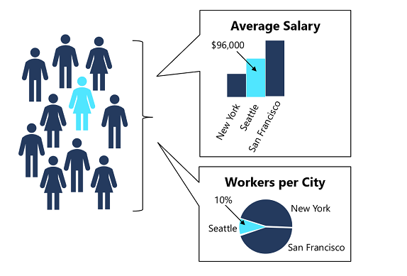
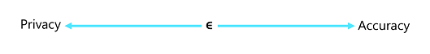

# Explore differential privacy

Data scientists have an ethical (and often legal) responsibility to protect sensitive data. Differential privacy is a leading edge approach that enables useful analysis while protecting individually identifiable data values.

## Introduction

Data science projects, including machine learning projects, involve analysis of data; and often that data includes sensitive personal details that should be kept private. In practice, most reports that are published from the data include aggregations of the data, which you may think would provide some privacy – after all, the aggregated results do not reveal the individual data values.

However, consider a case where multiple analyses of the data result in reported aggregations that when combined, could be used to work out information about individuals in the source dataset. Suppose 10 participants share data about their location and salary, from which two reports are produced:

* An aggregated salary report that tells us the average salaries in New York, San Francisco, and Seattle
* A worker location report that tells us that 10% of the study participants (in other words, a single person) is based in Seattle.

From these two reports, we can easily determine the specific salary of the Seattle-based participant. Anyone reviewing both studies who happens to know a person from Seattle that participated, now knows that person's salary.

In this module, you'll explore *differential privacy*, a technique that can help protect an individual's data against this kind of exposure.

## Tutorial Objectives

* Articulate the problem of data privacy
* Describe how differential privacy works
* Configure parameters for differential privacy
* Perform differentially private data analysis

## Understand differential privacy

Differential privacy seeks to protect individual data values by adding statistical "noise" to the analysis process. The math involved in adding the noise is complex, but the principle is fairly intuitive – the noise ensures that data aggregations stay statistically consistent with the actual data values allowing for some random variation, but make it impossible to work out the individual values from the aggregated data. In addition, the noise is different for each analysis, so the results are non-deterministic – in other words, two analyses that perform the same aggregation may produce slightly different results.

## Configure data privacy parameters

One way that an individual can protect their personal data is simply to not participate in a study – this is known as their "opt-out" option. However, there are a few considerations for this as a solution:

* Even if you decide to opt out a study may still produce results that affect you. For example, you may choose to opt-out of a study that compares the heart disease diagnoses across a group of people on the basis that doing so may reveal a heart disease diagnosis that causes your health insurance premiums to rise. If the study finds a correlation between people who drink coffee and higher risk of heart disease, and your insurance company knows that you are a coffee drinker, your rate may rise even though you didn’t personally participate in the study.

* The benefits of participation in the study may outweigh any negative impact. For example, if you're paid $100 to participate in a study that results in your health insurance rate rising by $10 per year, it will be more than 10 years before you make a net loss. This may be a worthwhile tradeoff to you (particularly if your rate may rise as a result of the study even if you don’t participate!)

* The only way for the opt-out option to work for every individual, is for every individual not to take part – which makes the whole study pointless!

The amount of variation caused by adding noise is configurable through a parameter called epsilon. This value governs the amount of additional risk that your personal data can be identified through rejecting the opt-out option and participating in a study. The key thing is that it applies this privacy principle for everyone participating in the study. A low epsilon value provides the most privacy, at the expense of less accuracy when aggregating the data. A higher epsilon value results in aggregations that are more true to the actual data distribution, but in which the individual contribution of a single individual to the aggregated value is less obscured by noise.

## Exercise - Use differential privacy

Now it's your chance to explore differential privacy for yourself by using the **SmartNoise** package.

In this exercise, you will:

* Use **SmartNoise** to generate differentially private analyses.
* Use **SmartNoise** to submit differentially private queries.

### Before you start

In this tutorial we provide some jupyter notebook templates that you can run (more detail in: [Jupyter Lab notebook templates](../labs)).

If you have not already done so, create a [compute instance](../Documents/Create-Compute-Instance.md) and ensure you have [cloned the notebooks](../Documents/Clone-and-Run-a-Notebook.md) required for this exercise.

### Open Jupyter

1. In Azure Machine Learning studio, view the **Compute** page for your workspace and on the Compute Instances tab, start your compute instance if it is not already running.
2. When the compute instance is running, click the **Jupyter** link to open the Jupyter home page in a new browser tab. Be sure to open Jupyter and not JupyterLab.

### Use SmartNoise to explore differential privacy

1. In the Jupyter home page, browse to the **Users/<user_name>/labs** folder where you cloned the notebook repository and open the **Explore-Differential-Privacy.ipynb** notebook.

2. Then read the notes in the notebook, running each code cell in turn.

3. When you have finished running the code in the notebook, on the **File** menu, click **Close and Halt** to close it and shut down its Python kernel. Then close all Jupyter browser tabs.

### Clean-up
If you’re finished working with Azure Machine Learning for now refer to [this page](../Documents/Stop-Compute-Instance.md) to stop your compute instance. 

*Source: https://docs.microsoft.com/en-us/learn/modules/detect-mitigate-unfairness-models-with-azure-machine-learning/*

