# How to deploy your model to a new environment

Creating a model it's just one part of a Machine Learning pipeline, arguably the easiest part. 
To take the model to production and obtain benefits of it, it's a completely different game. 
"Productionizing a model" needs to be able to package, deploy, track and monitor the model in various deployment targets. It needs to collect metrics, use those metrics to determine the value of the model and then enable retraining of it on the basis of these insights and/or new data. In addition to it, all this needs a mechanism that can be automated with the right knobs and dials to allow data science teams to be able to keep a tab and not allow the pipeline to go rogue, which could result in considerable business losses, as these data science models are often linked directly to customer actions.

This problem is very similar to what application development teams face with respect to managing apps and releasing new versions of it at regular intervals with improved features and capabilities. The app dev teams address these with DevOps, which is the industry standard for managing operations for an app dev cycle. To be able to replicate the same to machine learning cycles it's not an easy task.

For the development phase, Machine Learning life-cycle can be defined as:

  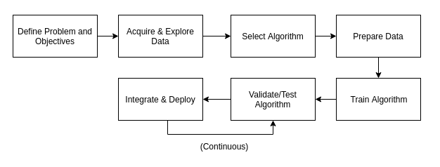

##### _Source: https://subscription.packtpub.com/book/big_data_and_business_intelligence/9781838550356/1/ch01lvl1sec13/ml-development-life-cycle_

Things are fairly simple (process wise) until we get to the final stage **Integrate and Deploy** and its continous integration with **Validating and Testing the Algorithm**. 

This is where Azure Machine Learning studio shines the most. It presents the most complete and intuitive model lifecycle management experience alongside integrating with Azure DevOps and also with GitHub.

**The decision on which deployment solution to follow depends on how the use case results should be delivered.*

In this tutorial we are going to focus on different ways of deploying the results of a data science use case based on different scenarios:

* Scenario 1 - Model was build using studio designer and it needs to be deployed as a real-time inference in another environment.

* Scenario 2 - Model was build using studio designer and it needs to be deployed as a batch inference.

* Scenario 3 - Model was build using studio notebooks and now it needs to be deployed as a real time webservice.

* Scenario 4 - Model was build using studio notebooks and now its results needs to be stored in a daily basis in a data lake file or database table.

## Scenario 1 - Model was build using studio designer and it needs to be deployed as a real-time inference in another environment.

In this scenario we are considering that the model training, scoring and evaluation is being done through studio designer and we just need to deploy it as a real time webservice in another environment (the idea is the developer is working in a development enviromnent with production data, once he gets the best model, that will be deployed to a production resource as a real-time webservice).

* Register the model (optional, see below).
* Prepare an inference configuration (unless using no-code deployment).
* Prepare an entry script (unless using no-code deployment).
* Choose a compute target.
* Deploy the model to the compute target.
* Test the resulting web service.

WIP

## Scenario 2 - Model was build using studio designer and it needs to be deployed as a batch inference.

WIP

## Scenario 3 - Model was build using studio notebooks and now it needs to be deployed as a real time webservice.

### Life-cycle management with Azure Machine Learning and Azure DevOps

1. The first task is to be able to version control the models. Now, the code generated, like the Python notebooks or scripts can be easily versioned controlled in GitHub/DevOps repositories and this is the recommended approach, but in addition to the notebooks and scripts you also need a way to version control the models, which are different entities than the python files. This is important as data scientists may create multiple versions of the model and very easily lose track of these in search of better accuracy or performance. Azure Machine Learning provides a central model registry, which forms the foundation of the lifecycle management process. This repository enables version control of models, it stores model metrics, it allows for one-click deployment and even tracks all deployments of the models so that you can restrict usage, in case the model becomes stale or its efficacy is no longer acceptable. Having this model registry is key as it also helps trigger other activities in the lifecycle when new changes appear or metrics cross a threshold.

2. The next step in the ML lifecycle management, after a data scientist has created and validated a model or a ML pipeline, is that it needs to be packaged, so that it can be executed where it needs to be deployed.

Once these tasks are done, then a tight collaboration between the DevOps development team and the Data Science team, using Azure ML, needs to kick-off.

**Azure DevOps** is the environment to manage app lifecycles and now it also enables data science teams and devOps teams to collaborate seamlessly and trigger new versions of the code whenever certain conditions are met for the MLOps cycle, as they are the ones often leveraging the new versions of the ML models, infusing them into apps or updating inference call URLs, when desired.

This may sound simple and the most logical way of doing it, but nobody has been able to bring MLOps to life with such close-knit integration into the whole process. Azure Machine Learning does an amazing job of it enabling data science teams to become immensely productive.

The following flow represents a MLOps flow within Azure Machine Learning.

  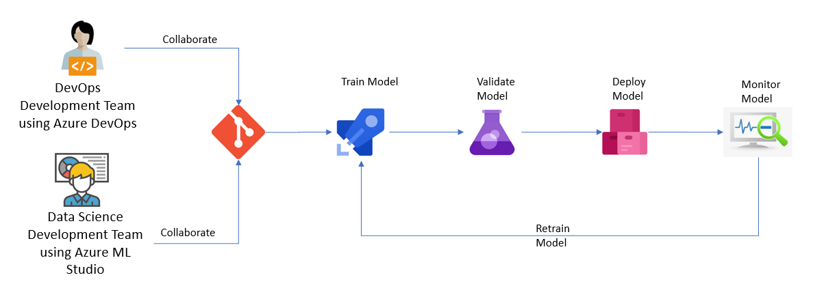

### Explaining MLOps flow within Azure Machine Learning and Azure DevOps

The idea behind the diagram shown above will be explained in the following sections.

#### Train, Validate and Deploy the Model

Once the data scientist is happy with the prediction developed in Azure Machine Learning, an Azure DevOps pipeline/release can be created to automate the process of training, registering and deploying the model and this is where the collaboration between DevOps Development Team and Data Science Team begins.

With this in mind, the following should be created in the Azure DevOps resource:

1. A Data Science project - _Team Responsible: DevOps Development Team_

2. Within the Data Science project, a new GIT repository should be created. - _Team Responsible: DevOps Development Team_

3. The following information should be added to the repository (note: the repository can be created outside Azure DevOps and can then be cloned into it). - _Team Responsible to odd the code: Data Science Team_ and  _Team Responsible to clone the repository, if needed: DevOps Development Team_

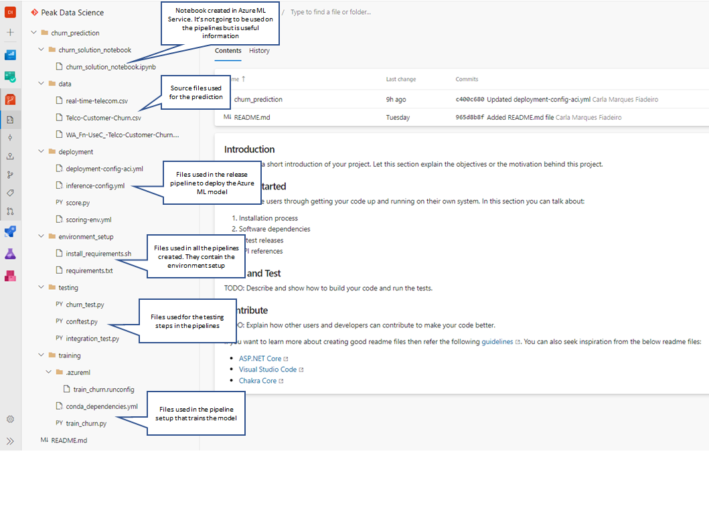

**Note**: 
In most cases, your _Data Science Team_ will provide the files and resources needed to train the machine learning model. As an example, data scientists would provide these files:

* Training script (train.py): The training script contains logic specific to the model that you're training.
* Scoring file (score.py): When the model is deployed as a web service, the scoring file receives data from clients and scores it against the model. The output is then returned to the client.
* RunConfig settings (sklearn.runconfig): Defines how the training script is run on the compute target that is used for training.
* Training environment (myenv.yml): Defines the packages needed to run the training script.
* Deployment environment (deploymentConfig.yml): Defines the resources and compute needed for the deployment environment.
* Deployment environment (inferenceConfig.yml): Defines the packages needed to run and score the model in the deployment environment.

Some of these files are directly used when developing a model. For example, the train.py and score.py files. However the data scientist may be programmatically creating the run configuration and environment settings. If so, they can create the .runconfig and training environment files, by using RunConfiguration.save(). Or, default run configuration files can be created for all compute targets already in the workspace by running the following command using Azure CLI Powershell:

`
az ml folder attach --experiment-name myexp -w myws -g mygroup
`

The files created by this command are stored in the .azureml directory of the Storage Account associated with the Azure Machine Learning Studio resource..

As we can see, this implies the creation of separate python files for training, scoring, testing and also configuration files. But this depends on what step(s) the user requires in order to start the deployment. More details are given in the sub-sections below.

##### Create a Pipeline to execute ML tasks and save all the relevant information in an Azure DevOps Artifact

1.  Once all the necessary code is added to the repository a pipeline should be created with the necessary steps steps: - _Team Responsible: DevOps Development Team_

###### _Pipeline 1 - Example_
This is an example where the model is trained, registered and saved in an Azure DevOps Artifact.

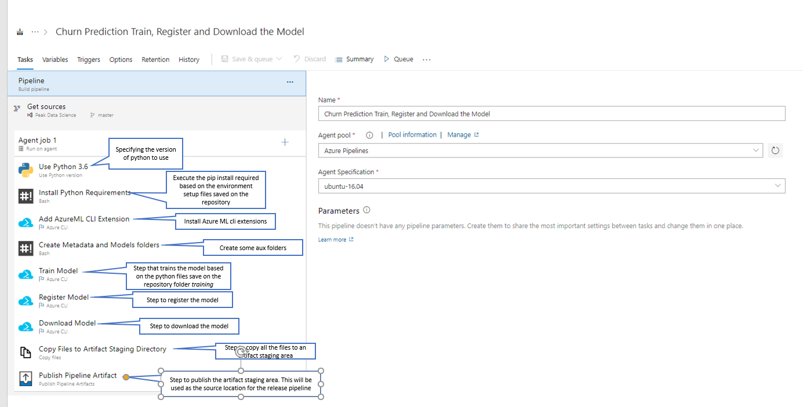

###### _Pipeline 2 - Example_
This is another example where, apart from what is done in _Pipeline 1 - Example_, some other tasks were added: Data Quality checking, testing and creating Azure ML resources.

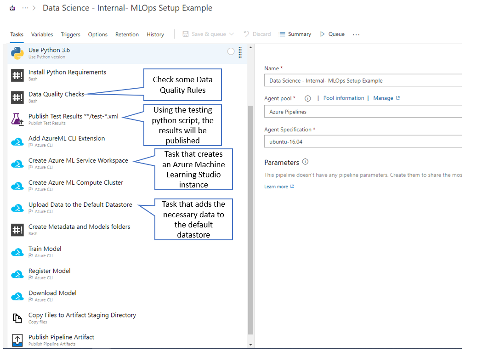

Variables can also be added to a pipeline, this is among the best practices and makes the pipeline easy to manage:

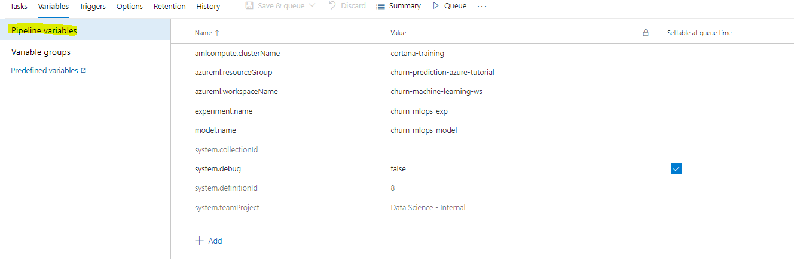

Once the pipeline is setup, it should be executed. The screenshot below shows examples of successful runnings:

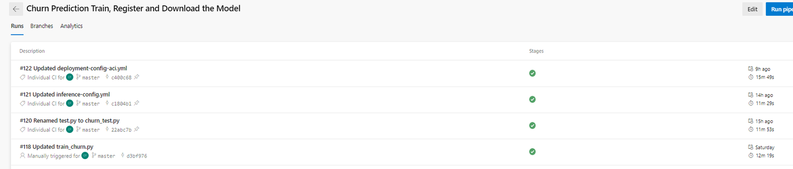

2. If the model registration is done in Azure DevOps, after each execution in order to verify the model, we can access Azure Machine Learning and verify that the model was trained and register: - _Team Responsible: Data Science Team_

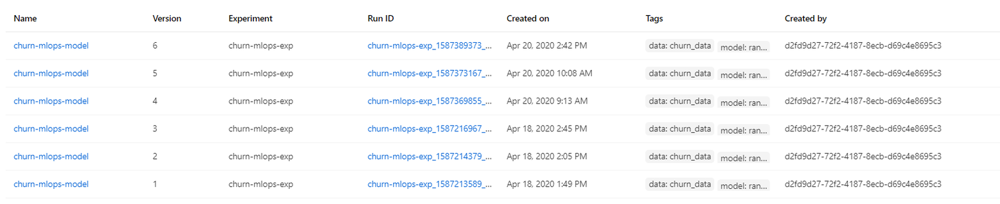

**Very Important Notes:**
* The above represent examples of pipelines that can be created. As stated, these are just examples and it really depends on what it's agreed/defined to do in Azure DevOps and what is agreed/defined to do in Azure ML. _Example:_ the user might want to train the model in an Azure ML notebook and in Azure DevOps he only wants to register and download the model in order to be able to deploy it, if that is the case then the pipeline should only start from _Download the Model_ task onwards.
* In order to deploy the model the following tasks are mandatory:
   * Download Model
   * Copy Files to Artifact Staging Directory
   * Publish Pipeline Artifact
   The others as said before may depend on what is the Azure ML/ Azure DevOps development plan.
* The creation of an Azure DevOps Artifact is mandatory since this is what is going to be used in the Deployment.
* In the _Pipeline 2 - Example_ we cans see a task related with publishing test results, if this is used, then in each pipeline run in Azure DevOps the test results can be seen:

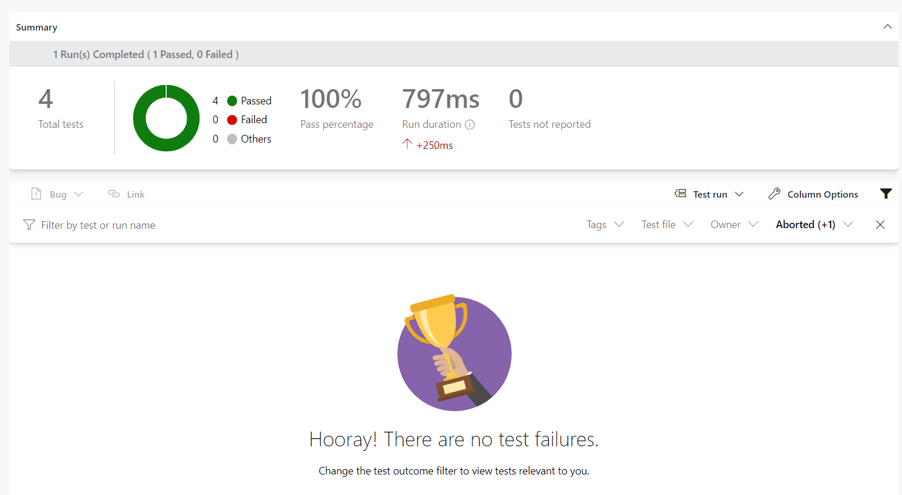

If these steps are followed, this means the following flow of the diagram have been done:

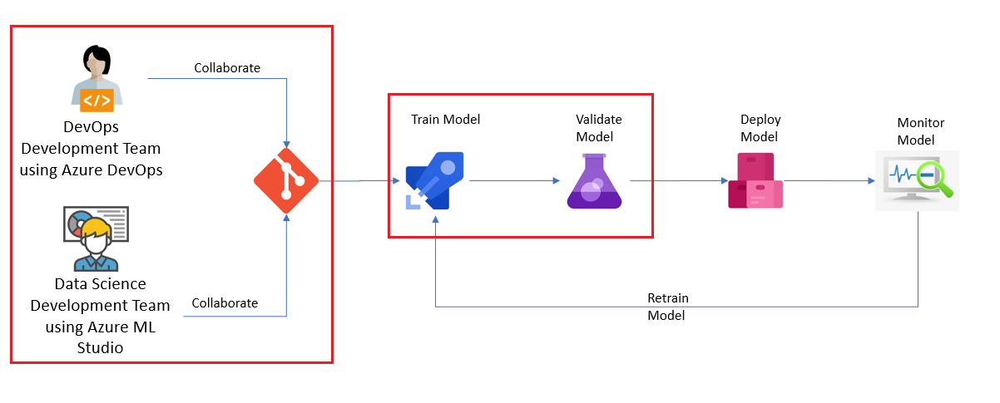

#####  Create a Release Pipeline to deploy the Azure DevOps Artifact created in the previous pipeline
This step will execute the **Deploy model** task of the diagram _MLOps flow within Azure Machine Learning_.

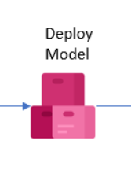

1. The deployment in Azure DevOps is done using a **Release Pipeline**. - _Team Responsible: DevOps Development Team_
This release pipeline might have the following structures (once again there is no right or wrong it really depends on to where the deployment needs to be done):

###### _Release Pipeline 1 - Example_
This is a very simple example where the artifact in only deployed to another environment:

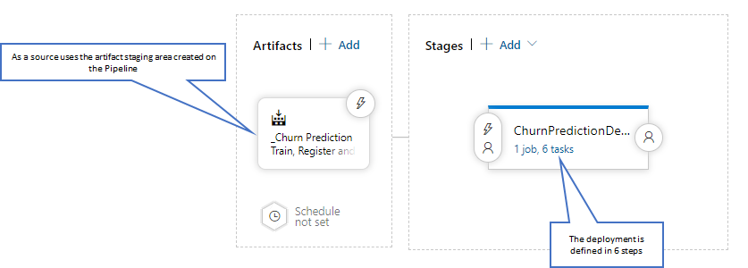

###### _Release Pipeline 2 - Example_
This is a more complex example where the artifact is being deployed to a Pre-Production environment, the after an approval, it goes to a Production environment:

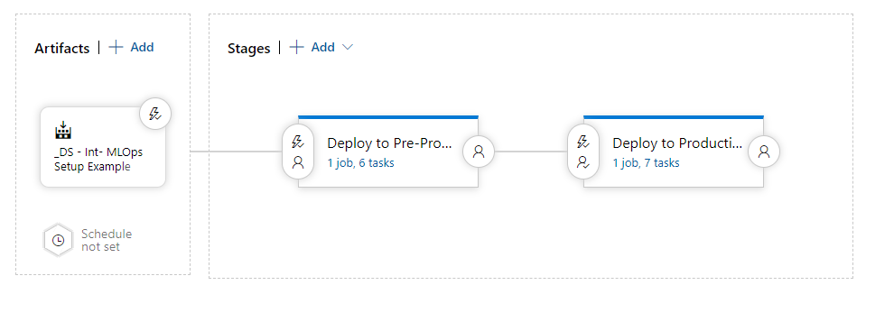

The deployment tasks are defined as:

###### _Release Pipeline 1 - Tasks - Example_
This deployment is an example of deploying a model into an Azure Container Instance, often used for non-Production environments.

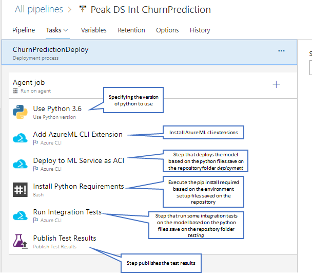

###### _Release Pipeline 2 - Tasks - Example_
This deployment is an example of deploying a model into an Azure Kubernetes Service, often used for Production environments.

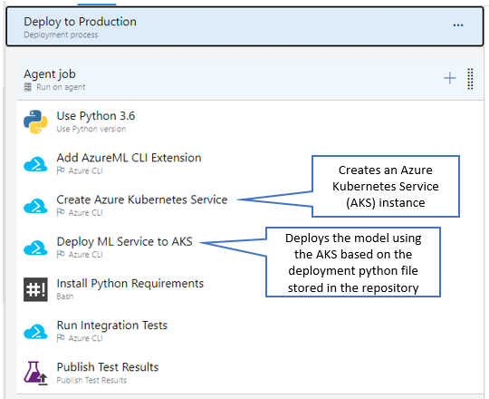

**Notes:**
* Once again the above represents examples of release pipelines, those can, should and need to be adapted to the organization rules, policies and demands.
* The flow for training, validating and deploying a model within Azure DevOps can be defined as:

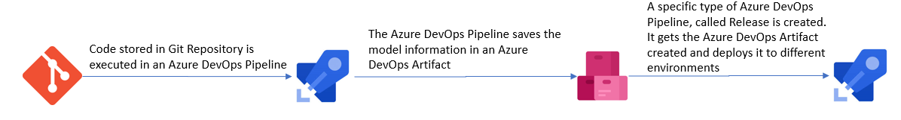

## Scenario 4 - Model was build using studio notebooks and now its results needs to be stored in a daily basis in a data lake file or database table.

WIP
