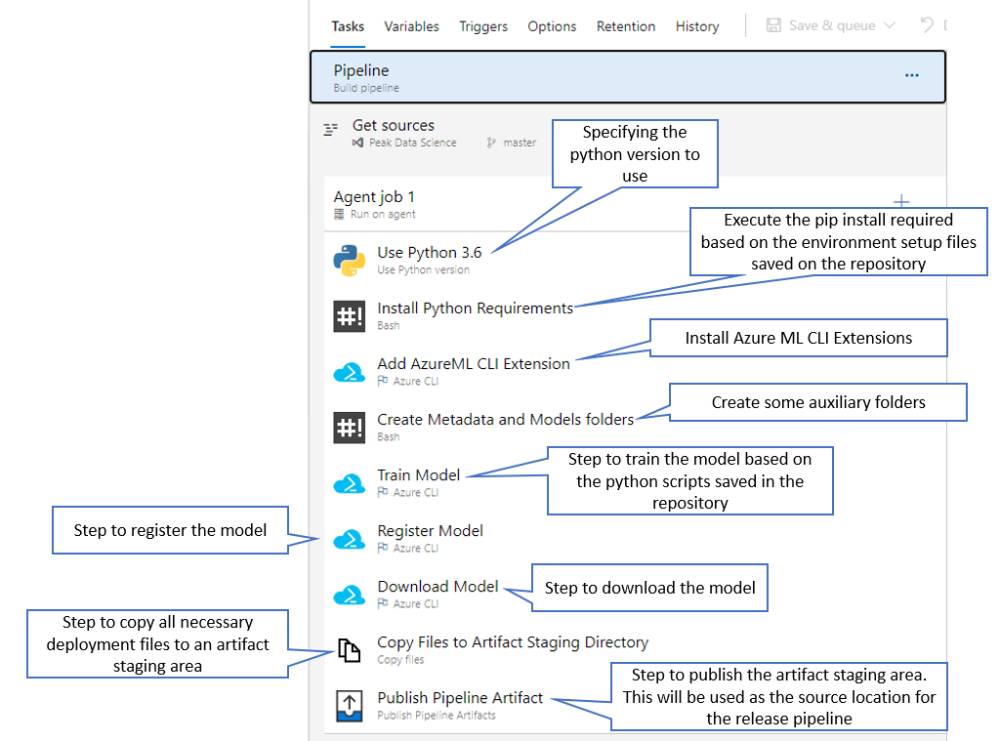
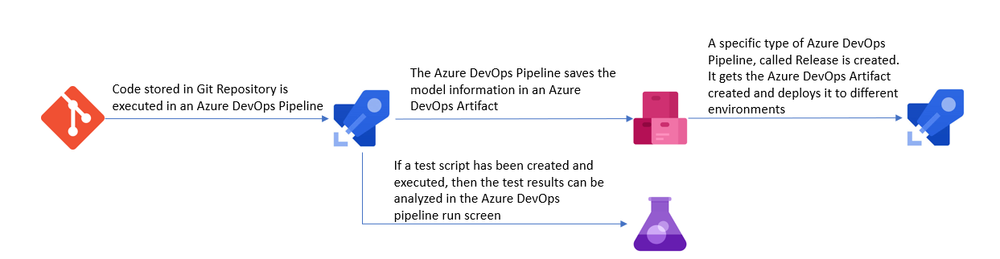

# How to productionize your Azure ML model

Creating a model it's just one part of a Machine Learning pipeline, arguably the easiest part. 
To take the model to production and obtain benefits of it, it's a completely different game. 
"Productionizing a model" needs to be able to package, deploy, track and monitor the model in various deployment targets. It needs to collect metrics, use those metrics to determine the value of the model and then enable retraining of it on the basis of these insights and/or new data. In addition to it, all this needs a mechanism that can be automated with the right knobs and dials to allow data science teams to be able to keep a tab and not allow the pipeline to go rogue, which could result in considerable business losses, as these data science models are often linked directly to customer actions.

This problem is very similar to what application development teams face with respect to managing apps and releasing new versions of it at regular intervals with improved features and capabilities. The app dev teams address these with DevOps, which is the industry standard for managing operations for an app dev cycle. To be able to replicate the same to machine learning cycles it's not an easy task.

For the development phase, Machine Learning life-cycle can be defined as:

<p align="center">
  
</p>

##### _Source: https://subscription.packtpub.com/book/big_data_and_business_intelligence/9781838550356/1/ch01lvl1sec13/ml-development-life-cycle_

Things are fairly simple (process wise) until we get to the final stage **Integrate and Deploy** and its continous integration with **Validating and Testing the Algorithm**. 

This is where Azure Machine Learning studio shines the most. It presents the most complete and intuitive model lifecycle management experience alongside integrating with Azure DevOps and GitHub.

## Life-cycle management with Azure Machine Learning and Azure DevOps

1. The first task is to be able to version control the models. Now, the code generated, like the Python notebooks or scripts can be easily versioned controlled in GitHub/DevOps repositories and this is the recommended approach, but in addition to the notebooks and scripts you also need a way to version control the models, which are different entities than the python files. This is important as data scientists may create multiple versions of the model and very easily lose track of these in search of better accuracy or performance. Azure Machine Learning provides a central model registry, which forms the foundation of the lifecycle management process. This repository enables version control of models, it stores model metrics, it allows for one-click deployment and even tracks all deployments of the models so that you can restrict usage, in case the model becomes stale or its efficacy is no longer acceptable. Having this model registry is key as it also helps trigger other activities in the lifecycle when new changes appear or metrics cross a threshold.

2. The next step in the ML lifecycle management, after a data scientist has created and validated a model or a ML pipeline, is that it needs to be packaged, so that it can be executed where it needs to be deployed.

Once these tasks are done, then a tight collaboration between the DevOps development team and the Data Science team, using Azure ML, needs to kick-off.

**Azure DevOps** is the environment to manage app lifecycles and now it also enables data science teams and devOps teams to collaborate seamlessly and trigger new versions of the code whenever certain conditions are met for the MLOps cycle, as they are the ones often leveraging the new versions of the ML models, infusing them into apps or updating inference call URLs, when desired.

This may sound simple and the most logical way of doing it, but nobody has been able to bring MLOps to life with such close-knit integration into the whole process. Azure Machine Learning does an amazing job of it enabling data science teams to become immensely productive.

The following flow represents a MLOps flow within Azure Machine Learning.

<p align="center">
  
</p>

### Explaining MLOps flow within Azure Machine Learning and Azure DevOps

The idea behind the diagram shown above will be explained in the following sections.

#### Train, Validate and Deploy the Model

Once the data scientist is happy with the prediction developed in Azure Machine Learning, an Azure DevOps pipeline/release can be created to automate the process of training, registering and deploying the model and this is where the collaboration between DevOps Development Team and Data Science Team begins.

With this in mind, the following should be created in the Azure DevOps resource:

1. A Data Science project - _Team Responsible: DevOps Development Team_

2. Within the Data Science project, a new GIT repository should be created. - _Team Responsible: DevOps Development Team_

3. The following information should be added to the repository (note: the repository can be created outside Azure DevOps and can then be cloned into it). - _Team Responsible to odd the code: Data Science Team_ and  _Team Responsible to clone the repository, if needed: DevOps Development Team_


**Note**: 
In most cases, your _Data Science Team_ will provide the files and resources needed to train the machine learning model. As an example, data scientists would provide these files:

* Training script (train.py): The training script contains logic specific to the model that you're training.
* Scoring file (score.py): When the model is deployed as a web service, the scoring file receives data from clients and scores it against the model. The output is then returned to the client.
* RunConfig settings (sklearn.runconfig): Defines how the training script is run on the compute target that is used for training.
* Training environment (myenv.yml): Defines the packages needed to run the training script.
* Deployment environment (deploymentConfig.yml): Defines the resources and compute needed for the deployment environment.
* Deployment environment (inferenceConfig.yml): Defines the packages needed to run and score the model in the deployment environment.

Some of these files are directly used when developing a model. For example, the train.py and score.py files. However the data scientist may be programmatically creating the run configuration and environment settings. If so, they can create the .runconfig and training environment files, by using RunConfiguration.save(). Or, default run configuration files can be created for all compute targets already in the workspace by running the following command using Azure CLI Powershell:

`
az ml folder attach --experiment-name myexp -w myws -g mygroup
`

The files created by this command are stored in the .azureml directory of the Storage Account associated with the Azure Machine Learning Studio resource..

As we can see, this implies the creation of separate python files for training, scoring, testing and also configuration files. But this depends on what step(s) the user requires in order to start the deployment. More details are given in the sub-sections below.

##### Create a Pipeline to execute ML tasks and save all the relevant information in an Azure DevOps Artifact

1.  Once all the necessary code is added to the repository a pipeline should be created with the necessary steps steps: - _Team Responsible: DevOps Development Team_

###### _Pipeline 1 - Example_
This is an example where the model is trained, registered and saved in an Azure DevOps Artifact.



###### _Pipeline 2 - Example_
This is another example where, apart from what is done in _Pipeline 1 - Example_, some other tasks were added: Data Quality checking, testing and creating Azure ML resources.


Variables can also be added to a pipeline, this is among the best practices and makes the pipeline easy to manage:


Once the pipeline is setup, it should be executed. The screenshot below shows examples of successful runnings:


2. If the model registration is done in Azure DevOps, after each execution in order to verify the model, we can access Azure Machine Learning and verify that the model was trained and register: - _Team Responsible: Data Science Team_


**Very Important Notes:**
* The above represent examples of pipelines that can be created. As stated, these are just examples and it really depends on what it's agreed/defined to do in Azure DevOps and what is agreed/defined to do in Azure ML. _Example:_ the user might want to train and register the model in an Azure ML notebook and in Azure DevOps he only wants to download the model in order to be able to deploy it, if that is the case then the pipeline should only start from _Download the Model_ task onwards.
* In order to deploy the model the following tasks are mandatory:
   * Download Model
   * Copy Files to Artifact Staging Directory
   * Publish Pipeline Artifact
   The others as said before may depend on what is the Azure ML/ Azure DevOps development plan.
* The creation of an Azure DevOps Artifact is mandatory since this is what is going to be used in the Deployment.
* In the _Pipeline 2 - Example_ we cans see a task related with publishing test results, if this is used, then in each pipeline run in Azure DevOps the test results can be seen:


If these steps are followed, this means the following flow of the diagram have been done:


##### <a name = 'Release-Pipeline'></a> Create a Release Pipeline to deploy the Azure DevOps Artifact created in the previous pipeline
This step will execute the **Deploy model** task of the diagram _MLOps flow within Azure Machine Learning_.


1. The deployment in Azure DevOps is done using a **Release Pipeline**. - _Team Responsible: DevOps Development Team_
This release pipeline might have the following structures (once again there is no right or wrong it really depends on to where the deployment needs to be done):

###### _Release Pipeline 1 - Example_
This is a very simple example where the artifact in only deployed to another environment:


###### _Release Pipeline 2 - Example_
This is a more complex example where the artifact is being deployed to a Pre-Production environment, the after an approval, it goes to a Production environment:


The deployment tasks are defined as:

###### _Release Pipeline 1 - Tasks - Example_
This deployment is an example of deploying a model into an Azure Container Instance, often used for non-Production environments.


###### _Release Pipeline 2 - Tasks - Example_
This deployment is an example of deploying a model into an Azure Kubernetes Service, often used for Production environments.


**Notes:**
* Once again the above represents examples of release pipelines, those can, should and need to be adapted to the organization rules, policies and demands.
* The flow for training, validating and deploying a model within Azure DevOps can be defined as:



#### Monitor the Model


Once the model is deployed, the data scientist wants to be able to collect metrics on the model. The user wants to ascertain that the model isn't drifting from its objective and that the inference is useful for the business. This means the need of capturing a lot of metrics and analyze them. Azure Machine Learning enables this tracking of metrics for the model is a very efficient manner. The central model registry becomes the one place where all this hosted.

For information and a practical example on how to use Application Insights to monitor your model's performance see [Monitor models with Azure Machine Learning](../Documents/Monitor_Models_AzureML.md).

#### Retrain the Model


Often, you'll want to validate your model, update it or even retrain it from scratch, as you receive new information. Sometimes, receiving new data is an expected part of the domain. Other times, as discussed in [Detect data drift on datasets](../Documents/Dataset-Monitors.md), model performance can degrade in the face of such things as changes to a particular sensor, natural data changes such as seasonal effects or features shifting in their relation to other features.

There is no universal answer to "How do I know if I should retrain?" but Azure ML event and monitoring tools previously discussed are good starting points for automation. 

Once you have decided to retrain, you should:

* Preprocess your data using a repeatable, automated process
* Train your new model
* Compare the outputs of your new model to those of your old model
* Use predefined criteria to choose whether to replace your old model

This process of retraining and effective Continous Integration/Continuous Development (CI/CD) of ML models is the biggest strength of Azure Machine Learning.

A theme of the above steps is that your **retraining should be automated, not ad hoc**. Azure ML provides different ways of achieving this automation. In this tutorial we will explain the following:

* Azure Machine Learning Designer - Retrain models with Azure Machine Learning Designer to see how pipelines and the Azure Machine Learning designer fit into a retraining scenario.
* Azure DevOps Retraining Pipelines with Azure CLI - Retrain models using Azure Pipelines using Azure CLI and python notebooks. It's the most common approach and allows automation and CI/CD

##### Azure Machine Learning Designer - Data Science Team

This approach can only be used when the model was designed using Azure Machine Learning Designer, more information [here](../Documents/studio-designer.md). 
This will mean the user will have a published training pipeline and this can be used to retrain the model on new data. To retrain the user can submit runs from a pipeline endpoint from the studio workspace or programmatically.

###### Submit runs by using the studio portal
The idea is to re-run and publish the pipeline using a new set of data. To achieve this, the first step is to change the pipeline in order to create a pipeline parameter which will contain the new file path and name. Once the pipeline parameter has been created and added to the pipeline, it needs to be published and then the pipeline can be executed with this new set of data for further analysis.

Step 1 - **Create a pipeline parameter**
Pipeline parameters are used to build versatile pipelines which can be resubmitted later with varying parameter values. Some common scenarios are updating datasets or some hyper-parameters for retraining. Create pipeline parameters to dynamically set variables at runtime.

Pipeline parameters can be added to data source or module parameters in a pipeline. When the pipeline is resubmitted, the values of these parameters can be specified.

For this example, we will change the training data path from a fixed value to a parameter, so that ythe model can be retrained on different set of data. Other module parameters can be added according to the use case.

1. Select the **Import Data** module.
**Note:** This example uses the Import Data module to access data in a registered datastore. However, you can follow similar steps if you use alternative data access patterns.
2. In the module detail pane, to the right of the canvas, select your data source.
3. Enter the path to your data. You can also select **Browse path** to browse your file tree.
4. Mouseover the **Path** field, and select the ellipses above the **Path** field that appear.
5. Select **Add to pipeline parameter**.
6. Provide a parameter name and a default value.
7. Select **Save**.
8. **Submit** the pipeline run.


Step 2 - **Publish the pipeline**

1. Select **Publish** above the designer canvas.
2. Select or create a pipeline endpoint.
3. Select **Publish**.


**Note:** More details on how to work with Azure ML Designer can be seen in [How to work with Azure Machine Learning Studio Designer](../Documents/studio-designer.md)

Step 3 - **Retrain the Model by submitting a new running**

Use the following steps to submit a parameterized pipeline endpoint run from the studio portal:

1. Go to the **Endpoints** page in your studio workspace.
2. Select the **Pipeline endpoints** tab. Then, select your pipeline endpoint.
3. Select the **Published pipelines** tab. Then, select the pipeline version that you want to run.
4. Select **Submit**.


5. In the setup dialog box, you can specify the parameters values for the run. 


##### Submit runs by using code
You can find the REST endpoint of a published pipeline in the overview panel. By calling the endpoint, you can retrain the published pipeline.

To make a REST call, you need an OAuth 2.0 bearer-type authentication header. The following example uses interactive authentication (for illustration purposes), but for most production scenarios that require automated or headless authentication.

Service principal authentication involves creating an App Registration in Azure Active Directory. First, you generate a client secret and then you grant your service principal role access to your machine learning workspace. Use the ServicePrincipalAuthentication class to manage your authentication flow. These tasks should be done or at least approved by your Azure Architecture Administrator Team.

Both **InteractiveLoginAuthentication** and **ServicePrincipalAuthentication** inherit from AbstractAuthentication. In both cases, use the **get_authentication_header()** function in the same way to fetch the header:

```
from azureml.core.authentication import InteractiveLoginAuthentication

interactive_auth = InteractiveLoginAuthentication()

auth_header = interactive_auth.get_authentication_header()
```

Get the REST URL from the endpoint property of the published pipeline object. You can also find the REST URL in your workspace in Azure Machine Learning studio.
Build an HTTP POST request to the endpoint. Specify your authentication header in the request. Add a JSON payload object that has the experiment name.
Make the request to trigger the run. Include code to access the Id key from the response dictionary to get the value of the run ID.

```
import requests

rest_endpoint = published_pipeline.endpoint

response = requests.post(rest_endpoint, 
                         headers=auth_header, 
                         json={"ExperimentName": "Tutorial-Batch-Scoring",
                               "ParameterAssignments": {"process_count_per_node": 6}})
run_id = response.json()["Id"]
```

Use the run ID to monitor the status of the new run. The new run takes another 10-15 min to finish.
The new run will look similar to the pipeline you ran earlier in the tutorial. You can choose not to view the full output.

```
from azureml.pipeline.core.run import PipelineRun
from azureml.widgets import RunDetails

published_pipeline_run = PipelineRun(ws.experiments["Tutorial-Batch-Scoring"], run_id)

RunDetails(published_pipeline_run).show()
```

#### Azure DevOps Retraining Pipelines with Azure CLI - Data Science Team and DevOps Development Team
Retraining the model using Azure ML Designer doesn't provide an automated way of doing but only involves the Data Science Team for the retrain itself.
Creating an Azure DevOps pipeline allows automation but involves once again the collaboration between the Data Science Team and the DevOps Development Team.

##### Create a Pipeline to execute retraining ML tasks and save all the relevant information in an Azure DevOps Artifact

1. All the necessary retraining python code needs to be added to the repository - Team Responsible: Data Science Team

2. A pipeline should be created with the necessary steps steps: - Team Responsible: DevOps Development Team

###### Pipeline - Example
This is an example of a pipeline to retrain a model:


##### Determine the best model
In your python scripts, you may want to log metrics so that you can determine the "best" model (this is the recommended approach for Production environments).

For example, you have a model that is already deployed and has an accuracy of 90. You train a new model based on new checkins to the repo and the accuracy is only 80, so you don't want to deploy it. You can use a metric such as this to build automation logic, as you can directly rank different models. In other cases, you may have several metrics that are used to indicate the "best" model. In this case, choosing the best model requires human judgment.

Depending on what "best" looks like for your scenario, you may need to create or re-use an existing release pipeline where someone must inspect the metrics to determine if the model should be deployed. For more details on how to create a release pipeline please check section [Create a Release Pipeline](#Release-Pipeline) from this page.

**Note:** To log metrics during training, use the Run class.
