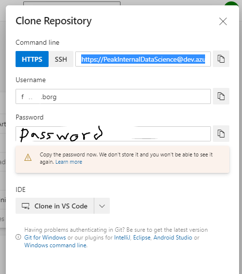

# Integrating AzureML notebooks with Git

To integrate code in Jupyterlab notebooks in GIT the recommended approach by Microsoft is to use a GIT command-line. 
The steps required to do this is shown and documented below. 

## Prerequisites

Make sure you have done the following before following this document:
* [Created a project and Git repo in Azure DevOps](../Documents/Create_project_Azure_DevOps.md).
* [Accessed Azure Machine Learning Studio](../Documents/Azure-ML-Studio.md).
* [Created a Compute Instance](../Documents/Create-Compute-Instance.md).
* [Created and run a Python or R notebook](../Documents/Creating-and-Running-a-Python-Notebook.md)

The following diagram explain the process to integrate the code in GIT

This tutorial will now explain each step.

**GIT Clone — clone the repo to your Azure ML JupyterLab**
To work with a Git repo, you need to clone the repo you will be working on for this project to your computing environment. Cloning a repo creates a complete local copy of the repo for you to work with and downloads all commits and branches in the repo and sets up a named relationship with the repo on the server. Use this relationship to interact with the existing repo, pushing and pulling changes to share code with your team.

1. From your web browser, sign in to your organization, `(https://dev.azure.com/{yourorganization})`, open the team project and select **Repos > Files**. 

2. Select **Clone** in the upper-right corner of the **Files** window. Then copy the clone URL and password (you will need both in the following step). 

3. Access Azure ML JupyterLab and open a terminal Session. 

    * Use the following: https://portal.azure.com/#home to access the Azure Portal.
    
    * Select your **Azure Machine Leanrning Workspace** 
    
    
    
    * Select **Launch Studio**
    
    

    * View the **Compute** page

    * Your compute instance must be running. Select **JupyterLab** and then open a terminal session. Note: This task can also be done using Jupyter or Terminal options that are also available in the Compute Instance. This document demonstrates how to do it in JupyterLab but the process is similar in Jupyter or Terminal options. 

    
If you need a more detailed reminder on how to how to open a JupyterLab see  [Prerequisites](#Prerequisites-1).
Once you have opened a terminal on JupyterLab switch your directory to where you want to clone your repo. This should be your own personal folder. See the screenshot below to see how you can locate and change your directory. 

After following the instructions to get a list of available directories enter: 

`cd your_directory`

and run `git clone` followed by the path copied from the Clone URL in the previous section, as shown in the following example:

`git clone https://dev.azure.com/fabrikam-fiber/MyFirstProject/_git/`

Next it will ask for a password, paste the password you copied above and press **Enter**. 
Git downloads a copy of the code, including all commits and branches from the repo, into a new folder for you to work with.

4. Switch your directory to the repository that you cloned. For e.g. 

`cd your_directory`

**GIT Checkout**

1. Still in a Terminal Session in Azure ML JupyterLab go to the repository folder that was cloned:
2. Check the GIT repository existing branches:

`git branch -a`

3. Checkout the branch you need (the one created for the project):

`git checkout <branch_name>`
 
**GIT Status**
`git status`

At any time a GIT status can be done to check any differences between the clone and the repository (it will list the files that changed between the repository and the clone made).
 
If there were changes, this means your clone is out of sync and it needs to be updated, in this case a GIT Push should be performed before any development.

**GIT Pull**
`git pull origin <branch_name>`

There are cases where, you already started changing your code in your clone and forgot to push the latest changes from the repository. If that is the case while doing git pull you may find some issues due to conflicts. In [here](https://www.freecodecamp.org/news/git-pull-force-how-to-overwrite-local-changes-with-git/) you find some good examples on how to overcome this problem.

## Work with the code (Start Developing and pushing the changes to the repository)

Once the right branch is checked out and the status doesn’t find any differences between the repository and the clone, the development can start.

When the developer is happy with the changes and wants to add them to the repository. The following steps are needed/recommended:

**GIT Add**

This step will stage the files/directories into the GIT repository staging area.
Go to the directory where the new data was stored and: 
•	if it’s a file then `git add <file>` 
•	or `git add .` if you want to add the entire content of the folder.

_Note: This step will only stage the files. Next step is to commit them._

**GIT Commit**

Once the files are staged in the GIT Repository Staging area then they to be committed. For that, the following command needs to be executed:

`git commit -m <commit_message>`

The first time we perform a commit, GIT might ask some more details on who is performing the commit.
For that we need to “tell” Git who we are by running:
`git config --global user.email "you@example.com"`
`git config --global user.name "Your Name"`
 
And then run the commit command. 
 
_Note: Always insert a commit message, so it's easy to identify what was done._

Next step is to push the changes to the target repository (currently they were only committed to the staging area). But before doing that, it’s mandatory to always check if we have the latest version of it. We do that by performing a GIT Fetch.

**GIT Fetch**

`git fetch origin` (it will ask for the clone repository password provided in Azure DevOps)
 
Once everything is up-to-date then the final step is then to push the changes made into the target repository.

Note: GIT also provides another command/option to download data from the remote repository into the clone, it is called git pull.

_What is the difference between git fetch and git pull?_

* git fetch - only downloads new data from a remote repository - but it doesn't integrate any of this new data into your working files. Fetch is great for getting a fresh view on all the things that happened in a remote repository. Due to it's "harmless" nature, you can rest assured: fetch will never manipulate, destroy, or screw up anything. This means you can never fetch often enough.
* git pull -  in contrast, is used with a different goal in mind: to update your current head branch with the latest changes from the remote server. This means that pull not only downloads new data; it also directly integrates it into your current working copy files. This has a couple of consequences: Since "git pull" tries to merge remote changes with your local ones, a so-called "merge conflict" can occur. Check out our in-depth tutorial on How to deal with merge conflicts for more information. Like for many other actions, it's highly recommended to start a "git pull" only with a clean working copy. This means that you should not have any uncommitted local changes before you pull. Use Git's Stash feature to save your local changes temporarily.

_Source: https://www.git-tower.com/learn/git/faq/difference-between-git-fetch-git-pull_

**GIT Push**

To finalize the process, even though we’ve added and commit the changes, it means they are only in GIT repository staging area. To move them to the target repository the following command needs to be executed:
`git push origin <branch_name>`

Switch back to the Azure DevOps web portal and select **History** view to show your new commit. The new repository should show the commit you just made to your notebook.

 

**Important Notes**
It is important that you commit and push changes you want to keep to the Git repository on the server (Remote Git repository). This is also particularly important if you want to clone your repository to your local laptop too. In this case you want to commit and push changes you make in one repository (for e.g. Azure ML JupyterLab) before your make changes to your work in another repository (local laptop). 

For more details on working with Git commands click [here](https://docs.microsoft.com/en-us/azure/devops/repos/git/?view=azure-devops).
