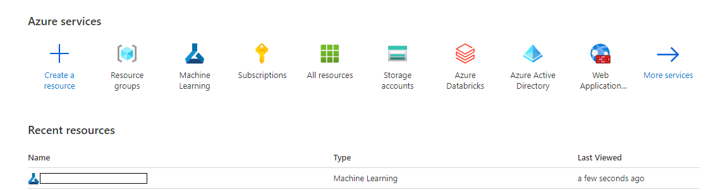

# Integrating AzureML notebooks with Git

To integrate code in Jupyterlab notebooks in GIT the recommended approach by Microsoft is to use a GIT command-line. 
The steps required to do this is shown and documented below. 

*Process used to integrate the code in GIT*

**GIT Clone — clone the repo to your Azure ML JupyterLab**
To work with a Git repo, you need to clone the repo you will be working on for this project to your computing environment. Cloning a repo creates a complete local copy of the repo for you to work with and downloads all commits and branches in the repo and sets up a named relationship with the repo on the server. Use this relationship to interact with the existing repo, pushing and pulling changes to share code with your team.

## Prerequisites

Make sure you have done the following before following this document:
* [Created a project and Git repo in Azure DevOps](../Documents/Create_project_Azure_DevOps.md).
* [Accessed Azure Machine Learning Studio](../Documents/Azure-ML-Studio.md).
* [Created a Compute Instance](../Documents/Create-Compute-Instance.md).
* [Created and run a Python or R notebook](../Documents/Creating-and-Running-a-Python-Notebook.md)

1. From your web browser, sign in to your organization, `(https://dev.azure.com/{yourorganization})`, open the team project and select **Repos > Files**. 

2. Select **Clone** in the upper-right corner of the **Files** window. Then copy the clone URL and password (you will need both in the following step). 

3. Access Azure ML JupyterLab and open a terminal Session. 

    * Use the following: https://portal.azure.com/#home to access the Azure Portal.
    
    * Select your **Azure Machine Leanrning Workspace** 
    
    
    
    * Select **Launch Studio**
    
    

    * View the **Compute** page

    * Your compute instance must be running. Select **JupyterLab** and then open a terminal session. Note: This task can also be done using Jupyter or Terminal options that are also available in the Compute Instance. This document demonstrates how to do it in JupyterLab but the process is similar in Jupyter or Terminal options. 

    
If you need a more detailed reminder on how to how to open a JupyterLab see  [Prerequisites](#Prerequisites-1).
Once you have opened a terminal on JupyterLab switch your directory to where you want to clone your repo. This should be your own personal folder. See the screenshot below to see how you can locate and change your directory. 

After following the instructions to get a list of available directories enter: 

`cd your_directory'

and run `git clone` followed by the path copied from the Clone URL in the previous section, as shown in the following example:

`git clone https://dev.azure.com/fabrikam-fiber/MyFirstProject/_git/`

Next it will ask for a password, paste the password you copied above and press **Enter**. 
Git downloads a copy of the code, including all commits and branches from the repo, into a new folder for you to work with.

4. Switch your directory to the repository that you cloned. For e.g. 

`cd your_directory`

## Work with the code

An example of how working with Git to save work with `commit` and sharing code with `push`. 

1. Navigate to one of the Jupyter Lab notebooks containing code and make some changes 'for e.g. add a comment `#testing my first edit` in one of the cells

2. Navigate back to the terminal and ensure you are still in the directory of the repository you cloned. 

3. Commit your changes by entering the following command in the Git command window, i.e. your terminal. 

`git commit -a -m "My first commit"`

When using `git commit`, `-a` means to commit all changed files and `-m` specifies a commit message.

4. Push your changes up to the Git repository on the server by entering the following command into the Git command window:

`git push`. 

5. Switch back to the web portal and select **History** from the **Code** view to show your new commit. The new repository should show the commit you just made to your notebook.

It is important that you commit and push changes you want to keep to the Git repository on the server (Remote Git repository). This is also particularly important if you want to clone your repository to your local laptop too. In this case you want to commit and push changes you make in one repository (for e.g. Azure ML JupyterLab) before your make changes to your work in another repository (local laptop). 

For more details on working with Git commands click [here](https://docs.microsoft.com/en-us/azure/devops/repos/git/?view=azure-devops).
