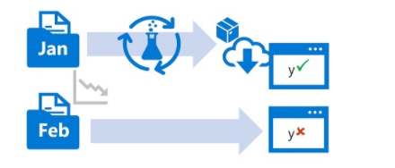

# Monitor data drift with Azure Machine Learning 

## Introduction
You typically train a machine learning model using a historical dataset that is representative of the new data that your model will receive for inferencing. However, over time there may be trends that change the profile of the data, making your model less accurate.

For example, suppose a model is trained to predict the expected gas mileage of an automobile based on the number of cylinders, engine size, weight, and other features. Over time, as car manufacturing and engine technologies advance, the typical fuel-efficiency of vehicles might improve dramatically; making the predictions made by the model trained on older data less accurate.

This change in data profiles between training and inferencing is known as data drift, and it can be a significant issue for predictive models used in production. It is therefore important to be able to monitor data drift over time, and retrain models as required to maintain predictive accuracy.

## Learning Objectives

* Create a data drift monitor. 
* Schedule data drift monitoring. 
* View data drift monitoring results.

## Creating a data drift monitor

Azure Machine Learning supports data drift monitoring through the use of *datasets*. You can capture new feature data in a dataset and compare it to the dataset with which the model was trained.

### Monitor data drift by comparing datasets
It's common for organizations to continue to collect new data after a model has been trained. For example, a health clinic might use diagnostic measurements from previous patients to train a model that predicts diabetes likelihood, but continue to collect the same diagnostic measurements from all new patients. The clinic's data scientists could then periodically compare the growing collection of new data to the original training data, and identify any changing data trends that might affect model accuracy.

To monitor data drift using registered datasets, you need to register two datasets:

* A *baseline* dataset - usually the original training data.
* A *target* dataset that will be compared to the baseline based on time intervals. This dataset requires a column for each feature you want to compare, and a timestamp column so the rate of data drift can be measured.

**Note:** 
You can configure a deployed service to collect new data submitted to the model for inferencing, which is saved in Azure blob storage and can be used as a target dataset for data drift monitoring. See [Collect data from models in production](https://aka.ms/AA70zg8) in the Azure Machine Learning documentation for more information. This has been explored prior to the creation of this document to see if it could be added as an additional document and practical example. The *azureml-monitoring* module required to enable data collection, however, at the time of writing (03/02/21), this module is still in [preview](https://pypi.org/project/azureml-monitoring/).   
