# Monitor data drift with Azure Machine Learning 

## Introduction
### what is data drift?
You typically train a machine learning model using a historical dataset that is representative of the new data that your model will receive for inferencing. However, over time there may be trends that change the profile of the data, making your model less accurate.

For example, suppose a model is trained to predict the expected gas mileage of an automobile based on the number of cylinders, engine size, weight, and other features. Over time, as car manufacturing and engine technologies advance, the typical fuel-efficiency of vehicles might improve dramatically; making the predictions made by the model trained on older data less accurate.

This change in data profiles between training and inferencing is known as data drift, and it can be a significant issue for predictive models used in production. 
Data drift is one of the top reasons model accuracy degrades over time. For machine learning models, data drift is the change in model input data that leads to model performance degradation. It is therefore important to be able to monitor and detect data drift over time, and retrain models as required to maintain predictive accuracy.

## Learning Objectives

* Causes of data drift
* Create a data drift monitor. 
* Schedule data drift monitoring. 
* View data drift monitoring results.
* Metrics, alerts, and events.

## Causes of data drift

Causes of data drift include:

* Upstream process changes, such as a sensor being replaced that changes the units of measurement from inches to centimeters.
* Data quality issues, such as a broken sensor always reading 0.
* Natural drift in the data, such as mean temperature changing with the seasons.
* Change in relation between features, or covariate shift.

Azure Machine Learning simplifies drift detection by computing a single metric abstracting the complexity of datasets being compared. These datasets may have hundreds of features and tens of thousands of rows. Once drift is detected, you drill down into which features are causing the drift. You then inspect feature level metrics to debug and isolate the root cause for the drift.

This top down approach makes it easy to monitor data instead of traditional rules-based techniques. Rules-based techniques such as allowed data range or allowed unique values can be time consuming and error prone.

In Azure Machine Learning, you use dataset monitors to detect and alert for data drift.

## Creating a data drift monitor

Azure Machine Learning supports data drift monitoring through the use of *datasets*. You can capture new feature data in a dataset and compare it to the dataset with which the model was trained.

With a dataset monitor you can:

* Detect and alert to data drift on new data in a dataset.
* Analyze historical data for drift.
* Profile new data over time.

The data drift algorithm provides an overall measure of change in data and indication of which features are responsible for further investigation. Dataset monitors produce a number of other metrics by profiling new data in the `timeseries` dataset.

Custom alerting can be set up on all metrics generated by the monitor through [Azure Application Insights](https://docs.microsoft.com/en-us/azure/azure-monitor/app/app-insights-overview). Dataset monitors can be used to quickly catch data issues and reduce the time to debug the issue by identifying likely causes.

Conceptually, there are three primary scenarios for setting up dataset monitors in Azure Machine Learning.

| Scenario | Description |
|------|------|
| Monitor a model's serving data for drift from the training data |Results from this scenario can be interpreted as monitoring a proxy for the model's accuracy, since model accuracy degrades when the serving data drifts from the training data. |
| Monitor a time series dataset for drift from a previous time period. | This scenario is more general, and can be used to monitor datasets involved upstream or downstream of model building. The target dataset must have a timestamp column. The baseline dataset can be any tabular dataset that has features in common with the target dataset. |
| Perform analysis on past data. | This scenario can be used to understand historical data and inform decisions in settings for dataset monitors. |

Dataset monitors depend on the following Azure services.

| Azure service | Description | 
| ------------- | ----------- |
| *Dataset* | Drift uses Machine Learning datasets to retrieve training data and compare data for model training. Generating profile of data is used to generate some of the reported metrics such as min, max, distinct values, distinct values count. |
| *Azureml pipeline and compute* |	The drift calculation job is hosted in azureml pipeline. The job is triggered on demand or by schedule to run on a compute configured at drift monitor creation time. |
| *Application insights* | Drift emits metrics to Application Insights belonging to the machine learning workspace. |
| *Azure blob storage* |	Drift emits metrics in json format to Azure blob storage. |

### Monitor data drift by comparing datasets
It's common for organizations to continue to collect new data after a model has been trained. For example, a health clinic might use diagnostic measurements from previous patients to train a model that predicts diabetes likelihood, but continue to collect the same diagnostic measurements from all new patients. The clinic's data scientists could then periodically compare the growing collection of new data to the original training data, and identify any changing data trends that might affect model accuracy.

To monitor data drift you monitor Azure Machine learning datasets. When you create a dataset monitor you reference two datasets: 

* A *baseline* dataset - usually the original training dataset for a model.
* A *target* dataset - usually model input data - is compared over time to your baseline dataset. This dataset requires a column for each feature you want to compare, and a timestamp column so the rate of data drift can be measured.

The monitor will compare the baseline and target datasets.

#### Create target dataset

The target dataset needs the `timeseries` trait set on it by specifying the timestamp column either from a column in the data or a virtual column derived from the path pattern of the files. Create the dataset with a timestamp through the Python SDK—as will be shown in the practical notebook at the end of this document, or [Azure Machine Learning studio](https://docs.microsoft.com/en-us/azure/machine-learning/how-to-monitor-datasets?tabs=python#studio-dataset). A column representing a "timestamp" must be specified to add `timeseries` trait to the dataset. If your data is partitioned into folder structure with time info, such as '{yyyy/MM/dd}', create a virtual column through the path pattern setting and set it as the "partition timestamp" to improve the importance of time series functionality.

The [Dataset](https://docs.microsoft.com/en-us/python/api/azureml-core/azureml.data.tabulardataset?preserve-view=true&view=azure-ml-py#&preserve-view=truewith-timestamp-columns-timestamp-none--partition-timestamp-none--validate-false----kwargs-) class [with_timestamp_columns()](https://docs.microsoft.com/en-us/python/api/azureml-core/azureml.data.tabulardataset?preserve-view=true&view=azure-ml-py#&preserve-view=truewith-timestamp-columns-timestamp-none--partition-timestamp-none--validate-false----kwargs-) method defines the time stamp column for the dataset.

    from azureml.core import Workspace, Dataset, Datastore

     # get workspace object
     ws = Workspace.from_config()

     # get datastore object 
     dstore = Datastore.get(ws, 'your datastore name')

     # specify datastore paths
     dstore_paths = [(dstore, 'weather/*/*/*/*/data.parquet')]

     # specify partition format
     partition_format = 'weather/{state}/{date:yyyy/MM/dd}/data.parquet'

     # create the Tabular dataset with 'state' and 'date' as virtual columns 
     dset = Dataset.Tabular.from_parquet_files(path=dstore_paths, partition_format=partition_format)

     # assign the timestamp attribute to a real or virtual column in the dataset
     dset = dset.with_timestamp_columns('date')

     # register the dataset as the target dataset
     dset = dset.register(ws, 'target')
     
**Tip:** For a full example of using the timeseries trait of datasets, see the [example notebook](https://github.com/Azure/MachineLearningNotebooks/blob/master/how-to-use-azureml/work-with-data/datasets-tutorial/timeseries-datasets/tabular-timeseries-dataset-filtering.ipynb or the [datasets SDK documentation](https://docs.microsoft.com/en-us/python/api/azureml-core/azureml.data.tabulardataset?preserve-view=true&view=azure-ml-py#&preserve-view=truewith-timestamp-columns-timestamp-none--partition-timestamp-none--validate-false----kwargs-).

#### Create dataset monitor

**Note:** 
You can configure a deployed service to collect new data submitted to the model for inferencing, which is saved in Azure blob storage and can be used as a target dataset for data drift monitoring. See [Collect data from models in production](https://aka.ms/AA70zg8) in the Azure Machine Learning documentation for more information. This has been explored prior to the creation of this document to see if it could be added as an additional document and practical example. The **azureml-monitoring** module required to enable data collection, however, at the time of writing (03/02/21), this module is still in [preview](https://pypi.org/project/azureml-monitoring/). 

After creating these datasets, you can define a *dataset* monitor to detect data drift and trigger alerts if the rate of drift exceeds a specified threshold. You can create dataset monitors using the visual interface in Azure Machine Learning studio, or by using the **DataDriftDetector** class in the Azure Machine Learning SDK as shown in the code below. This can also be craeted on [Azure Machine Learning studio](https://docs.microsoft.com/en-us/azure/machine-learning/how-to-monitor-datasets?tabs=python#studio-monitor).
*Python example*: See the [Python SDK reference documentation on data drift](https://docs.microsoft.com/en-us/python/api/azureml-datadrift/azureml.datadrift) for full details.

The following example shows how to create a dataset monitor using the Python SDK

     from azureml.core import Workspace, Dataset
     from azureml.datadrift import DataDriftDetector
     from datetime import datetime

     # get the workspace object
     ws = Workspace.from_config()

     # get the target dataset
     dset = Dataset.get_by_name(ws, 'target')

     # set the baseline dataset
     baseline = target.time_before(datetime(2019, 2, 1))

     # set up feature list
     features = ['latitude', 'longitude', 'elevation', 'windAngle', 'windSpeed', 'temperature', 'snowDepth', 'stationName', 'countryOrRegion']

     # set up data drift detector
     monitor = DataDriftDetector.create_from_datasets(ws, 'drift-monitor', baseline, target, 
                                                      compute_target='cpu-cluster', 
                                                      frequency='Week', 
                                                      feature_list=None, 
                                                      drift_threshold=.6, 
                                                      latency=24)

     # get data drift detector by name
     monitor = DataDriftDetector.get_by_name(ws, 'drift-monitor')

     # update data drift detector
     monitor = monitor.update(feature_list=features)

     # run a backfill for January through May
     backfill1 = monitor.backfill(datetime(2019, 1, 1), datetime(2019, 5, 1))

     # run a backfill for May through today
     backfill1 = monitor.backfill(datetime(2019, 5, 1), datetime.today())

     # disable the pipeline schedule for the data drift detector
     monitor = monitor.disable_schedule()

     # enable the pipeline schedule for the data drift detector
     monitor = monitor.enable_schedule()

After creating the dataset monitor, you can *backfill* to immediately compare the baseline dataset to existing data in the target dataset, as shown in the following example, which backfills the monitor based on weekly changes in data for the previous six weeks:

     import datetime as dt

     backfill = monitor.backfill( dt.datetime.now() - dt.timedelta(weeks=6), dt.datetime.now())
     
## Scheduling alerts

When you define a data monitor, you specify a schedule on which it should run. Additionally, you can specify a threshold for the rate of data drift and an operator email address for notifications if this threshold is exceeded.

### Configure data drift monitor schedules

Data drift monitoring works by running a comparison at scheduled **frequency**, and calculating data drift metrics for the features in the dataset that you want to monitor. You can define a schedule to run every **Day**, **Week**, or **Month**.

For dataset monitors, you can specify a **latency**, indicating the number of hours to allow for new data to be collected and added to the target dataset. For deployed model data drift monitors, you can specify a **schedule_start** time value to indicate when the data drift run should start (if omitted, the run will start at the current time).

### Configure alerts
Data drift is measured using a calculated *magnitude* of change in the statistical distribution of feature values over time. You can expect some natural random variation between the baseline and target datasets, but you should monitor for large changes that might indicate significant data drift.

You can define a **threshold** for data drift magnitude above which you want to be notified, and configure alert notifications by email. The following code shows an example of scheduling a data drift monitor to run every week, and send an alert if the drift magnitude is greater than 0.3:

    alert_email = AlertConfiguration('data_scientists@contoso.com')
    monitor = DataDriftDetector.create_from_datasets(ws, 'dataset-drift-detector', 
                                                    baseline_data_set, target_data_set,
                                                    compute_target=cpu_cluster,
                                                    frequency='Week', latency=2,
                                                    drift_threshold=.3,
                                                     alert_configuration=alert_email)
                                                     
### Understand data drift results:

This section shows you how to examine and visualise the data drift metrics in Azure Machine Learning Studio. You can update the settings as well as analyze existing data for a specific time period on this page.

Analysing data drift in Azure Machine Learning Studio is still in preview, you can also analyse data drift in Python SDK notebooks as show in the practical notebook for this tutorial.

 Example of analysing data drift in JupyterLab notebook

To visualize the data drift metrics follow these steps:

1. Navigate to [Azure Machine Learning Studio](https://ml.azure.com/?tid=168c1fe3-a841-49b5-b692-7b3132c0a997&wsid=/subscriptions/52cbf6c7-01f2-4df2-bae9-c80cee4db7eb/resourcegroups/churn-prediction-azure-tutorial/workspaces/churn-machine-learning-ws).
2. On the **Datasets** page, view the **Dataset monitors** tab.
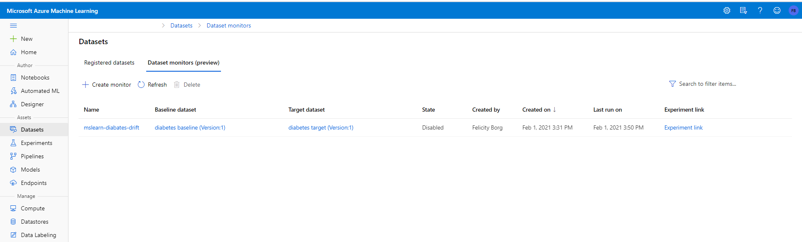
3. Click the data drift monitor you want to view.
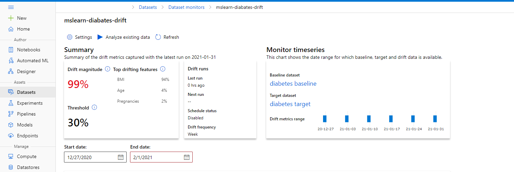

| Metric | Description |
| ------ | ----------- |
| Data drift magnitude | A percentage of drift between the baseline and target dataset over time. Ranging from 0 to 100, 0 indicates identical datasets and 100 indicates the Azure Machine Learning data drift model can completely tell the two datasets apart. Noise in the precise percentage measured is expected due to machine learning techniques being used to generate this magnitude. |
| Top drifting features | Shows the features from the dataset that have drifted the most and are therefore contributing the most to the Drift Magnitude metric. Due to covariate shift, the underlying distribution of a feature does not necessarily need to change to have relatively high feature importance. |
| Threshold | Data Drift magnitude beyond the set threshold will trigger alerts. This can be configured in the monitor settings. |

4. Select the date range over which you want to view data drift metrics (if the column chart does not show multiple weeks of data, wait a minute or so and click Refresh).

5. Examine the charts in the Drift overview section at the top, which show overall drift magnitude and the drift contribution per feature.
### Drift magnitude trend
See how the dataset differs from the target dataset in the specified time period. The closer to 100%, the more the two datasets differ.

The target dataset is also profiled over time. The statistical distance between the baseline distribution of each feature is compared with the target dataset's over time. Conceptually, this is similar to the data drift magnitude. However this statistical distance is for an individual feature rather than all features. Min, max, and mean are also available.

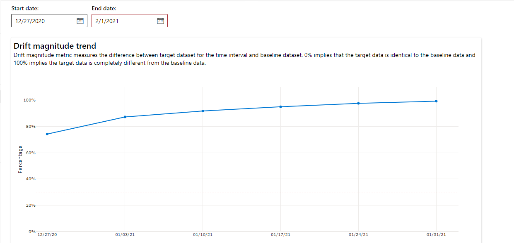

These metrics can also be retrieved in the Python SDK through the `get_metrics()` method on a `DataDriftDetector` object.

### Feature details
6. Explore the charts in the Feature detail section at the bottom, which enable you to see various measures of drift for individual features.

Scroll down to view details for each individual feature. Use the dropdowns above the chart to select the feature, and additionally select the metric you want to view.

In the Azure Machine Learning studio, click on a bar in the graph to see the the feature level details for that date. By default, you see the baseline dataset's distribution and the most recent run's distribution of the same feature.

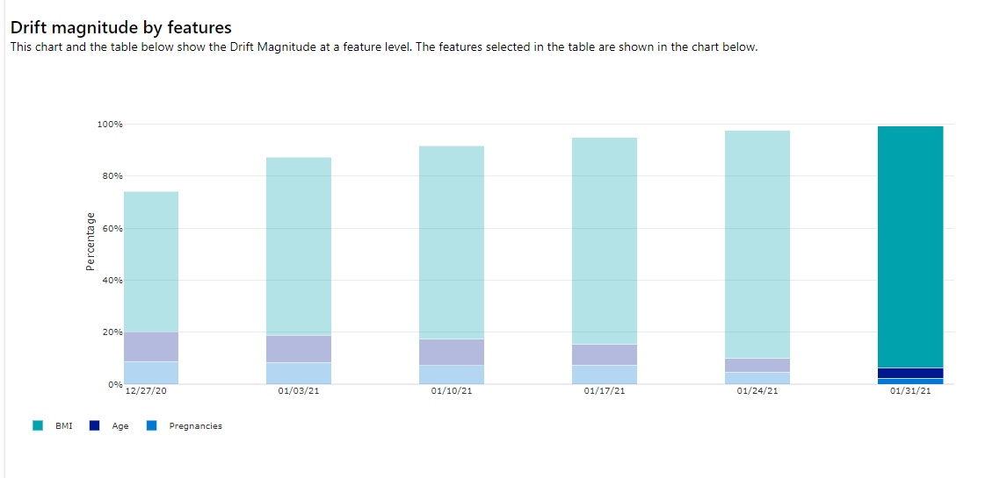
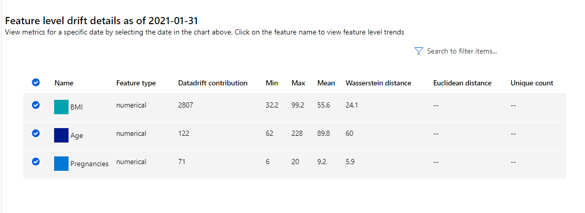
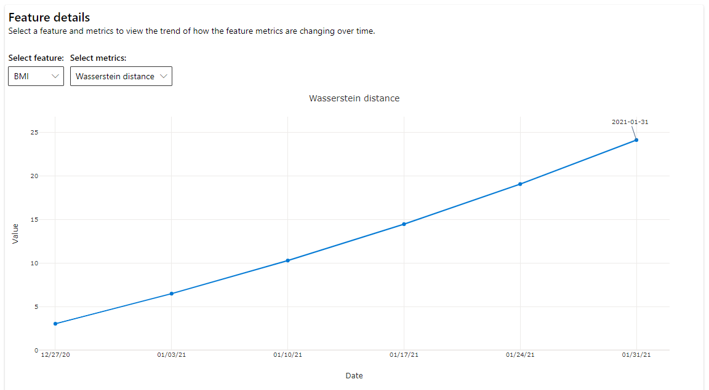
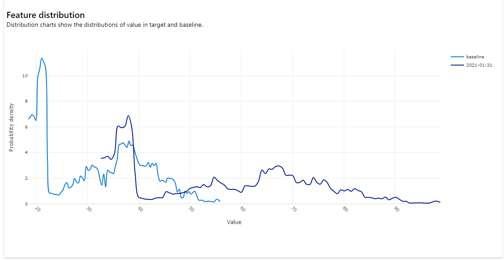

Metrics in the chart depend on the type of feature.

* Numeric features

| Metric |	Description |
| ------ | ------------ |
| Wasserstein distance | Minimum amount of work to transform baseline distribution into the target distribution. |
| Mean value | Average value of the feature. |
| Min value | Minimum value of the feature. |
| Max value | Maximum value of the feature. |

* Categorical features

| Metric | Description |
| ------ | ----------- |
| Euclidian distance  |  Computed for categorical columns. Euclidean distance is computed on two vectors, generated from empirical distribution of the same categorical column from two datasets. 0 indicates there is no difference in the empirical distributions.  The more it deviates from 0, the more this column has drifted. Trends can be observed from a time series plot of this metric and can be helpful in uncovering a drifting feature. |
| Unique values	| Number of unique values (cardinality) of the feature. |

On this chart, select a single date to compare the feature distribution between the target and this date for the displayed feature. For numeric features, this shows two probability distributions. If the feature is numeric, a bar chart is shown.

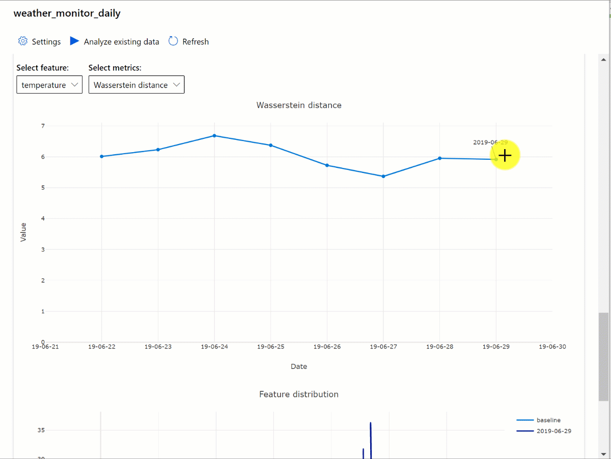

### Metrics, alerts, and events

Metrics can be queried in the [Azure Application Insights](https://docs.microsoft.com/en-us/azure/azure-monitor/app/app-insights-overview) resource associated with your machine learning workspace. You have access to all features of Application Insights including set up for custom alert rules and action groups to trigger an action such as, an Email/SMS/Push/Voice or Azure Function. Refer to the complete Application Insights documentation for details.

To get started, navigate to the [Azure portal](https://portal.azure.com/) and select your workspace's **Overview** page. The associated Application Insights resource is on the far right:

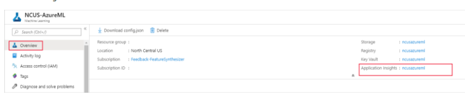

Select Logs (Analytics) under Monitoring on the left pane:

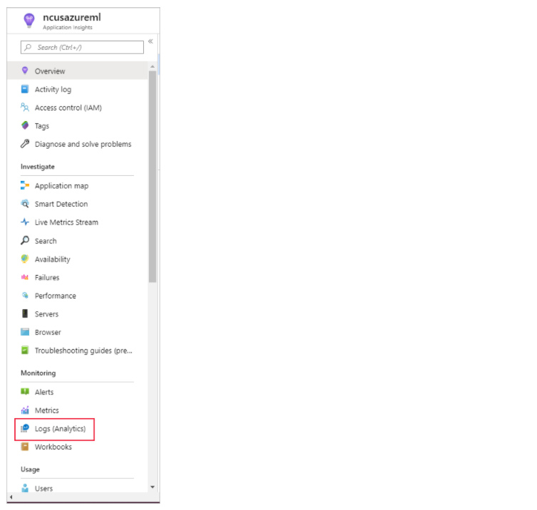

The dataset monitor metrics are stored as `customMetrics`. You can write and run a query after setting up a dataset monitor to view them:

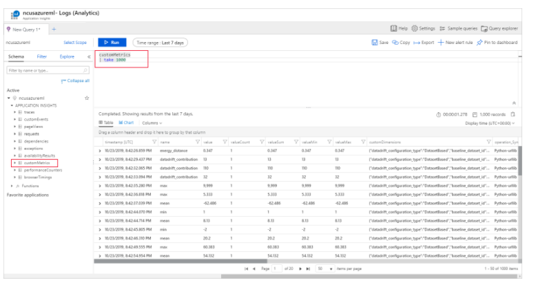

After identifying metrics to set up alert rules, create a new alert rule:

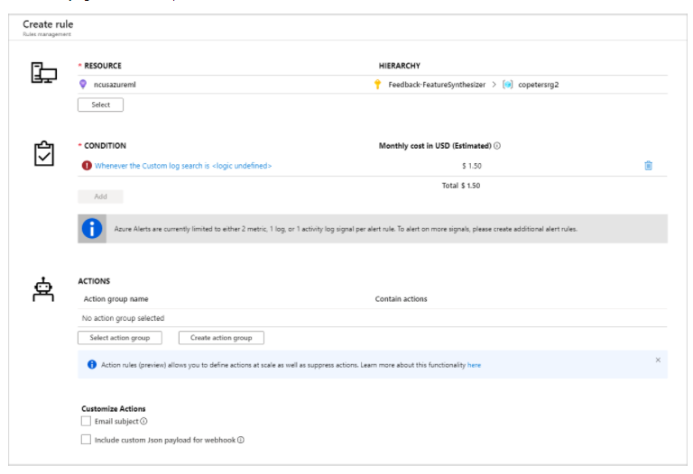

You can use an existing action group, or create a new one to define the action to be taken when the set conditions are met:

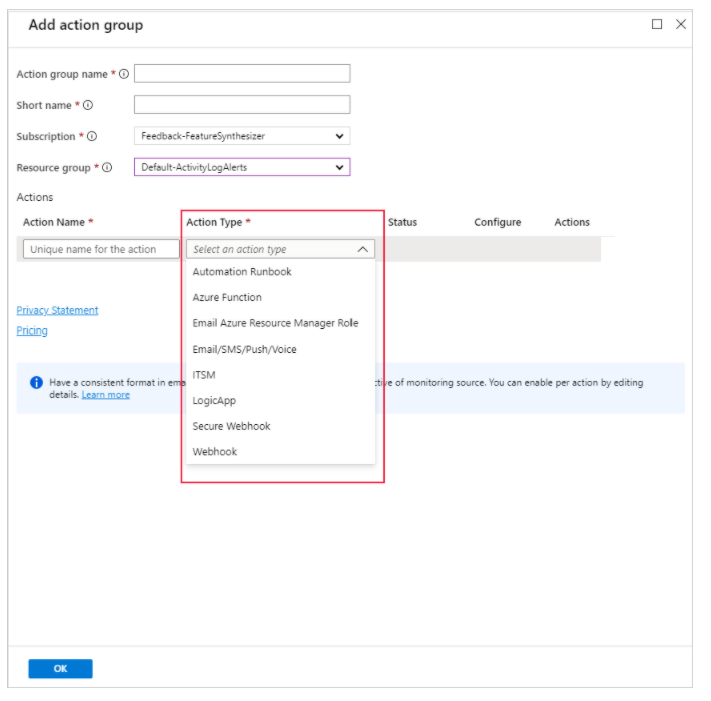

If you need support troubleshooting see [here](https://docs.microsoft.com/en-us/azure/machine-learning/how-to-monitor-datasets?tabs=python#troubleshooting)

## Exercise - Monitor data drift

### Before you start

In this tutorial we provide some jupyter notebook templates that you can run (more detail in: [Jupyter Lab notebook templates](../labs)).

If you have not already done so, create a [compute instance](../Documents/Create-Compute-Instance.md) and ensure you have [cloned the notebooks](../Documents/Clone-and-Run-a-Notebook.md) required for this exercise.

### Open Jupyter

1. In Azure Machine Learning studio, view the **Compute** page for your workspace; and on the Compute Instances tab, start your compute instance if it is not already running.
2. When the compute instance is running, click the **Jupyter** link to open the Jupyter home page in a new browser tab. Be sure to open Jupyter and not JupyterLab.

### Monitor data drift for a dataset
In this exercise, the code to monitor data drift is provided in a notebook.

1. In the Jupyter home page, browse to the Users/<user_name>/labs folder where you cloned the notebook repository, and open the **Monitoring-Data-Drift.ipynb** notebook.

2. Then read the notes in the notebook, running each code cell in turn.

3. When you have finished running the code in the notebook, on the **File** menu, click **Close and Halt** to close it and shut down its Python kernel. Then close all Jupyter browser tabs.

### Clean-up
If you’re finished working with Azure Machine Learning for now refer to [this page](../Documents/Stop-Compute-Instance.md) to stop your compute instance. 

