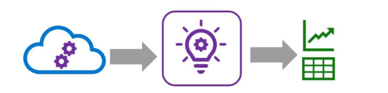
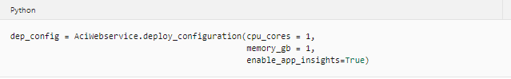
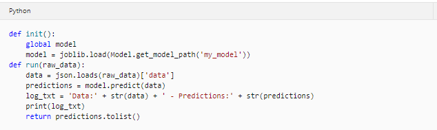

# Monitor models with Azure Machine Learning

After a machine learning model has been deployed into production, it's important to understand how it is being used by capturing and viewing telemetry.

## Introduction

Application Insights is an application performance management service in Microsoft Azure that enables the capture, storage and analysis of telemetry data from applications.



You can use Application Insights to monitor telemetry from many kinds of application, including applications that are not running in Azure. All that's required is a low-overhead instrumentation package to capture and send the telemetry data to Application Insights. The necessary package is already included in Azure Machine Learning Web services, so you can use it to capture and review telemetry from models published with Azure Machine Learning.

## Learning objectives

* Enable Application Insights monitoring for an Azure Machine Learning web service.
* Capture and view model telemetry.

## Enable Application Insights

To log telemetry in application insights from an Azure machine learning service, you must have an Application Insights resource associated with your Azure Machine Learning workspace and you must configure your service to use it for telemetry logging.

### Associate Application Insights with a workspace

When you create an Azure Machine Learning Studio workspace, you can select an Azure Application Insights resource to associate with it. If you do not select an existing Application Insights resource, a new one is created in the same resource group as your Studio.

You can determine the Application Insights resource associated with your Studio by viewing the **Overview** page of the workspace blade in the Azure portal or by using the **get_details()** method of a **Workspace** object as shown in the following code example:

```
from azureml.core import Workspace

ws = Workspace.from_config()

ws.get_details()['applicationInsights']
```

### Enable Application Insights for a service

When deploying a new real-time service, you can enable Application Insights in the deployment configuration for the service, as shown in this example:



If you want to enable Application Insights for a service that is already deployed, you can modify the deployment configuration for Azure Kubernetes Service (AKS) based services in the Azure portal. Alternatively, you can update any web service by using the Azure Machine Learning SDK, like this:
```
service = ws.webservices['my-svc']
service.update(enable_app_insights=True)
```
## Capture and view telemetry

Application Insights automatically captures any information written to the standard output and error logs and provides a query capability to view data in these logs.

### Write log data
To capture telemetry data for Application insights, you can write any values to the standard output log in the scoring script for your service by using a `print` statement, as shown in the following example:


Azure Machine Learning creates a custom dimension in the Application Insights data model for the output you write.

### Query logs in Application Insights
To analyze captured log data, you can use the Log Analytics query interface for Application Insights in the Azure portal. This interface supports a SQL-like query syntax that you can use to extract fields from logged data, including custom dimensions created by your Azure Machine Learning service.

For example, the following query returns the timestamp and customDimensions.Content fields from log traces that have a message field value of STDOUT (indicating the data is in the standard output log) and a customDimensions.["Service Name"] field value of *my-svc*:



This query returns the logged data as a table:

|       |       |
|-------|-------|
|timestamp|customDimensions_content|
|01/02/2020...	|Data:[[1, 2, 2.5, 3.1], [0, 1, 1,7, 2.1]] - Predictions:[0 1]|
|01/02/2020...	|Data:[[3, 2, 1.7, 2.0]] - Predictions:[0]|

## Exercise - Monitor a model

### Before you start

In this tutorial we provide some jupyter notebook templates that you can run (more detail in: [Jupyter Lab notebook templates](../labs)).

If you have not already done so, create a [compute instance](../Documents/Create-Compute-Instance.md) and ensure you have [cloned the notebooks](../Documents/Clone-and-Run-a-Notebook.md) required for this exercise.

### Open Jupyter

1. In Azure Machine Learning studio, view the **Compute** page for your workspace; and on the Compute Instances tab, start your compute instance if it is not already running.
2. When the compute instance is running, click the **Jupyter** link to open the Jupyter home page in a new browser tab. Be sure to open Jupyter and not JupyterLab.

### Use Application Insights to monitor a real-time service
In this exercise, the code to configure application insights for a deployed predictive service is provided in a notebook.

1. In the Jupyter home page, browse to the Users/<user_name>/labs folder where you cloned the notebook repository, and open the **Monitor_a_Model.ipynb** notebook.

2. Then read the notes in the notebook, running each code cell in turn.

3. When you have finished running the code in the notebook, on the **File** menu, click **Close and Halt** to close it and shut down its Python kernel. Then close all Jupyter browser tabs.

### Clean-up
If you’re finished working with Azure Machine Learning for now refer to [this page](../Documents/Stop-Compute-Instance.md) to stop your compute instance. 
