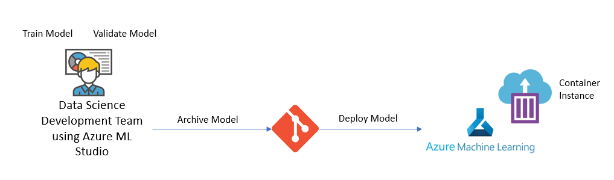

# Scenario 1 - Model was built using studio Designer and it needs to be deployed as a real-time inference in another environment

## Before you start
This tutorial will only show how to deploy a batch inference in another environment using Azure ML Studio as the deployment tool. Some of these tasks can also be done using Azure DevOps <-> Azure ML Studio existing partnership. Once you have all the necessary code / configuration files, instead of executing those directly in Azure ML Studio, you can use Azure DevOps pipelines. More details can be seen [here](../Documents/Scenario3-Notebook-RealTimeInf.md#MLOpsTrainandDeploy).

## Introduction
In this scenario we are considering that the model training, scoring and evaluation is being done through studio designer and we just need to deploy it as a real time webservice in another environment (the idea is the developer is working in a development enviromnent with production data, once he gets the best model, it will be deployed to a production resource as a real-time webservice).

The flow to achieve this can be defined as:

  

Going into a bit more depth, for each stage of the flow we have:

## Development Stage

**Designer: Create and Submit a Pipeline and Download the chosen Model** 

This step is meant to the done in the "dev" environment, it consists of:

* Creating a Pipeline in the Designer interface to prepare the data, train, score and evaluate the model - More details can be seen [here](../Documents/studio-designer.md#DesignerCreatePipeline).
* Submit the Pipeline - This means submiting the pipeline defined in the previous point. You might need to perform a couple of submissions and changes to your pipeline before being happy with the model results. More details can be seen [here](../Documents/studio-designer.md#DesignerSubmitPipeline).
* Download the Model details - Once the Model is chosen and the final pipeline execution has been submitted, the next step is to download the model information so it can be applied in a different environment. This can be done by following the steps bellow:

## Archiving and Version Controlling

All the filed retrieved from the _Download the Model details_ task should be stored in the GIT repository for future reference and versioning control.

## Migrating and Deploying to a different environment

**Step 1:** Upload and register the model to the new environment. Following the steps shown below:

This will mean using the .pkl file retrieved on the _Download the Model details_ task and that were stored in GIT repository (task: _Archiving and Version Controlling_).

**Step 2:** Select the model registered in the previous step and deploy it in this new environment as a real-time webservice. This will mean the remaining downloaded files from   _Download the Model details_ task are going to be needed (scoring script and environment configuration). This step can be achieved from 2 different ways:

_Option 1_ - Deploying directly in the portal by executing the following:

_Option 2_ - Create a notebook to build this real time inference webservice. More details can be seen [here](../Documents/Deploy-Real-Time-Service.md#Inf-Pipeline-infconfig).
