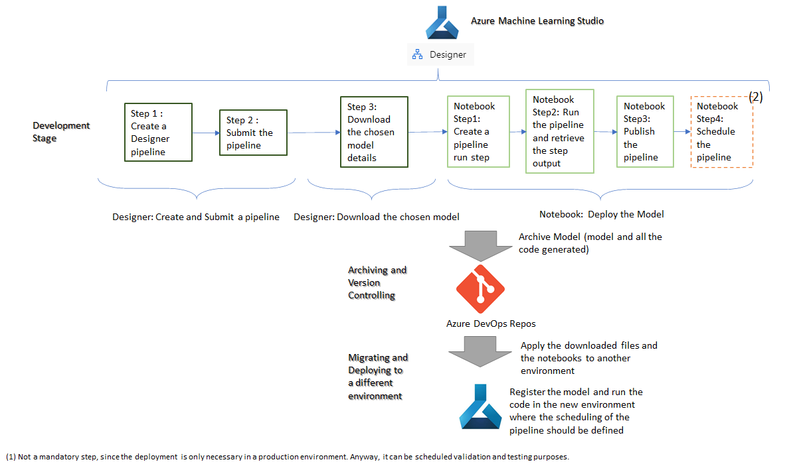
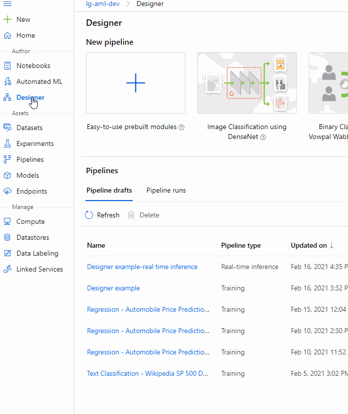

# Scenario 2 - Model was built using studio Designer and it needs to be deployed as a batch inference in another environment

## Before you start
This tutorial will only show how to deploy a batch inference in another environment using Azure ML Studio as the deployment tool. Some of these tasks can also be done using Azure DevOps <-> Azure ML Studio existing partnership. Once you have all the necessary code / configuration files, instead of executing those directly in Azure ML Studio, you can use Azure DevOps pipelines. More details can be seen [here](../Documents/Scenario3-Notebook-RealTimeInf.md#MLOpsTrainandDeploy).

## Introduction
In this scenario we are considering that the model training, scoring and evaluation is being done through studio designer and we just need to deploy it as a batch inference. But with the caveat that the deployment will be done in a different environment than the one where the Designer definition and submission took place.

The life cycle defined in this tutorial to suppport this solution is based on the following flow:

## Development Stage

**Designer: Create and Submit a Pipeline and Download the chosen Model** 

This step is meant to the done in the "dev" environment, it consists of:

* Creating a Pipeline in the Designer interface to prepare the data, train, score and evaluate the model - More details can be seen [here](../Documents/studio-designer.md#DesignerCreatePipeline).
* Submit the Pipeline - This means submiting the pipeline defined in the previous point. You might need to perform a couple of submissions and changes to your pipeline before being happy with the model results. More details can be seen [here](../Documents/studio-designer.md#DesignerSubmitPipeline).
* Download the Model details - Once the Model is chosen and the final pipeline execution has been submitted, the next step is to download the model information so it can be applied in a different environment. This can be done by following the steps bellow:

**Notebook: Deploy Model** 

For the deployment, the following steps should be developed:

* Register the Model - This step will upload and register the model, following the steps shown below:

This will mean using the downloaded files retrieved on the _Download Best Model details_ stage.
* Scoring script - This step consists of getting the scoring script and configuration details retrieved on the _Download the Model details_ stage into the new environment. 
* Create a pipeline with a Pipeline Run Step - To perform high performance parallel batch inferencing then the pipeline particular step called [ParallelRunStep](../Documents/Deploy-Batch-Inference-Pipeline.md#Batch-Pipeline-parallelstep) should be used. When you only want to run the model from time to time, generating all possible predictions in a batch without any parallel concerns then [PythonScriptStep](https://vladiliescu.net/deploying-models-with-azure-ml-pipelines/#step-1-fetching-new-data) is the one to use.
* [Run the pipeline and retrieve the step output](../Documents/Deploy-Batch-Inference-Pipeline.md#Batch-Pipeline-publish) - In the example provided in this tutorial, this is where the output of the model is stored in a file (but other options are available such as: saving the model output in a database table, publishing it as a REST service that then can be invoked by Power BI,...).
* [Publishing and Scheduling a batch inference pipeline](../Documents/Deploy-Batch-Inference-Pipeline.md#Batch-Pipeline-publish) - The model will be published as a batch inferencing pipeline. For this particular example, everytime it is invoked it will be storing a file in the defined storage area. Once again, in the example, the scheduling is being done within the Azure ML pipeline code but the option defined in [Note](#Note) can also be considered.

## Archiving and Version Controlling

All the filed retrieved from the _Download the Model details_ task should be stored in the GIT repository for future reference and versioning control.
Once all the notebooks code is properly tested, it also should be archived in the GIT repository. In this tutorial, we are considering Azure DevOps Repos as the GIT Repository but others can be used. More details on how to do this step can be found in [Integrating Azure ML notebooks with Git](../Documents/Integrating_AzureML_notebooks_with%20Git.md).

## Migrating and Deploying to a different environment

**Step 1:** Upload and register the model to the new environment. Following the steps shown below:

This will mean using the .pkl file retrieved on the _Download the Model details_ task and that were stored in GIT repository (task: _Archiving and Version Controlling_).

**Step 2:** Deploy the model in this new environment as a batch inference by following the steps below:

* The migration of the code to a new environment is a very simple task, it consists of cloning the repository from the previous task (_Archiving and Version Controlling_) into the new environment. More details on how to do this can be seen in [Clone and Run a Notebook](../Documents/Clone-and-Run-a-Notebook.md). 

* Once the code has been added to the new environment, it should be executed. This will create and register the model and will also scheduled the pipeline with the recurrence defined (Minute, Hour, Day, Week or Month). This will mean the code associated with that pipeline will be executed with the defined recurrence and the predictions will be retrieved with that frequency.

<a name = 'Note'> **Note: This example considers the pipeline will be scheduled within Azure ML Studio, another option can be to schedule and execute the pipeline using Azure Data Factory, more details can be seen [here](https://docs.microsoft.com/en-us/azure/data-factory/transform-data-machine-learning-service).**

## Useful links: 
https://vladiliescu.net/deploying-models-with-azure-ml-pipelines/

