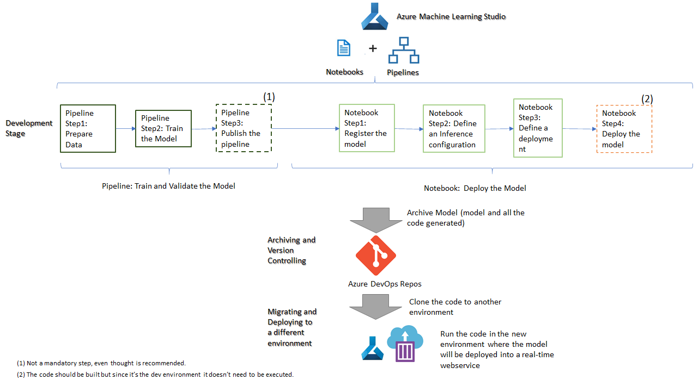
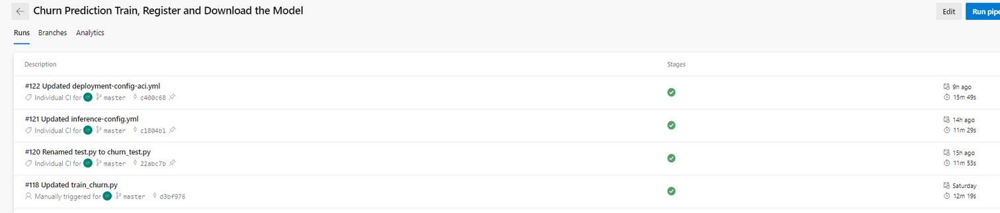
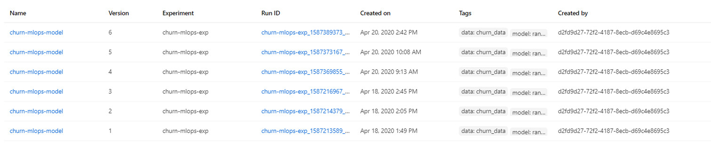
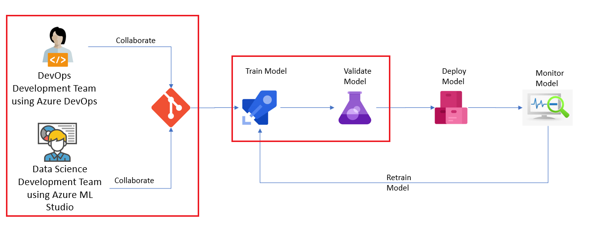
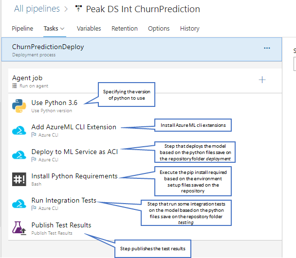

# Scenario 3 - Model was built using studio notebooks and now it needs to be deployed as a real time inference

For this scenario this tutorial will explain 2 different options:

* Option 1: Life-cycle management with Azure Machine Learning and Azure DevOps Repos 

  This option consists of the following flow:
  

  

  
* Option 2: Life-cycle management with Azure Machine Learning, Azure DevOps Repos and Azure DevOps Pipelines

  This option consists of the following flow:

  

This flow reflects the entire life-cycle management including Model Monitoring and Model Retrain, this section will only focus on the highlighted areas. The remaining ones are explained [here](../Documents/monitor-model-productionize.md) and [here](../Documents/retrain-model-productionize.md).

## Option 1: Life-cycle management with Azure Machine Learning and Azure DevOps Repos 

The life cycle defined in this tutorial to suppport this solution is based on the following flow:

  

Adding more detail to each stage we have:

Explaining each step in detail:

## Development Stage

**Pipeline: Train and Validate the Model** 

This step is meant to the done in the "dev" environment, the notebook code should be build using the Azure ML Pipelines concept, more information can be seen in [Create Pipelines](../Documents/Orchestrate-ML-With-Pipelines.md) but be aware that, while developing, only these 2 steps are needed:

   * Create an Azure Machine Learning pipeline. - to prepare and train the data
   * Publish an Azure Machine Learning pipeline - not a mandatory step but it's recommended. If the pipeline is published then it can be executed at any time without the need of running the notebook.
   
 **Note: Schedule an Azure Machine Learning pipeline is not needed at this stage since this is just a development environment. But the code should be developed so it can be executed in the production environment**
 
**Notebook: Deploy the Model** 

For the deployment development more information can be seen in [Deploy real-time machine learning services with Azure Machine Learning](../Documents/Deploy-Real-Time-Service.md#Deploy-RTinf), once again only section _Deploying a model as a real-time service_ is needed. 

## Archiving and Version Controlling

Once all the code is properly tested, it should be archived in a git repository. In this tutorial, we are considering Azure DevOps Repos as the Git Repository but others can be used. More details on how to do this step can be found in [Integrating Azure ML notebooks with Git](../Documents/Integrating_AzureML_notebooks_with%20Git.md).

## Migrating and Deploying to a different environment

**Step 1:** The migration of the code to a new environment is a very simple task, it consists of cloning the repository from the previous step (Step 2) into the new environment. More details on how to do this can be seen in [Clone and Run a Notebook](Documents/Clone-and-Run-a-Notebook.md). 

**Step 2:** Once the code as been added to the new environment, then all the code should be executed. This will create the model and will deploy it into a real time inference (this means the model will be deployed into a container as a webservice and can be consumed as a REST API, more details on how to consume the model can be seen [here](../Documents/Deploy-Real-Time-Service.md#Consume_inf).

**Note: This example considers that all the code will be migrated from one enviroment to the other and it will be executed in the destination environment (which is will be the final one). Another option might be to download the model created in the "dev" environment, then upload it in the new environment using the web portal Register Model option (see image below) and then only execute the notebook that deploys the model.**

## Option 2: Life-cycle management with Azure Machine Learning, Azure DevOps Repos and Azure DevOps Pipelines

1. The first task is to be able to version control the models. Now, the code generated, like the Python notebooks or scripts can be easily versioned controlled in GitHub/DevOps repositories and this is the recommended approach, but in addition to the notebooks and scripts you also need a way to version control the models, which are different entities than the python files. This is important as data scientists may create multiple versions of the model and very easily lose track of these in search of better accuracy or performance. Azure Machine Learning provides a central model registry, which forms the foundation of the lifecycle management process. This repository enables version control of models, it stores model metrics, it allows for one-click deployment and even tracks all deployments of the models so that you can restrict usage, in case the model becomes stale or its efficacy is no longer acceptable. Having this model registry is key as it also helps trigger other activities in the lifecycle when new changes appear or metrics cross a threshold.

2. The next step in the ML lifecycle management, after a data scientist has created and validated a model or a ML pipeline, is that it needs to be packaged, so that it can be executed where it needs to be deployed.

Once these tasks are done, then a tight collaboration between the DevOps development team and the Data Science team, using Azure ML, needs to kick-off.

**Azure DevOps** is the environment to manage app lifecycles and now it also enables data science teams and devOps teams to collaborate seamlessly and trigger new versions of the code whenever certain conditions are met for the MLOps cycle, as they are the ones often leveraging the new versions of the ML models, infusing them into apps or updating inference call URLs, when desired.

This may sound simple and the most logical way of doing it, but nobody has been able to bring MLOps to life with such close-knit integration into the whole process. Azure Machine Learning does an amazing job of it enabling data science teams to become immensely productive.

The following flow (also presented at the begining of this page) is a good representation of the MLOps flow within Azure Machine Learning.

  

Once again, this flow reflects the entire life-cycle management including Model Monitoring and Model Retrain, this section will only focus on the highlighted areas. The remaining ones are explained [here](../Documents/monitor-model-productionize.md) and [here](../Documents/retrain-model-productionize.md).

## Explaining MLOps flow within Azure Machine Learning and Azure DevOps

Taking into consideration the diagram shown previously describing the MLOps flow, we will go into a bit more detail on how the process will work.

The idea behind these diagrams will be explained in the following sections.

### Train, Validate and Deploy the Model

Once the data scientist is happy with the prediction developed in Azure Machine Learning, an Azure DevOps pipeline/release can be created to automate the process of training, registering and deploying the model and this is where the collaboration between DevOps Development Team and Data Science Team begins.

With this in mind, the following should be created in the Azure DevOps resource:

1. A Data Science project - _Team Responsible: DevOps Development Team_

2. Within the Data Science project, a new GIT repository should be created. - _Team Responsible: DevOps Development Team_

3. The following information should be added to the repository (note: the repository can be created outside Azure DevOps and can then be cloned into it). - _Team Responsible to odd the code: Data Science Team_ and  _Team Responsible to clone the repository, if needed: DevOps Development Team_

**Note**: 
In most cases, your _Data Science Team_ will provide the files and resources needed to train the machine learning model. As an example, data scientists would provide these files:

* Training script (train.py): The training script contains logic specific to the model that you're training.
* Scoring file (score.py): When the model is deployed as a web service, the scoring file receives data from clients and scores it against the model. The output is then returned to the client.
* RunConfig settings (sklearn.runconfig): Defines how the training script is run on the compute target that is used for training.
* Training environment (myenv.yml): Defines the packages needed to run the training script.
* Deployment environment (deploymentConfig.yml): Defines the resources and compute needed for the deployment environment.
* Deployment environment (inferenceConfig.yml): Defines the packages needed to run and score the model in the deployment environment.

Some of these files are directly used when developing a model. For example, the train.py and score.py files. However the data scientist may be programmatically creating the run configuration and environment settings. If so, they can create the .runconfig and training environment files, by using RunConfiguration.save(). Or, default run configuration files can be created for all compute targets already in the workspace by running the following command using Azure CLI Powershell:

`
az ml folder attach --experiment-name myexp -w myws -g mygroup
`

The files created by this command are stored in the .azureml directory of the Storage Account associated with the Azure Machine Learning Studio resource..

As we can see, this implies the creation of separate python files for training, scoring, testing and also configuration files. But this depends on what step(s) the user requires in order to start the deployment. More details are given in the sub-sections below.

###   Create a Pipeline to execute ML tasks and save all the relevant information in an Azure DevOps Artifact

1.  Once all the necessary code is added to the repository a pipeline should be created with the necessary steps steps: - _Team Responsible: DevOps Development Team_

#### _Pipeline 1 - Example_
This is an example where the model is trained, registered and saved in an Azure DevOps Artifact.

#### _Pipeline 2 - Example_
This is another example where, apart from what is done in _Pipeline 1 - Example_, some other tasks were added: Data Quality checking, testing and creating Azure ML resources.

Variables can also be added to a pipeline, this is among the best practices and makes the pipeline easy to manage:

Once the pipeline is setup, it should be executed. The screenshot below shows examples of successful runnings:

2. If the model registration is done in Azure DevOps, after each execution in order to verify the model, we can access Azure Machine Learning and verify that the model was trained and register: - _Team Responsible: Data Science Team_

**Very Important Notes:**
* The above represent examples of pipelines that can be created. As stated, these are just examples and it really depends on what it's agreed/defined to do in Azure DevOps and what is agreed/defined to do in Azure ML. _Example:_ the user might want to train the model in an Azure ML notebook and in Azure DevOps he only wants to register and download the model in order to be able to deploy it, if that is the case then the pipeline should only start from _Download the Model_ task onwards.
* In order to deploy the model the following tasks are mandatory:
   * Download Model
   * Copy Files to Artifact Staging Directory
   * Publish Pipeline Artifact
   The others as said before may depend on what is the Azure ML/ Azure DevOps development plan.
* The creation of an Azure DevOps Artifact is mandatory since this is what is going to be used in the Deployment.
* In the _Pipeline 2 - Example_ we cans see a task related with publishing test results, if this is used, then in each pipeline run in Azure DevOps the test results can be seen:

If these steps are followed, this means the following flow of the diagram have been done:

### Deploy the model into a real time inference

In this tutorial we explain 3 different options of deploying a model into a real time inference:

###  Option 1: Create a Release Pipeline to deploy the Azure DevOps Artifact created in the previous pipeline as a real-time inference
This step will execute the **Deploy model** task of the diagram _MLOps flow within Azure Machine Learning_.

1. The deployment in Azure DevOps is done using a **Release Pipeline**. - _Team Responsible: DevOps Development Team_
This release pipeline might have the following structures (once again there is no right or wrong it really depends on to where the deployment needs to be done):

##### _Release Pipeline 1 - Example_
This is a very simple example where the artifact in only deployed to another environment:

##### _Release Pipeline 2 - Example_
This is a more complex example where the artifact is being deployed to a Pre-Production environment, the after an approval, it goes to a Production environment:

The deployment tasks are defined as:

##### _Release Pipeline 1 - Tasks - Example_
This deployment is an example of deploying a model into an Azure Container Instance, often used for non-Production environments.

##### _Release Pipeline 2 - Tasks - Example_
This deployment is an example of deploying a model into an Azure Kubernetes Service, often used for Production environments.

**Notes:**
* Once again the above represents examples of release pipelines, those can, should and need to be adapted to the organization rules, policies and demands.
* The flow for training, validating and deploying a model within Azure DevOps can be defined as:

### Option 2: Deploy a real-time inference with Azure Machine Learning notebooks

Instead of deploying the model using Azure DevOps Pipelines, the same can be achieved by running a notebook in Azure ML. More details can be seen in 
[Deploy real-time machine learning services with Azure Machine Learning](../Documents/Deploy-Real-Time-Service.md).

### Option 3: Deploy a real-time inference with Azure Machine Learning web portal

This step has the following assumptions:

* While running the [Create a Pipeline to execute ML tasks and save all the relevant information in an Azure DevOps Artifact](#Create-Pipeline), the register model step was configured and ran successfully. This will mean that the model will be available in the Azure ML Studio.
* The **Entry script** file and **conda dependencies** files have been created

The following page describes how the model can be deployed using the web portal: [Deploy the Model - Microsoft Documentation]https://docs.microsoft.com/en-us/azure/machine-learning/how-to-deploy-model-designer#deploy-the-model)

