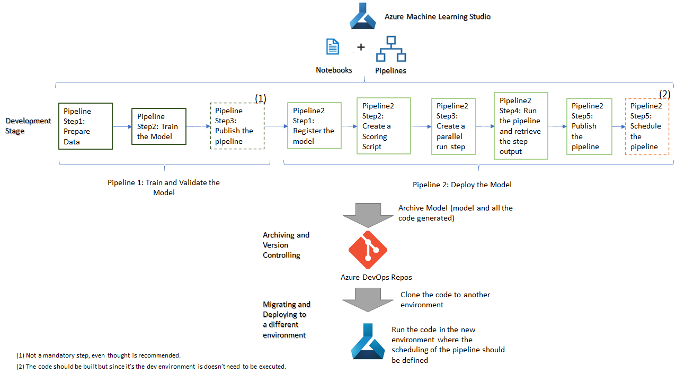
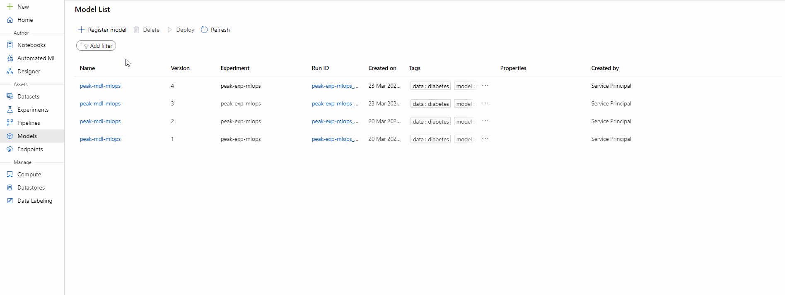

# Scenario 4 - Model was build using studio Notebooks and it needs to be deployed as a batch inference in another environment

The life cycle defined in this tutorial to suppport this solution is based on the following flow:

Explaning the flow in detail:

## Development Stage

**Pipeline 1: Train and Validate the Model** 

This step is meant to the done in the "dev" environment, the notebook code should be build using the Azure ML Pipelines concept, more information can be seen in [Create Pipelines](../Documents/Orchestrate-ML-With-Pipelines.md) but be aware that, while developing, only these 2 steps are needed:

   * Create an Azure Machine Learning pipeline. - to prepare and train the data
   * Publish an Azure Machine Learning pipeline - not a mandatory step but it's recommended. If the pipeline is published then it can be executed at any time without the need of running the notebook.
   
 **Note: Schedule an Azure Machine Learning pipeline is not needed at this stage since this is just a development environment. But the code should be developed so it can be executed in the production environment**
 
**Pipeline 2: Deploy the Model** 

For the deployment development more information can be seen in [Deploy batch inference pipelines with Azure Machine Learning](../Documents/Deploy-Batch-Inference-Pipeline.md). 
The following steps should be developed:

* [Register a Model](../Documents/Deploy-Batch-Inference-Pipeline.md#Register) - This step will register the model. It's not needed if the development is done using option shown in [Note 1](#Note1) below. 
* [Create a scoring script](../Documents/Deploy-Batch-Inference-Pipeline.md#Batch-Pipeline-scoring) - This step will create the scoring script batch inferencing service required to load the model and use it to predict new values. 
* [Create a pipeline with a ParallelRunStep](../Documents/Deploy-Batch-Inference-Pipeline.md#Batch-Pipeline-parallelstep) - This step will create a pipeline particular step called _ParallelRunStep_ that is specifically defined for performing parallel batch inferencing.
* [Run the pipeline and retrieve the step output](../Documents/Deploy-Batch-Inference-Pipeline.md#Batch-Pipeline-publish) - In the example provided in this tutorial, this is where the output of the model will be stored in a file/database table.
* [Publishing and Scheduling a batch inference pipeline](../Documents/Deploy-Batch-Inference-Pipeline.md#Batch-Pipeline-publish) - The model will be published as a batch inferencing pipeline as a REST service. For this particular example, everytime it is invoked it will be storing a file in the defined target area. Once again, in the example, the scheduling is being done within the Azure ML pipeline code but the option defined in [Note 2](#Note2) can also be considered.

## Archiving and Version Controlling

Once all the code is properly tested, it should be archived in a git repository. In this tutorial, we are considering Azure DevOps Repos as the Git Repository but others can be used. More details on how to do this step can be found in [Integrating Azure ML notebooks with Git](../Documents/Integrating_AzureML_notebooks_with%20Git.md).

## Migrating and Deploying to a different environment

**Step 1:** The migration of the code to a new environment is a very simple task, it consists of cloning the repository from the previous step (Step 2) into the new environment. More details on how to do this can be seen in [Clone and Run a Notebook](../Documents/Clone-and-Run-a-Notebook.md). 

**Step 2:** Once the code has been added to the new environment, then all the code should be executed. This will create and register the model and also will scheduled pipeline 2 with the recurrence defined (Minute, Hour, Day, Week or Month). This will mean the code associated with that pipeline will be executed with the defined recurrence and the predictions will be stored in the defined target area (ex: data lake, datawarehouse, ...) with that frequency.

<a name = 'Note1'> **Note 1 : This example considers that all the code will be migrated from one enviroment to the other and it will be executed in the destination environment (which is will be the final one). Another option might be to download the model created in the "dev" environment, then upload it in the new environment using the web portal Register Model option (see image below) and then only execute the notebook that deploys the model.**

<a name = 'Note2'> **Note 2 : This example considers the pipeline will be scheduled within Azure ML Studio, another option can be to schedule and execute the pipeline using Azure Data Factory, more details can be seen [here](https://docs.microsoft.com/en-us/azure/data-factory/transform-data-machine-learning-service).**

## Useful links: 
https://vladiliescu.net/deploying-models-with-azure-ml-pipelines/
