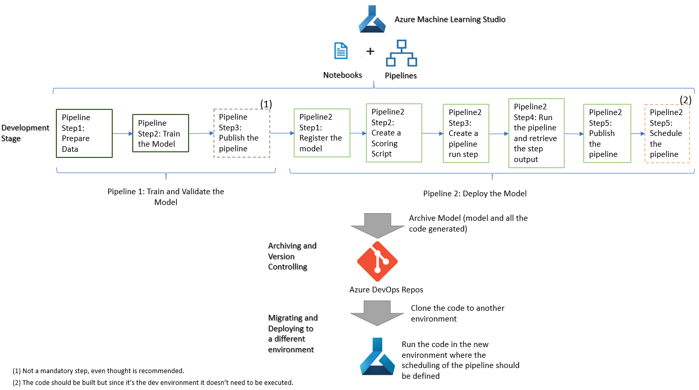

# Scenario 4 - Model was built using studio notebooks and now its results needs to be deployed as a batch inference (stored in a specific shedule in a data lake file or database table)

This life cycle is based on the following flow:

_Development Stage_

**Step 1** - The notebook is developed and tested in a "dev" environment, the code should be build using the Azure ML Pipelines concept and the deployment code should be build as a batch inference.

For the Azure ML Pipeline development, more information can be seen in [Create Pipelines](../Documents/Orchestrate-ML-With-Pipelines.md) but be aware that, while developing, only these 2 steps are needed:
   * Create an Azure Machine Learning pipeline.
   * Publish an Azure Machine Learning pipeline.
   
 **Note: Schedule an Azure Machine Learning pipeline is not needed at this stage since this is just a development environment. But the code should be developed so it can be executed in the production environment**
 
For the deployment development more information can be seen in [Deploy batch inference pipelines with Azure Machine Learning](../Documents/Deploy-Batch-Inference-Pipeline.md). 

**Step 2** - Once all the code is properly tested, it should be archived in a git repository. In this tutorial, we are considering Azure DevOps Repos as the Git Repository but others can be used. More details on how to do this step can be found in [Integrating Azure ML notebooks with Git](../Documents/Integrating_AzureML_notebooks_with%20Git.md).

_Migrate to another environment stage_

**Step 3** - The migration of the code to a new environment is a very simple task, it consists of cloning the repository from the previous step (Step 2) into the new environment. More details on how to do this can be seen in [Clone and Run a Notebook](Documents/Clone-and-Run-a-Notebook.md). 

_Deploy the model as a real time inference in the new environment_

**Step 4** - Once the code as been added to the new environment, then all the code should be executed. This will create the model and will deploy it into a real time inference.

**Note: This example considers that all the code will be migrated from one enviroment to the other and it will be executed in the destination environment (which is will be the final one). Another option might be to download the model created in the "dev" environment, then upload it in the new environment using the web portal Register Model option (see image below) and then only execute the notebook that deploys the model.**

Source: https://vladiliescu.net/deploying-models-with-azure-ml-pipelines/
