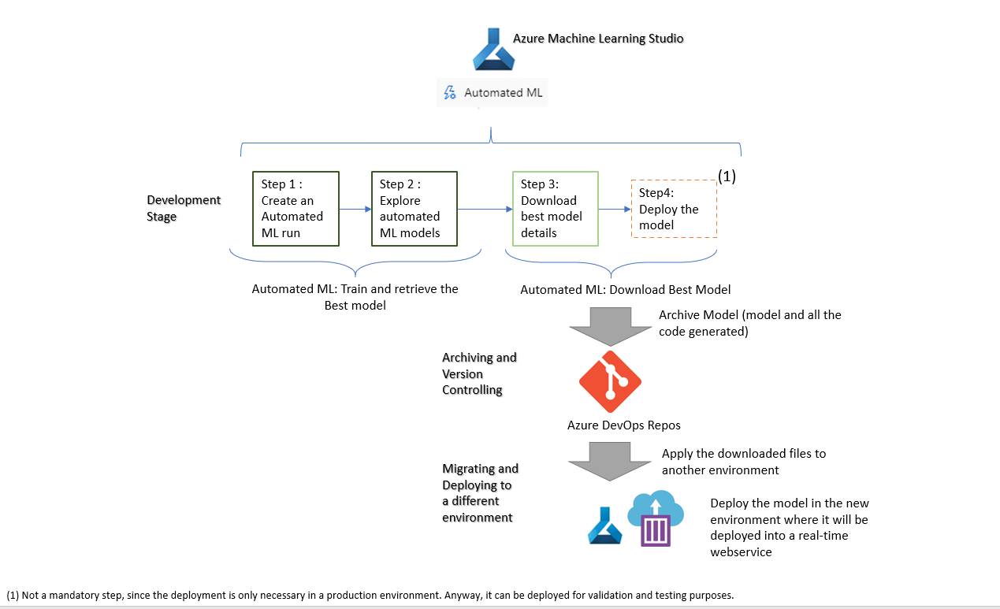

# Scenario 5 - Model was build using studio Automated ML and it needs to be deployed as a real-time inference in another environment

In this scenario, this tutorial will demonstrate how to deploy the best model defined within the Azure Studio Automated ML run as a real-time inference. But with the caveat that the deployment will be done in a different environment than the one where the Automated ML run took place.

The flow to achieve this can be defined as:

  

Going into a bit more depth, for each stage of the flow we have:

## Development Stage

**Automated ML: Train, Retrieve and Download the Best Model** 

This step is meant to the done in the "dev" environment, it consists of:

* Running an automated machine learning experiment - This means creating an Automated ML run, more details can be seen [here](../Documents/Automated-ML.md#New-AutomatedML-Run).
* View experiment details - This means exploring the Automated ML models that were tested, more details can be seen [here](../Documents/Automated-ML.md#Explore-AutomatedML-Models).
* Download the Best Model details - Once the Best Model is chosen, the next step is to download its information so it can be applied in a different environment, more details on how to download the Best Model details can be seen [here](../Documents/Automated-ML.md#Download-Best-Model).

## Archiving and Version Controlling

The contents of the .zip file retrieved from the _Download of the Best Model details_ task should be stored in the GIT repository for future reference and versioning control. You shouldn't add the .zip file to GIT but it's contents.

## Migrating and Deploying to a different environment

**Step 1:** Upload and register the model to the new environment. Following the steps shown below:

This will mean using the .pkl file retrieved on the _Download Best Model details_ task and that were stored in GIT repository (task: _Archiving and Version Controlling_).

**Step 2:** Deploy the model in this new environment as a real-time webservice by following the steps defined in [here](../Documents/Automated-ML.md#Deploy-AutomatedML-Model).
