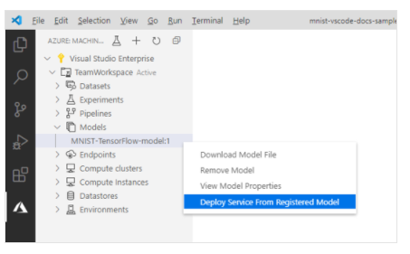

# Train and deploy an image classification TensorFlow model using the Azure Machine Learning Visual Studio Code Extension 

Learn how to train and deploy an image classification model to recognize hand-written numbers using TensorFlow and the Azure Machine Learning Visual Studio Code Extension.

You will:

* Understand the code
* Create a workspace
* Create an experiment
* Configure computer targets
* Run a configuration file
* Train a model
* Register a model
* Deploy a model

Before you work through the rest of the tutorial ensure you have:
* Installed Visual Studio Code and the Python Extension as described [here](../Documents/Installing_VS_Code.md).
* Installed the Azure Machine Learning Visual Studio Code extension as described [here](../Documents/VS_Code_Azure_ML_Git.md)

## Understand the code

The code for this tutorial uses TensorFlow to train an image classification machine learning model that categorizes handwritten digits from 0-9. It does so by creating a neural network that takes the pixel values of 28 px x 28 px image as input and outputs a list of 10 probabilities, one for each of the digits being classified. Below is a sample of what the data looks like.

Get the code for this tutorial by downloading and unzipping the [VS Code Tools for AI repository](https://github.com/microsoft/vscode-tools-for-ai/archive/master.zip) anywhere on your computer.

The guidelines of this tutorial are based on the following assumption:

* Even thought resources can be reused, for the examples below, we will be creating a new Azure Machine Learning Studio and all its resources in a new Resource Group

## Create a workspace
The first thing you have to do to build an application in Azure Machine Learning is to create a workspace. A workspace is basically an instance of an Azure Machine Learning Studio, it contains the resources to train models as well as the trained models themselves. For more information, see [What is Azure ML Studio](../Documents/what-is-azure-ml-studio.md).

1. On the Visual Studio Code activity bar, select the Azure icon to open the Azure Machine Learning view.
&nbsp;
2. Right-click your Azure subscription and select **Create Workspace** (if you already have a workspace, which means an Azure Machine Learning Studio instance, that you want to complete this tutorial on, select it and move on to the [next section](#CreateExperiment-1)).

3. By default a name is generated containing the date and time of creation. In the text input box, change the name to "TeamWorkspace" and press **Enter**.
&nbsp;
4. Select **Create a new resource group**.
&nbsp;
5. Name your resource group "TeamWorkspace-rg" and press Enter.  
&nbsp;
6. Choose a location for your workspace. It's recommended to choose a location that is closest to the location you plan to deploy your model. For example, "UK South".
&nbsp;
7. When prompted to select the type of workspace, choose **basic**.

At this point, a request to Azure is made to create a new workspace in your account. After a few minutes, the new workspace appears in your subscription node.

## Create an experiment

One or more experiments can be created in your workspace to track and analyze individual model training runs. Runs can be done in the Azure cloud or on your local machine.

1. On the Visual Studio Code activity bar, select the **Azure** icon. The Azure Machine Learning view appears.

2. Expand your **Subscription** node.

3. Expand the **TeamWorkspace** node.

4. Right-click the **Experiments** node.

5. Select **Create Experiment** from the context menu.

6. Name your experiment "Tutorial-VSCode-MNIST" and press **Enter** to create the new experiment.

A request is sent to Azure to create an experiment with the provided configurations. After a few minutes, the new experiment appears in the *Experiments* node of your Studio.

## Configure Compute Targets
A compute target is the computing resource or environment where you run scripts and deploy trained models. For more information, see the [Create Compute Instances](Documents/Create-Compute-Instance.md).

To create a compute target:

1. On the Visual Studio Code activity bar, select the **Azure** icon. The Azure Machine Learning view appears.
&nbsp;
2. Expand your **Subscription** node.
&nbsp;
3. Expand the **TeamWorkspace** node.
&nbsp;
4. Under the workspace node, right-click the **Compute clusters** node and choose **Create Compute**.

5. Select **Azure Machine Learning Compute (AmlCompute)**. Azure Machine Learning Compute is a managed-compute infrastructure that allows the user to easily create a single or multi-node compute that can be used with other users in your workspace.

6. Choose a VM size. Select **Standard_F2s_v2** from the list of options. The size of your VM has an impact on the amount of time it takes to train your models. For more information on VM sizes, see [sizes for Linux virtual machines in Azure](https://docs.microsoft.com/en-us/azure/virtual-machines/sizes).

7. Name your compute "TeamWkspc-com" and press **Enter** to create your compute.

A file appears in VS Code with content similar to the one below:

8. When satisfied with the configuration, open the command palette **(CTRL+SHIFT+P)**.

Enter the following command into the command palette to save your run configuration file.

`Azure ML: Save and Continue`

After a few minutes, the new compute target appears in the `Compute clusters` node of your workspace.

## Create a run configuration
When you submit a training run to a compute target, you also submit the configuration needed to run the training job. For example, the script that contains the training code and the Python dependencies needed to run it.

To create a run configuration:

1. On the Visual Studio Code activity bar, select the **Azure** icon. The Azure Machine Learning view appears.
&nbsp;
2. Expand your **subscription node**.
&nbsp;
3. Expand the **TeamWorkspace > Compute clusters** node.
&nbsp;
4. Under the compute node, right-click the **TeamWkspc-com** compute node and choose **Create Run Configuration**.

&nbsp;
5. Name your run configuration "MNIST-rc" and press **Enter** to create your run configuration.
&nbsp;
6. Then, select **Create new Azure ML Environment**. Environments define the dependencies required to run your scripts.
&nbsp;
7. Name your environment "MNIST-env" and press **Enter**.
&nbsp;
8. Select **Conda dependencies file** from the list.
&nbsp;
9. Press **Enter** to browse the Conda dependencies file. In this case, the dependencies file is the `env.yml` file inside the `vscode-tools-for-ai/mnist-vscode-docs-sample` directory.

A file appears in VS Code with content similar to the one below:

10. Once you're satisfied with your configuration, save it by opening the Command Palette and entering the following command:

`Azure ML: Save and Continue`

11. This sample does not use a dataset registered in Azure Machine Learning. Instead, it's loaded when `train.py` runs. When prompted to create a data reference for your training run, enter "n" into the prompt and press **Enter**.
&nbsp;
12. Press **Enter** to browse the script file to run on the compute. In this case, the script to train the model is the `train.py` file inside the `vscode-tools-for-ai/mnist-vscode-docs-sample` directory.

A file called `MNIST-rc.runconfig` appears in VS Code with content similar to the one below:

13. Once you're satisfied with your configuration, save it by opening the Command Palette and entering the following command:

`Azure ML: Save and Continue`

The `MNIST-rc` run configuration is added under the *TeamWkspc-com* compute node and the `MNIST-env` environment configuration is added under the *Environments* node.

## Train the model

During the training process, a TensorFlow model is created by processing the training data and learning patterns embedded within it for each of the respective digits being classified.

To run an Azure Machine Learning experiment:

1. On the Visual Studio Code activity bar, select the **Azure** icon. The Azure Machine Learning view appears.
&nbsp;
2. Expand your *subscription* node.
&nbsp;
3. Expand the **TeamWorkspace > Experiments** node.
&nbsp;
4. Right-click the *MNIST* experiment.
5. Select **Run Experiment**.

When the model is done training, the status label next to the run node updates to "Completed".

## Register the model

Now that you've trained your model, you can register it in your workspace.

To register your model:

1. On the Visual Studio Code activity bar, select the **Azure** icon. The Azure Machine Learning view appears.
&nbsp;
2. Expand your **Subscription** node.
&nbsp;
3. Expand the **TeamWorkspace > Experiments > MNIST** node.
&nbsp;
4. Get the model outputs generated from training the model. Right-click the Run 1 run node and select **Download outputs**.

5. Choose the directory to save the downloaded outputs to. By default, the outputs are placed in the directory currently opened in Visual Studio Code.
&nbsp;
6. Right-click the **Models** node and choose **Register Model**.

7. Name your model "MNIST-TensorFlow-model" and press **Enter**.

8. A TensorFlow model is made up of several files. Select **Model folder** as the model path format from the list of options.

9. Select the `azureml_outputs/Run_1/outputs/outputs/model` directory.

A file containing your model configurations appears in Visual Studio Code with similar content to the one below:

10. Once you're satisfied with your configuration, save it by opening the Command Palette and entering the following command:

`Azure ML: Save and Continue`

## Deploy the model

In Visual Studio Code, you can deploy your model as a web service to:

* Azure Container Instances (ACI).
* Azure Kubernetes Service (AKS).
You don't need to create an ACI container to test in advance, because ACI containers are created as needed. However, you do need to configure AKS clusters in advance. For more information on deployment options, see [Deploy a model as a real-time inferencing service](../Documents/Deploy-Real-Time-Service.md), [Create a batch webservice](../Documents/Deploy-Batch-Inference-Pipeline.md) and [Create Compute Instances](../Documents/Create-Compute-Instance.md).

To deploy a web service as an ACI :

1. On the Visual Studio Code activity bar, select the **Azure** icon. The Azure Machine Learning view appears.

2. Expand your **Subscription** node.

3. Expand the **TeamWorkspace > Models** node.

4. Right-click the **MNIST-TensorFlow-model** and select **Deploy Service from Registered Model**.

5. Select **Azure Container Instances**.

6. Name your service "mnist-tensorflow-svc" and press **Enter**.

7. Choose the script to run in the container by pressing **Enter** in the input box and browsing for the `score.py` file in the mnist-vscode-docs-sample directory.

Provide the dependencies needed to run the script by pressing Enter in the input box and browsing for the env.yml file in the `mnist-vscode-docs-sample` directory.

A file containing your model configurations appears in Visual Studio Code with similar content to the one below:

9. Once you're satisfied with your configuration, save it by opening the command palette and entering the following command:

`Azure ML: Save and Continue`

At this point, a request is sent to Azure to deploy your web service. This process takes several minutes. Once deployed, the new service appears under the *Endpoints* node.
