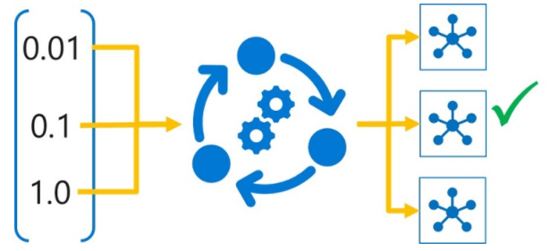

# Tune hyperparameters with Azure Machine Learning

## Introduction

In machine learning, models are trained to predict unknown labels for new data based on correlations between known labels and features found in the training data. Depending on the algorithm used, you may need to specify *hyperparameters* to configure how the model is trained. For example, the *logistic regression* algorithm uses a *regularization rate* hyperparameter to counteract overfitting; and deep learning techniques for convolutional neural networks (CNNs) use hyperparameters like *learning rate* to control how weights are adjusted during training, and *batch size* to determine how many data items are included in each training batch.

**Note**: Machine Learning is an academic field with its own particular terminology. Data scientists refer to the values determined from the training features as parameters, so a different term is required for values that are used to configure training behavior but which are **not** derived from the training data - hence the term *hyperparameter*.

The choice of hyperparameter values can significantly affect the resulting model, making it important to select the best possible values for your particular data and predictive performance goals.

## Tuning hyperparameters

Hyperparameter tuning is accomplished by training the multiple models, using the same algorithm and training data but different hyperparameter values. The resulting model from each training run is then evaluated to determine the performance metric for which you want to optimize (for example, *accuracy*), and the best-performing model is selected.

In Azure Machine Learning, you achieve this through an experiment that consists of a *hyperdrive* run, which initiates a child run for each hyperparameter combination to be tested. Each child run uses a training script with parameterized hyperparameter values to train a model, and logs the target performance metric achieved by the trained model.

## Tutorial Objectives:

* Define a hyperparameter search space.
* Configure hyperparameter sampling.
* Select an early-termination policy.
* Run a hyperparameter tuning experiment.

## Defining a search space

The set of hyperparameter values tried during hyperparameter tuning is known as the *search space*. The definition of the range of possible values that can be chosen depends on the type of *hyperparameter*.

### Discrete hyperparameters
Some hyperparameters require *discrete* values - in other words, you must select the value from a particular set of possibilities. You can define a search space for a discrete parameter using a **choice** from a list of explicit values, which you can define as a Python **list** `(choice([10,20,30]))`, a **range** `(choice(range(1,10)))`, or an arbitrary set of comma-separated values `(choice(30,50,100))`.

You can also select discrete values from any of the following discrete distributions:

* qnormal
* quniform
* qlognormal
* qloguniform

### Continuous hyperparameters
Some hyperparameters are *continuous* - in other words you can use any value along a scale. To define a search space for these kinds of value, you can use any of the following distribution types:

* normal
* uniform
* lognormal
* loguniform

#### Defining a search space
To define a search space for hyperparameter tuning, create a dictionary with the appropriate parameter expression for each named hyperparameter. For example, the following search space indicates that the **batch_size** hyperparameter can have the value 16, 32, or 64, and the **learning_rate** hyperparameter can have any value from a normal distribution with a mean of 10 and a standard deviation of 3.

  `from azureml.train.hyperdrive import choice, normal`

   `param_space = {`

                    `'--batch_size': choice(16, 32, 64),`
                  
                    `'--learning_rate': normal(10, 3)`
                  
                   `}`
