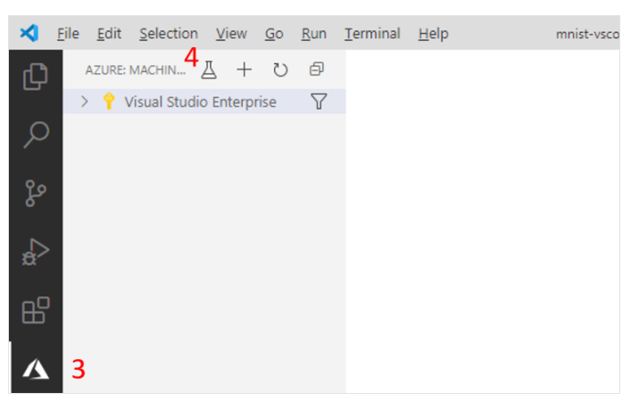

# Set up Azure Machine Learning Visual Studio Code extension 

Learn how to install and run scripts using the Azure Machine Learning Visual Studio Code extension.

In this tutorial, you learn the following tasks:

* Install the Azure Machine Learning Visual Studio Code extension
* Sign into your Azure account from Visual Studio Code
* Use the Azure Machine Learning extension to run a sample script.

## Prerequisites 

Before following this document ensure you have installed Visual Studio Code and the Python Extension. Refer to [this page](../Documents/Installing_VS_Code.md) if you haven't done it already. 

## Install the Azure Machine Learning Visual Studio Code extension

1. Open Visual Studio Code
&nbsp;
2. Select **Extensions** icon from the **Activity Bar** to open the Extensions view.
&nbsp;
3. In the Extensions view, search for "Azure Machine Learning".
&nbsp;
4. Select **Install**.

*Note—The rest of the steps in this tutorial have been tested with version 0.6.8 of the extension.*

## Sign in to your Azure Account
In order to provision resources and run workloads on Azure, you have to sign in with your Azure account credentials. To assist with account management, Azure Machine Learning automatically installs the Azure Account extension. Visit the following site to [learn more about the Azure Account extension](https://marketplace.visualstudio.com/items?itemName=ms-vscode.azure-account).

1. Open the **Command Palette (CTRL+SHIFT+P**).
2. Enter the command *"Azure: Sign In"* into the Command Palette to start the sign in process.

## Run a machine learning model training script in Azure
Now that you have signed into Azure with your account credentials, use the steps in this section to learn how to use the extension to train a machine learning model.

1. Download and unzip the [VS Code Tools for AI repository](https://github.com/microsoft/vscode-tools-for-ai/archive/master.zip) anywhere on your computer.
&nbsp;
2. Open the `mnist-vscode-docs-sample` directory in Visual Studio Code.
&nbsp;
3. Select the **Azure** icon in the Activity Bar.
&nbsp;
4. Select the **Run Experiment** icon at the top of the Azure Machine Learning View.

5. When the Command Palette expands, follow the prompts.
    * Select your Azure subscription.
    * From the list of environments, select **Conda dependencies file**.
    * Press **Enter** to browse the Conda dependencies file. This file contains the dependencies required to run your script. In this case, the dependencies file is the `env.yml` file inside the `mnist-vscode-docs-sample` directory.
    * Press **Enter** to browse the training script file. This is the file that contains code to a machine learning model that categorize images of handwritten digits. In this case, the script to train the model is the `train.py` file inside the `mnist-vscode-docs-sample` directory.
&nbsp;
6. At this point, a configuration file similar to the one below appears in the text editor. The configuration contains the information required to run the training job—similarly to how we have a file that contains the code to train the model— and any Python dependencies specified in the previous step.

7. Once you're satisfied with your configuration, submit your experiment by opening the Command Palette and entering the following command:

`Azure ML: Submit Experiment`

This sends the `train.py` and configuration file to your Azure Machine Learning workspace. The training job is then started on a compute resource in Azure.

## Track the progress of the training script
Running your script can take several minutes. To track its progress:

1. Select the **Azure** icon from the activity bar.

2. Expand your subscription node.

3. Expand your currently running experiment's node. This is located inside the `{workspace}/Experiments/{experiment}` node where the values for your workspace and experiment are the same as the properties defined in the configuration file.

4. All of the runs for the experiment are listed, as well as their status. To get the most recent status, click the refresh icon at the top of the Azure Machine Learning View.

## Download the trained model
When the experiment run is complete, the output is a trained model. To download the outputs locally:

1. Right-click the most recent run and select **Download Outputs**.

2. Select a location where to save the outputs to.

3. A folder with the name of your run is downloaded locally. Navigate to it.

4. The model files are inside the `outputs/outputs/model` directory.
