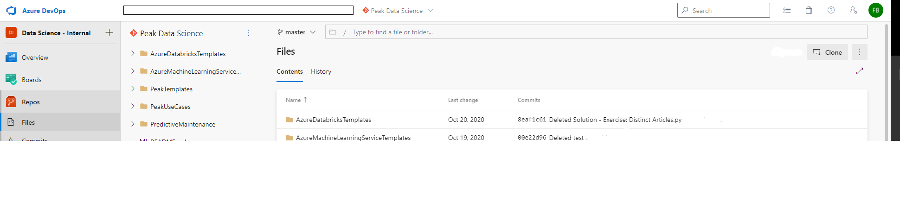

# Installing Git

When you want to version control work you have been working on locally (i.e., your local laptop) you will need to install Git. 
An example of this is if you were developing a Python Script on VS Code and you wanted to save this in your Git repo on Azure DevOps. 
If you would like to learn more about Git see [this article](https://guides.github.com/introduction/git-handbook/).

## Prerequisites

* [Install Git](https://git-scm.com/book/en/v2/Getting-Started-Installing-Git)
* [Created a project in Azure DevOps and establish a Git repo for source code](../Documents/Create_project_Azure_DevOps.md)
* [Installed Visual Studio (VS) Code and the Python Extension](../Documents/Installing_VS_Code.md)

This document will detail how to:

* Clone the repo to your computer
* Open the repo in VS Code
* Example of working with the code

## Clone the repo to your computer

1. From your web browser, sign in to your organization, `(https://dev.azure.com/{yourorganization})`, open the team project and select **Repos > Files**. 

2. Select **Clone** in the upper-right corner of the **Files** window. Then copy the clone URL and password (you will need both in the following step). 

3. Open the Git command Window. 

4. Browse to the folder where you want the code from the repo stored on your local computer. 

In the example below I am navigating to a folder named Documents, follwed by the sub-folders Projects and Example. This means that when I give the command to clone, Git will clone my remote repo to this folder. 

5. Run `git clone` followed by the path copied from the Clone URL in the previous section, as shown in the example below:

Next it will ask for a password, paste the password you copied above and press **Enter**. Git downloads a copy of the code, including all commits and branches from the repo, into a new folder for you to work with.

Switch your directory to the repository that you cloned. For e.g. 

`cd ./Getting-Started-On-Azure-ML`

## Open the repo in VS Code

1. Open a new instance of VS Code.

2. Open one of the files or folder from your repo.

Below I have opened a clone of the repo containing all the documents I have created for this course on getting started in the world of Python and Azure ML.

The **Source Control** symbol with "2" next to it shows changed that have been made to the repo. In this case I have added two images since I have created the clone. 

As an example lets create a new text file called `test`

* Open a new file
* type `test`, then press **(CTRL+SHIFT+S)** and save it 
**Note	—** always save **(CTRL+S)** before you **stage** and **commit** changes. 

The **Source Control** symbol should now show a change.

* Navigate to it, click **Source Control** and select the **+** symbol to **stage** the changes. 

* Type a message and then select the **tick** symbol to **Commit** the change.

* Type **(CTRL+SHIFT+P)** and start typing `push`.

* Select `Git: Push to....` and the remote repo you have cloned it from should come up. 

Once pushed your changes should appear in your remote repo, which in your case should be the Git repo you have created in Azure DevOps. 

When you navigate to your Azure DevOps Git repo and look at your **History** you should see something similar to the below:

 *Changes to your repo should show your commit message, log details and whether the change was successful*

You can also confirm your remote repo by navigating to **Source Control** and selecting **Remotes**. At the top you should be able to view your Azure DevOps Git repo. In our case we have cloned all the documentation from our GitHub repo. 

If you click on the entries you can also view changes made to the file. This is useful if you want to view changes you or your colleagues have made.

