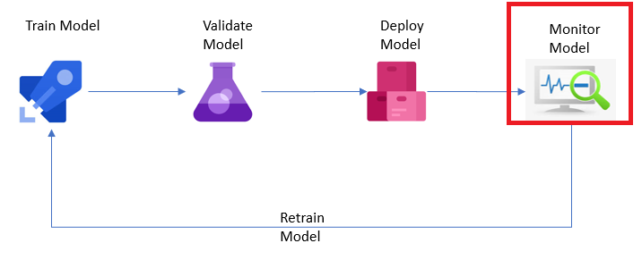

# Monitor the Model

Once the model is deployed, the data scientist wants to be able to collect metrics on the model. The user wants to ascertain that the model isn't drifting from its objective and that the inference is useful for the business. This means the need of capturing a lot of metrics and analyze them. Azure Machine Learning enables this tracking of metrics for the model is a very efficient manner. The central model registry becomes the one place where all this hosted.

For information and a practical example on how to use Application Insights to monitor your model's performance see [Monitor models with Azure Machine Learning](../Documents/Monitor_Models_AzureML.md).
