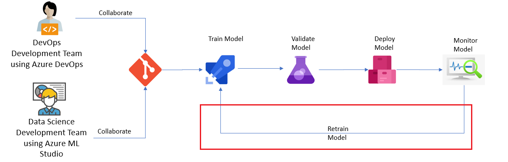
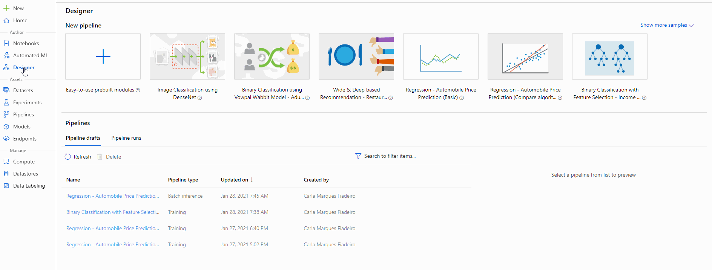
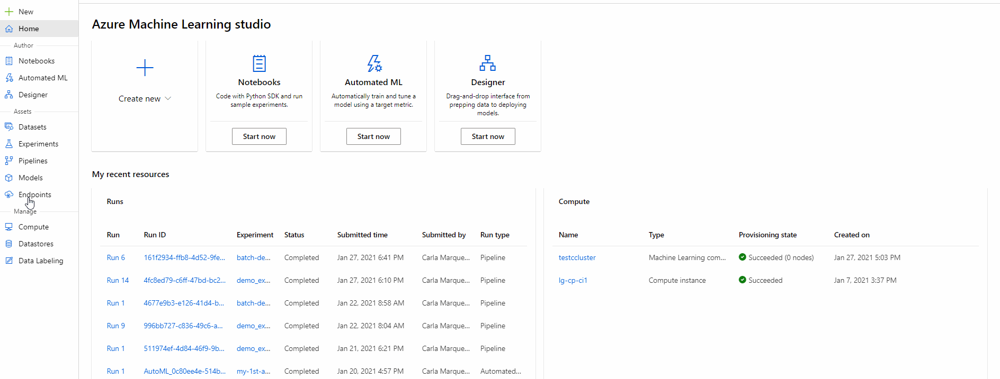
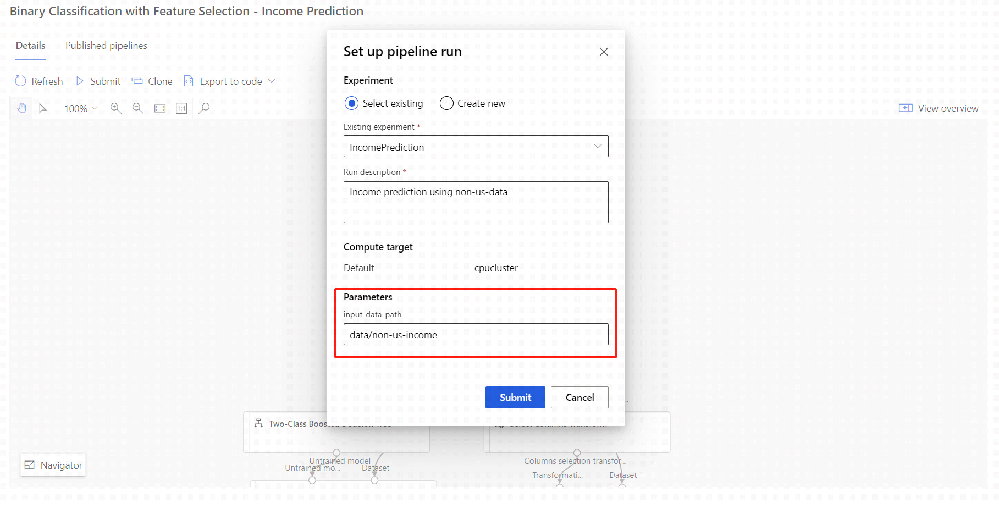
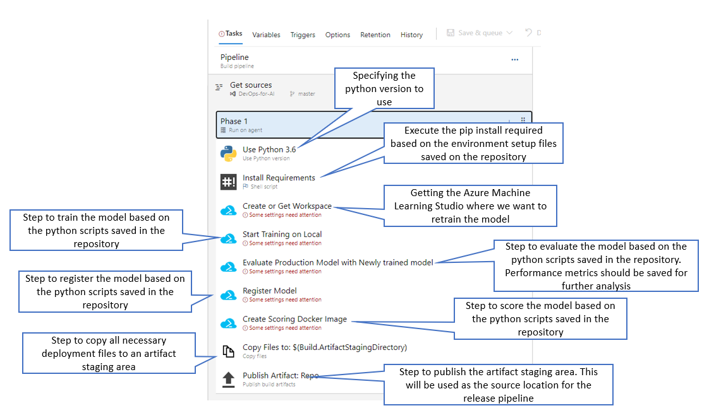

# Retrain the Model


Often, you'll want to validate your model, update it or even retrain it from scratch, as you receive new information. Sometimes, receiving new data is an expected part of the domain. Other times, as discussed in [Detect data drift on datasets](../Documents/Dataset-Monitors.md), model performance can degrade in the face of such things as changes to a particular sensor, natural data changes such as seasonal effects or features shifting in their relation to other features.

There is no universal answer to "How do I know if I should retrain?" but Azure ML event and monitoring tools previously discussed are good starting points for automation. 

Once you have decided to retrain, you should:

* Preprocess your data using a repeatable, automated process
* Train your new model
* Compare the outputs of your new model to those of your old model
* Use predefined criteria to choose whether to replace your old model

This process of retraining and effective Continous Integration/Continuous Development (CI/CD) of ML models is the biggest strength of Azure Machine Learning.

A theme of the above steps is that your **retraining should be automated, not ad hoc**. Azure ML provides different ways of achieving this automation. In this tutorial we will explain the following:

* Azure Machine Learning Designer - Retrain models with Azure Machine Learning Designer to see how pipelines and the Azure Machine Learning designer fit into a retraining scenario.
* Azure DevOps Retraining Pipelines with Azure CLI - Retrain models using Azure Pipelines using Azure CLI and python notebooks. It's the most common approach and allows automation and CI/CD

##### Azure Machine Learning Designer - Data Science Team

This approach can only be used when the model was designed using Azure Machine Learning Designer, more information [here](../Documents/studio-designer.md). 
This will mean the user will have a published training pipeline and this can be used to retrain the model on new data. To retrain the user can submit runs from a pipeline endpoint from the studio workspace or programmatically.

###### Submit runs by using the studio portal
The idea is to re-run and publish the pipeline using a new set of data. To achieve this, the first step is to change the pipeline in order to create a pipeline parameter which will contain the new file path and name. Once the pipeline parameter has been created and added to the pipeline, it needs to be published and then the pipeline can be executed with this new set of data for further analysis.

Step 1 - **Create a pipeline parameter**
Pipeline parameters are used to build versatile pipelines which can be resubmitted later with varying parameter values. Some common scenarios are updating datasets or some hyper-parameters for retraining. Create pipeline parameters to dynamically set variables at runtime.

Pipeline parameters can be added to data source or module parameters in a pipeline. When the pipeline is resubmitted, the values of these parameters can be specified.

For this example, we will change the training data path from a fixed value to a parameter, so that ythe model can be retrained on different set of data. Other module parameters can be added according to the use case.

1. Select the **Import Data** module.
**Note:** This example uses the Import Data module to access data in a registered datastore. However, you can follow similar steps if you use alternative data access patterns.
2. In the module detail pane, to the right of the canvas, select your data source.
3. Enter the path to your data. You can also select **Browse path** to browse your file tree.
4. Mouseover the **Path** field, and select the ellipses above the **Path** field that appear.
5. Select **Add to pipeline parameter**.
6. Provide a parameter name and a default value.
7. Select **Save**.
8. **Submit** the pipeline run.



Step 2 - **Publish the pipeline**

1. Select **Publish** above the designer canvas.
2. Select or create a pipeline endpoint.
3. Select **Publish**.


**Note:** More details on how to work with Azure ML Designer can be seen in [How to work with Azure Machine Learning Studio Designer](../Documents/studio-designer.md)

Step 3 - **Retrain the Model by submitting a new running**

Use the following steps to submit a parameterized pipeline endpoint run from the studio portal:

1. Go to the **Endpoints** page in your studio workspace.
2. Select the **Pipeline endpoints** tab. Then, select your pipeline endpoint.
3. Select the **Published pipelines** tab. Then, select the pipeline version that you want to run.
4. Select **Submit**.



5. In the setup dialog box, you can specify the parameters values for the run. 



##### Submit runs by using code
You can find the REST endpoint of a published pipeline in the overview panel. By calling the endpoint, you can retrain the published pipeline.

To make a REST call, you need an OAuth 2.0 bearer-type authentication header. The following example uses interactive authentication (for illustration purposes), but for most production scenarios that require automated or headless authentication.

Service principal authentication involves creating an App Registration in Azure Active Directory. First, you generate a client secret and then you grant your service principal role access to your machine learning workspace. Use the ServicePrincipalAuthentication class to manage your authentication flow. These tasks should be done or at least approved by your Azure Architecture Administrator Team.

Both **InteractiveLoginAuthentication** and **ServicePrincipalAuthentication** inherit from AbstractAuthentication. In both cases, use the **get_authentication_header()** function in the same way to fetch the header:

```
from azureml.core.authentication import InteractiveLoginAuthentication

interactive_auth = InteractiveLoginAuthentication()

auth_header = interactive_auth.get_authentication_header()
```

Get the REST URL from the endpoint property of the published pipeline object. You can also find the REST URL in your workspace in Azure Machine Learning studio.
Build an HTTP POST request to the endpoint. Specify your authentication header in the request. Add a JSON payload object that has the experiment name.
Make the request to trigger the run. Include code to access the Id key from the response dictionary to get the value of the run ID.

```
import requests

rest_endpoint = published_pipeline.endpoint

response = requests.post(rest_endpoint, 
                         headers=auth_header, 
                         json={"ExperimentName": "Tutorial-Batch-Scoring",
                               "ParameterAssignments": {"process_count_per_node": 6}})
run_id = response.json()["Id"]
```

Use the run ID to monitor the status of the new run. The new run takes another 10-15 min to finish.
The new run will look similar to the pipeline you ran earlier in the tutorial. You can choose not to view the full output.

```
from azureml.pipeline.core.run import PipelineRun
from azureml.widgets import RunDetails

published_pipeline_run = PipelineRun(ws.experiments["Tutorial-Batch-Scoring"], run_id)

RunDetails(published_pipeline_run).show()
```

#### Azure DevOps Retraining Pipelines with Azure CLI - Data Science Team and DevOps Development Team
Retraining the model using Azure ML Designer doesn't provide an automated way of doing but only involves the Data Science Team for the retrain itself.
Creating an Azure DevOps pipeline allows automation but involves once again the collaboration between the Data Science Team and the DevOps Development Team.

##### Create a Pipeline to execute retraining ML tasks and save all the relevant information in an Azure DevOps Artifact

1. All the necessary retraining python code needs to be added to the repository - Team Responsible: Data Science Team

2. A pipeline should be created with the necessary steps steps: - Team Responsible: DevOps Development Team

###### Pipeline - Example
This is an example of a pipeline to retrain a model:



##### Determine the best model
In your python scripts, you may want to log metrics so that you can determine the "best" model (this is the recommended approach for Production environments).

For example, you have a model that is already deployed and has an accuracy of 90. You train a new model based on new checkins to the repo and the accuracy is only 80, so you don't want to deploy it. You can use a metric such as this to build automation logic, as you can directly rank different models. In other cases, you may have several metrics that are used to indicate the "best" model. In this case, choosing the best model requires human judgment.

Depending on what "best" looks like for your scenario, you may need to create or re-use an existing release pipeline where someone must inspect the metrics to determine if the model should be deployed. For more details on how to create a release pipeline please check section [Create a Release Pipeline](../Documents/Scenario3-Notebook-RealTimeInf.md#Release-Pipeline) from this page.

**Note:** To log metrics during training, use the Run class.
