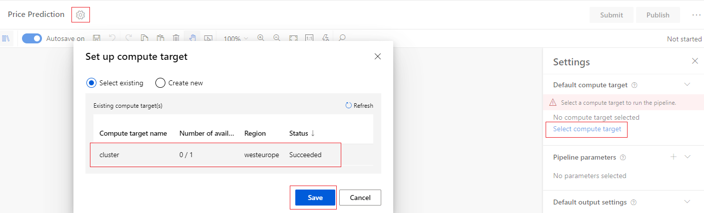

# How to work with Azure Machine Learning Studio Designer

This section will explain how to use the Azure Machine Learning Studio Designer to train and deploy a machine learning model. The designer is a drag-and-drop tool that lets the user creates machine learning models without a single line of code.

In part one of the tutorial, we will describe how to:

* Create a new pipeline.
* Import data.
* Prepare data.
* Train a machine learning model.
* Score and Evaluate a machine learning model.
* Deploy the model

### Before you start

If you have not already done so, please:

* Create a Compute Cluster, the Designer won't work with a compute instance, it requires a compute cluster. More details can be seen in: [create and Remove a Compute Cluster](../Documents/Create-Compute-Cluster.md).
* Create a Datastore and a Dataset with the data you want to use. For more information see: [Create a Datastore using the web portal](../Documents/Work-With-Data-in-Azure-ML.md) and [Create Datasets using the web portal](../Documents/Work-With-Data-in-Azure-ML-Datasets.md).

**Note**
If you do not see the graphical elements mentioned in the steps below, such as buttons, you may not have the right level of permissions to studio. Please contact your Azure subscription administrator to verify that you have been granted the correct level of access.

## <a name = 'DesignerCreatePipeline'> Create a pipeline
1. Sign in to [Azure Machine Learning studio](https://ml.azure.com/).

2. Select **Designer** on the left pane under **Author** section and select **Easy-to-use prebuilt modules**.

3. At the top of the canvas, select the default pipeline name Pipeline-Created-on. Rename it to the name you want to give to your pipeline. The name doesn't need to be unique.

### Set the default Compute Target
A pipeline runs on a compute target (needs to be a compute cluster), which is a compute resource that's attached to your studio.The compute target can be reused in future runs.

You can set a Default compute target for the entire pipeline, which will tell every module to use the same compute target by default. However, you can specify compute targets on a per-module basis.

1. Next to the pipeline name, select the **Gear icon**  at the top of the canvas to open the Settings pane.

2. In the Settings pane to the right of the canvas, select **Select compute target**. Select the desired compute cluster and click **Save**.

 **Note:** The designer can only run training experiments on Azure Machine Learning Compute Clusters other types of compute won't be shown.

### Import data

1. From the left side panel expand **Datasets** and select the dataset you need to work with. Drag it onto the canvas.

**Note:** The designer also provides sample datasets for user to experiment. Instead of expanding **Datasets** expand **Sample Datasets** and select the one that best suits the needs.

### Prepare data
Datasets typically require some preprocessing before analysis. Example: You might have noticed some missing values when you inspected the dataset. 
The designer has some prebuild fucntions that helps the user to prepare the data. In the module palette to the left of the canvas, expand the **Data Transformation** section and those will be available to use.

The following shows an example on what can be done:

### Train a machine learning model
Now that we have the modules in place to process the data, we can set up the training modules.

This training steps can be divided into:

* Split the data
* Train the model
* Score the model
* Evaluate the model

#### Split the data
Splitting data is a common task in machine learning. You will split your data into two separate datasets. One dataset will train the model and the other will test how well the model performed.

1. In the module palette, expand the section **Data Transformation** and find the **Split Data** module.
2. Drag the Split Data module to the pipeline canvas. In the module details pane to the right of the canvas, set the desired value on the **Fraction of rows in the first output dataset**.
3. Connect the previous module to the Split Data module.

**Notes:**
* When using **Clean Missing Data** as the predecessor of the **Split Data** module be sure that the left output ports of Clean Missing Data connects to Split Data. This is because the left port contains the the cleaned data while the right port contains the discarted data.

* In the example above, on the Fraction of rows in the first output dataset field the value inserted was 0.7, this means it will split 70 percent of the data to train the model and 30 percent for testing it. The 70 percent dataset will be accessible through the left output port. The remaining data will be available through the right output port.

#### Train the model
Designer provides around 19 different Machine Learning Algorithms that can be selected. 

1. In the module palette, expand Machine Learning Algorithms. This option displays several categories of modules that you can use to initialize learning algorithms.

2. Select the appropriate model and drag it to the pipeline canvas.

3. In the module palette, expand the section Module training and drag the Train Model module to the canvas.

4. Connect the output of the Machine Learning Algorithm module selected to the left input of the Train Model module.

5. Connect the training data output (left port) of the Split Data module to the right input of the Train Model module.

**Note:** 
Be sure that the left output ports of Split Data connects to Train Model. The left port contains the the training set. The right port contains the test set.

6. Select the **Train Model** module.

7. In the module details pane to the right of the canvas, select **Edit column** selector.

8. In the Label column dialog box, expand the drop-down menu and select Column names.

9. In the text box, enter the column that your model is going to predict.

#### Score the model 
After having trained the model by using the value configured in field **Fraction of rows in the first output dataset**, the remaing value can be used for scoring to see how well your model functions.

1. Enter score model in the search box to find the **Score Model** module. Drag the module to the pipeline canvas.

2. Connect the output of the **Train Model** module to the left input port of Score Model. Connect the test data output (right port) of the **Split Data** module to the right input port of Score Model.

#### Evaluate the model 
Use the Evaluate Model module to evaluate how well the model scored the test dataset.

1. Enter evaluate in the search box to find the **Evaluate Model** module. Drag the module to the pipeline canvas.

2. Connect the output of the *Score Model* module to the left input of Evaluate Model.

_The final pipeline should look something like this:_

### <a name = 'DesignerSubmitPipeline'> Submit the pipeline
The pipeline is all setup, we will now submit a pipeline run to train the machine learning model designed. Any valid pipeline run can be submitted at any point, which can be used to review changes to it pipeline during development.

1. At the top of the canvas, select **Submit**.

2. In the **Set up pipeline run** dialog box, if you already have created an experiment and want to use it, select it from the drop down. If not, then select Create new, enter the Experiment Name (be aware of the naming rules: Name must be between 1 to 250 characters, start with letters or numbers. Valid characters are letters, numbers, “_”, and the “-” character) and select **Submit**.

**Note:** Experiments group similar pipeline runs together. If you run a pipeline multiple times, you can select the same experiment for successive runs.

You can view run status and details at the top right of the canvas.

If this is the first run, it may take up to 20 minutes for your pipeline to finish running. The default compute settings have a minimum node size of 0, which means that the designer must allocate resources after being idle. Repeated pipeline runs will take less time since the compute resources are already allocated. Additionally, the designer uses cached results for each module to further improve efficiency.

4. Run status and details can be seen at the top right of the canvas.

_If this is the first run, it may take up to 20 minutes for your pipeline to finish running. The default compute settings have a minimum node size of 0, which means that the designer must allocate resources after being idle. Repeated pipeline runs will take less time since the compute resources are already allocated. Additionally, the designer uses cached results for each module to further improve efficiency._

#### View scored labels
After the run completes, the results of the pipeline run can be analised. First, we can look at the predictions generated by the model.

1. Right-click the **Score Model** module, and select **Outpus+Logs** and then **Visualize** to view its output. Here you can see the predicted values and the actual values from the testing data.

**Note :** For the scoring column to be added to the output, on the scoring task the following needs to be enabled:

#### Evaluate models
The Evaluate Model will provide information on how well the trained model performed on the test dataset.

1. Right-click the **Evaluate Model** module and select **metrics** to view its output.

## Deploy the Model

Once the user is happy with the model it can be deployed. In this part of the tutorial, we will:

* Create a real-time inference pipeline.
* Deploy the real-time endpoint.
* Test the real-time endpoint.
* Create a batch inference pipeline.

### Create a real-time inference pipeline
To deploy your pipeline, you must first convert the training pipeline into a real-time inference pipeline. This process removes training modules and adds web service inputs and outputs to handle requests.

1. Above the pipeline canvas, select **Create inference pipeline > Real-time inference pipeline**.

Your pipeline should now look like this:

**Note:** When selecting **Create inference pipeline**, several things happen:

* The trained model is stored as a Dataset module in the module palette. You can find it under My Datasets.
* Training modules like Train Model and Split Data are removed.
* The saved trained model is added back into the pipeline.
* Web Service Input and Web Service Output modules are added. These modules show where user data enters the pipeline and where data is returned.

By default, the Web Service Input will expect the same data schema as the training data used to create the predictive pipeline. 

2. Select **Submit** and use the same compute target and experiment that you used in part one.

3. Run status and details can be seen at the top right of the canvas.

### Deploy the real-time endpoint

#### Before you start

* You can deploy a model to an Azure Container Instance (ACI) if you select Azure Container Instance for Compute type in the real-time endpoint setting box. Azure Container Instance is more used for testing or development. Use ACI for low-scale CPU-based workloads that require less than 48 GB of RAM.
* For high-scale CPU-based workloads, the recommendation is to use Azure Kubernetes Service (AKS).

In this tutorial and since it's only to guide on the steps needed, we will use an ACI.

#### Deploying

1. Once the run has finished successfully. Select **Deploy** above the canvas.

2. Select **Deploy new real-time endpoint**, name it and then select the Compute Type. Click **Deploy**.
Note: The Name field must only consist of lowercase letters, numbers, or dashes, start with a letter, end with a letter or number

You can also change Advanced setting for your real-time endpoint.

|Advanced setting|Description|Type of Compute|
|-------|------|-------|
|Enable Application|Insights diagnostics and data collection. To enable Azure Application Ingishts to collect data from the deployed endpoints. By default: false|ACI and AKS|
|Enable SSL|SSL relies on digital certificates, which help with encryption and identity verification.By default: false|ACI|
|Scoring timeout|	A timeout in milliseconds to enforce for scoring calls to the web service. By default: 60000|AKS|
|Auto scale enabled|	Whether to enable autoscaling for the web service. By default: true|AKS|
|Min replicas|	The minimum number of containers to use when autoscaling this web service. By default: 1|AKS|
|Max replicas|	The maximum number of containers to use when autoscaling this web service. By default: 10|AKS|
|Target utilization|	The target utilization (in percent out of 100) that the autoscaler should attempt to maintain for this web service. By default: 70|AKS|
|Refresh period|	How often (in seconds) the autoscaler attempts to scale this web service. By default: 1|AKS|
|CPU reserve capacity|	The number of CPU cores to allocate for this web service. By default: 0.1|ACI and AKS|
|Memory reserve capacity|	The amount of memory (in GB) to allocate for this web service. By default: 0.5|ACI and AKS|

4. A success notification above the canvas appears after deployment finishes. It might take a few minutes.

#### View the real-time endpoint
After deployment finishes, you can view your real-time endpoint by going to the Endpoints page.

1. On the **Endpoints** page, select the endpoint you deployed.

2. In the **Details** tab, you can see more information such as the REST URI, status, and tags.

3. In the **Consume** tab, you can find security keys and set authentication methods.

4. In the **Deployment** logs tab, you can find the detailed deployment logs of your real-time endpoint.

### Create a batch inference pipeline

1. Above the pipeline canvas, select **Create inference pipeline > Create batch inference pipeline**.

2. Select **Submit** and use the same compute target and experiment that you used in part one.

3. Run status and details can be seen at the top right of the canvas.

### Publish the pipeline endpoint
1. Once the run has finished successfully. Select **Publish** above the canvas.

2. Name the pipeline endpoint and then select **Publish**.

3. The status of the publishing can be seen at the top of the canvas.

### View the pipeline endpoint
After the publishing finishes, the pipeline endpoint can be viewed by 

1. On the pipeline canvas, once the process completes successfully click on the link provided.

2. On the **Endpoints** page, select **Pipeline Endpoints** and choose the endpoint.

_Sources: https://docs.microsoft.com/en-us/azure/machine-learning/algorithm-module-reference/module-reference and https://docs.microsoft.com/en-us/azure/machine-learning/tutorial-designer-automobile-price-train-score_
